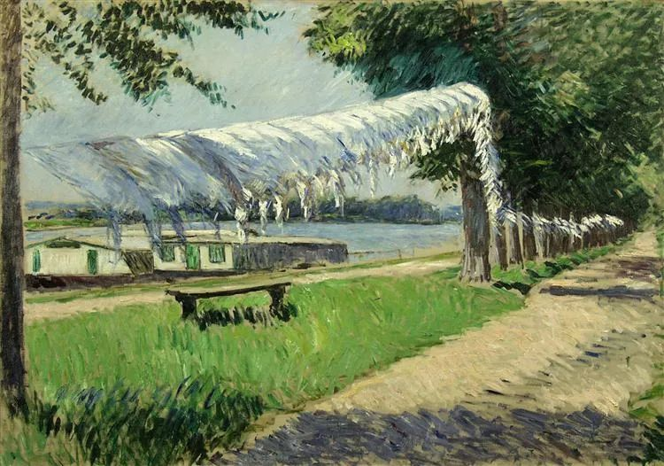

Gustave Caillebotte，Laundry Drying

  

连叔：

  

连叔是我人生路上的贵人，是我跌跌撞撞走在迷雾中逐渐清晰的明灯。我又遇到难题了，在情与理之间难以取舍。

  

背景是这样的：我是体制内事业单位上班，月薪4000多，三个孩子的妈妈，大的八岁上小学，小的双胞胎三岁上幼儿园，因为孩子爸爸放肆打麻将不顾家（几乎每周有四五天后半夜回家）和对我态度恶劣以及不处理婆媳关系离婚。确实离婚我也有错，我太容易爆炸，他在我这里听不到安慰和鼓励的话，给他的就是噼里啪啦一顿骂，所以他觉得在外面比在家里轻松。三个孩子抚养权给了男方，2套房子车子给我，由于现在住的大房子的装修贷每月要还6000，三个孩子要照顾和二分感情在仍然和前夫生活在一起，也是希望他能改好，再次凑成一个家。离婚后半年他稍微收敛了打麻将的次数但是对我并没有表现很好，冷暴力，精神隔离，要么不理睬要么呛回来，不交流，没有能量传递，我有点心灰意冷，在一次吵架中他骂了我，让我彻底寒了心，把他赶了出去。想彻底分了。赶出去10天，他表示认错悔改了，加上孩子，还有他父亲消瘦的面庞，又和好了。但是他始终不提复婚的事。

  

现在是他被单位（国企）辞退了，辞退的原因他自述他是社招，没后台，公司体制不行，侯岗池制度不合理，我找到的原因是他怼天怼地怼领导怼同事，工作不在状态。矛盾点在辞退后做什么，他想自己单干，实现自己多年来的愿望（创业），他早就有辞职不干的想法，觉得在别人手底下做事不自由，他也不服管教也不听劝，很执拗的一个人。我的意思是装修贷还要三年还清，这三年也正是小的上幼儿园花销大的时候，家里经济支撑不起。现在不宜创业，让他找个单位继续上班，家里经不起冒险，也经不起试错。再者，他的脾气性格很狭窄，容不下也担不起创业路上的方方面面。他要实现个人价值我不肯。我对打击他实现个人价值的做法又有点不齿，觉得对不起他。想想他现在也很可怜，离了婚，又失了业，但是一看到他自傲自大心浮气躁一副无所不能的样子就想踩扁他。

  

现在是离婚后吵架又和好的状态下他失了业，我应该一起承担。想问，作为前妻，对他个人创业我要干涉吗？他为什么迟迟不肯提复婚的事？

  

倔强的一棵草

  

* * *

  

倔强的一棵草：

  

你的叙述真是神转折，一通嫌弃后，竟然期待他跟你复婚。

  

或许他家的经济实力不错，复婚后你才能还上房贷，保住两套房子。但你有更好的办法摆脱入不敷出的困境，你有两套房子，卖掉一套就是了。

  

他并没有脱胎换骨，浪子回头，状态和离婚前一样，复婚不就意味着回到以前你无法忍受的生活？他照样不负责任，你照样要念叨他。念叨固然让人烦，但这样的丈夫妻子不念叨也不正常。复婚后，要么就是这样互相折磨，要么就是再次离婚。这么难听的歌，为何要单曲循环？

  

他创业成功的可能性是0。创业成功率本来就不高，除了各种外因具备，成功的创业者，往往要有勤奋、克制与责任感的品质。有责任感，才能经营正业，不碰歪门邪道的东西，才能保护客户与合作伙伴的利益，才能获得信任。能克制，才能在逆境、打击与误解中冷静求生，由着自己的性子，放纵自己的脾气，稍不如意就掀桌子，创业路上活不过半年。你前夫，缺乏这两点。而最基本的勤奋，他也是没有的。勤奋地打麻将，不算勤奋，那是反证工作与生活中的懒惰。你们复婚，再加上他创业，那可能不久之后，所有房子都得卖掉还债。那不如现在卖掉一套，一个人清爽过日子，同时把三个孩子教育好，孩子的抚养权虽然归他，但教育的重任看来还是得靠你。

  

真正的好婚姻，核心是找一个好人。好人都具有勤奋、克制与责任感的品质，用它们经营婚姻，成功率极高。无需大富大贵，就是两人都按部就班，拿一份普通的薪水，他们的生活也是幸福的。该有都会有，房子、车子、他人的尊重。好人是因，好生活是果。人生的开局给你一个好生活，你不当好人，生活也会变坏。人生的开局很差，当一个勤奋、克制、有责任感的好人，也容易得到好生活。

  

祝开心。

  

连岳

  

（我的邮箱：lianyue@xmlykd.com，来信前请谨慎考虑，因为意味着只可能在微信平台公开回复，并授权我用于图书汇编。）

推荐：[作业与游戏，和一位二年级小朋友谈时间管理](http://mp.weixin.qq.com/s?__biz=MjM5NDU0Mjk2MQ==&mid=2651699826&idx=1&sn=950b86adfcfc65559205aef11c4478f1&chksm=bd7f3e6c8a08b77a0214bf6e1fceccce549df2b51919fc1575cb18f8c81442491b59757a004c&scene=21#wechat_redirect)  

上文：[教育与成长，无需焦虑](http://mp.weixin.qq.com/s?__biz=MjM5NDU0Mjk2MQ==&mid=2651700420&idx=1&sn=ec3dedd4cf445562a99e97f7544a0b0d&chksm=bd7f38da8a08b1ccbd7d367e64749c67809cc3bab633cea0171f2c8c8defd588174016f1432c&scene=21#wechat_redirect)
