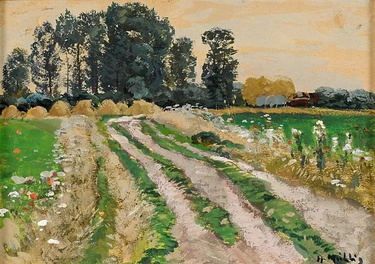

Hugo Mühlig

  

连叔：

  

连叔你好，一直关注你的文章，现有一事比较迷茫特想向连叔请教。

  

由于清明假期回乡扫墓的原因，便向9岁的儿子讲了清明的习俗，扫墓的流程，顺便提到了死亡的问题。孩子对死亡的问题比较感兴趣，于是在他的睡前闲聊时间，我们就这个问题闲聊过几次。通过几次聊天，特别的假期回来以后，明显感觉出他对死亡害怕，总担心我们什么时候会死，死的时候痛不痛，死后会去哪里，会不会有下辈子 ......等等看似幼稚，我却又无法回答的问题，本想着打消他的顾虑，告诉他死亡是每个人的必经阶段，正因为如此我们才要珍惜现在，正常的死亡应该是到了一定年龄以后平静的离去，就跟睡着了差不多（毕竟我也才39岁，双亲健在，没有经历过大的离别，无法告诉他更多），我们要远离危险才能避免意外，意外的死亡应该是比较痛苦。直到昨天，孩子告诉我“爸爸，爸爸，过奈何桥的时候我不要喝孟婆的茶，我要好好的记得你们，我长大了要发明长生不老药，一共要10颗，爸爸、妈妈、外公、外婆、爷爷、奶奶......一共十个人，都不能死掉，要一直一直活着。”听着孩子的这些言语，老父亲很是欣慰。

  

因为孩子从小感情就比较细腻，这件事情已经对他造成了不小的困扰，每每静下来他便要去思考，要发问。我跟妻子商量着必需要好好的，系统的跟孩子聊聊，避免他的胡思乱想，打扰到本该无忧无虑的少年，但苦于阅历有限不知如何才能消除他的顾虑，好好的面对这个不太友好但又充满希望的世界。

  

廷予，敬上。

  

* * *

  

廷予：

  

你想系统地和孩子聊聊死亡话题，以消除他的顾虑。这是不可能完成的任务。

  

死亡与人生所有方面相联系，是庞杂无边的、动态的、持续更新与丰富的主题，它不是百科全书里翻出来的标准答案，念一遍了事，我们得用一生去理解死亡。比如清明节，家人围着一堆土怀念亲人，还要搞不少仪式，从科学的角度，它一点也不科学。但它却是中国文化的重要组成部分，因为慎终追远，所以民德归厚。知道自己的来源，传承祖先的美德，我们可以活得更有归属感、更有责任感、更高贵，所以清明成为怀念、反思与团聚的重要文化事件，没有它，中国人的人生、家庭与文化就不完整了。又比如，用无穷的理念来分析，人却是永生的，存在无数多的宇宙，里面生活着无数多的我们，在有的宇宙，你现在才出生，在有的宇宙，你做着不同的事，有不同的人生选择，在有的宇宙，你已经活在未来。即使只有我们现在生活的这个单一宇宙，构成我们的原子若无穷次重新组合，迟早会重组出同样的一个我们，我们的人生重放一次。这概率当然极极极极小，不过，在无穷的世界里，再小概率的事情都会发生无穷多次。你看，知识的增加，对死亡的理解也会不同。

  

不过，无穷的理念能够缓解我们的死亡恐惧吗？可能也不行。恐惧死亡是人的正常反应，无论是孩子还是成人。孩子谈到死亡一点也不怕，那才值得害怕。我们小时候第一次知道死亡，都会怕到强撑着不睡，以为一睡就会死掉，后来太困了就睡着了，第二天早上醒来，对死亡恐惧的理解就更深了，更接受了。死亡恐惧终生存在，因为有它，我们才会珍惜时间、健康与生命，才会爱、才有了布施与宽容。不必因为孩子有正常的死亡恐惧而恐惧。

  

在这件事上，孩子的反应正常，他还有了研究药物的目标，倒是你过于焦虑了。教育焦虑是许多家长的通病，在任何时候都想塞给孩子一堆知识、道理与标准答案，不必如此拔苗助长，生活中很多时候更需要抱一抱，亲一亲，逗一逗，聊聊天，孩子需要欢笑远甚于知识。不是说知识不重要，而是知识的传授得见招拆招，随机应变，孩子感兴趣，问了，那把自己的知识用他听得懂的话告诉他，不懂也不必装懂，承认自己不懂，也还在学习。如此即可，不必用力过度，放轻松。否则，搞得孩子太紧张，压力太大，反而更难体验到人生之美，知识之美。

  

祝开心。

  

连岳

  

（我的邮箱：lianyue@xmlykd.com，来信前请谨慎考虑，因为意味着只可能在微信平台公开回复，并授权我用于图书汇编。）

推荐：[借东西的小人](http://mp.weixin.qq.com/s?__biz=MzI3NzQxMzI0MQ==&mid=2247492074&idx=2&sn=020ce4baca293af13faeeb97bca1635b&chksm=eb640dfcdc1384ea4c02ad27fe6f2f5d2572afd9c940b74de2dc5dabe1cb5d3dd5fb1371658e&scene=21#wechat_redirect)  

上文：[梦想职业竟然是“流氓”](http://mp.weixin.qq.com/s?__biz=MjM5NDU0Mjk2MQ==&mid=2651696347&idx=1&sn=6c7d1e98b235754493437acb0384e088&chksm=bd7f28c58a08a1d3a0f2309778d5b09a64b1edba306234b6597ca40e7ffa45b5a1e80b7da023&scene=21#wechat_redirect)
