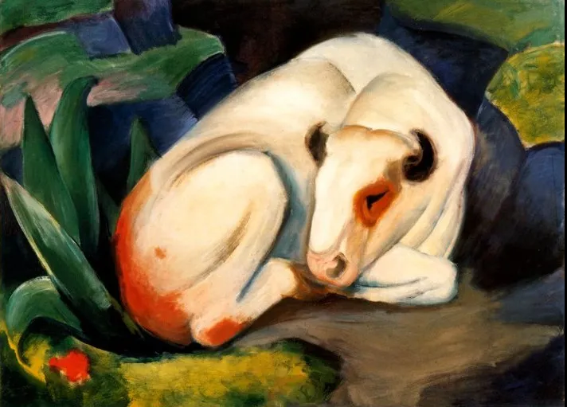

Franz Marc

  

连叔：

  

您好！

  

一直看您的公众号，一直在学习，受益匪浅，有时候还把您的文章推荐给儿子和侄女，希望他们从你的文章中汲取能量，安排好自己的学习和生活。最近有个小小的烦恼，我想跟您说说。

  

我们在省会城市，老公有个合伙的公司和合伙的工厂，公司业务一直很平稳，但是收益一般（比我的年收入要高点），工厂一直在合伙人打理，还在创业阶段，比较艰难。工厂他前期参与比较多，因为各种原因现在基本是撤出的阶段。我是正常上班族，儿子初中住校，他因为公司离家太远，一周去个一两次，其余时间基本在家办公、锻炼、做家务，上午去河边钓钓鱼、下午去足球场踢球，顺带撸个猫。今年以来我们一直考虑理财问题，进行了讨论，然后决定拿出50万进行股票投资。按照资产的配比，50万是我们全部资产（包括房产）差不多是百分之10。他一直在学习金融知识，每天都在听课、学习的状态中，还认真做了笔记，做了图标，做了每只股票的基本情况表，很专注于这个工作。每天跟我讨论最多的也是股票。我们一直的理念是价值投资，不是炒股，短线获利。但是随着股票涨涨跌跌，心情多少也会受影响。我最近也在网上看了很多人说股票投资，基本没有挣钱的，还有本钱都亏没了的。

  

他在19年底，有些焦虑，睡眠不好，后来经过听音乐、积极锻炼调整过来。当时我们分析，他可能是因为没有在工作中获得一种成就感，导致的焦虑。现在他热衷于股票投资，貌似找到一个可以专注的事情，也算个好事。不过我觉得他刚40岁，不应该有这种退休休闲的状态，还有就是股票投资我担心他会亏钱，虽然他一直在学习，但是我总觉得这里的水太深。盼连叔指点一二，感谢！ 

  

一个心烦的小女子

  

* * *

  

一个心烦的小女子：

  

我自己是中国比较早的股票投资者，现在仍然是，也获利不小。不过，我倒是经常劝人不要炒股，因为看过太多人因为股票倾家荡产，神智不清，空耗一生。你有点认识是对的，在股市上，大多数人是亏本的，尤其是散户。

  

我也得承认，私下指点过几个人，具体到让买哪只股票。他们也获利不小。这说明，我还是认为股票是个好投资，只是它的门槛太高了。我指点过的人，我对他们非常了解，判断他们的素质跨得过那个获利的高门槛，那为何不分享自己的心得，让他们的人生更好呢？不然的话，再亲的家人，再好的朋友，我觉得他们会在股市上吃亏，也绝不会推荐什么股票，那样是害他们，也让自己陷入麻烦。见人就推荐股票的，卖理财课的，这好那好，不是半桶水，就是割你的韭菜。利用理财热情和财务焦虑，也是骗子常用的手段。

  

即使如此信任指点过的那几个人，有些原则，我也是反复强调，担心他们忘了。

  

你们反正都已决定入市，那就把这些原则跟你们说一说。

  

你寥寥数语，让我对你的丈夫印象很好，生活健康，对家庭负责。这也引出第一条原则：人品要好。人类一切竞争，到最后都是人品竞争，这是不可违抗的天理。投资很凶险，无良低劣的公司也不少，巨大的风险可能体现为美好的愿景，暂时的利润。在有意的、狡诈的骗子面前，一切基本面分析、财务分析都会失效，你想要什么，他们就可以编什么。此时，只有对人品的信仰才能救你，你本能地反感巧取豪夺、花言巧语、不劳而获、为富不仁、不公不义，一切骗子，必有这些气质，引起你本能的反感与警觉，让你远离危险。

  

第二条原则是，专注本业。买入股票，就几秒钟的事，之后你天天盯着起伏干嘛？买完就精进自己的本业。股票有时涨一天，比你一年收入都高，这让人产生错觉，以为本业不值得做，天天炒股，又舒服又赚钱。你对快钱上瘾，开始败人品，违反了第一条原则。没什么快钱，你荒废本业以后，股票有时跌一天，跌掉你一年的收入。本业是你的责任之源，资金之源，永远不要放弃。

  

第三条原则是，控制资金量，先解决家庭更重要的需求，有房有车，生活达到有平均水平。你们这点做得好，资金量为资产的百分之十，要坚持住。太多人很快放弃这条原则，赚了，想加大本金赚更多，亏了，想加大本金翻本。然后，抵押房产，刷信用卡，借网贷，碰高利贷，最后骗钱。直到钱与人都输得精光。股票交易有毒品一样的成瘾性，即时满足，渴望加量。对这点，要有足够的恐惧。

  

第四条原则是，亏得起。极优秀的上市公司，就那么一些，对有办厂经商经验的人来说，更容易判断。即使是这些公司的股票，你买入后，亏掉一半，长达数年处于亏损，也是经常发生的事，你要能够保持平常心与耐心，否则的话，难免心浮气躁，沮丧焦虑，天天冲家人发火。

  

以上四条原则你们永不违反，那恭喜你们发财。

  

祝开心。

  

连岳

  

（我的邮箱：lianyue@xmlykd.com，来信前请谨慎考虑，因为意味着只可能在微信平台公开回复，并授权我用于图书汇编。）

推荐：[穷查理，富人生](http://mp.weixin.qq.com/s?__biz=MjM5NDU0Mjk2MQ==&mid=2651643298&idx=2&sn=21cb1652a6999d789f0a8ee63ea2a0c3&chksm=bd7e59bc8a09d0aa91d168a813d0fb5701f65340732f00a9d89df9bce724100ee44af2c6ff1a&scene=21#wechat_redirect)  

上文：[当你情绪低落时，应做什么？](http://mp.weixin.qq.com/s?__biz=MjM5NDU0Mjk2MQ==&mid=2651698098&idx=1&sn=594ccfd7ded8ef86e038374afc8095f0&chksm=bd7f37ac8a08beba099841b7f25644db53ba1dbba4a1a941b6cf2f0996a4f3e15e7af1c7b8dc&scene=21#wechat_redirect)
