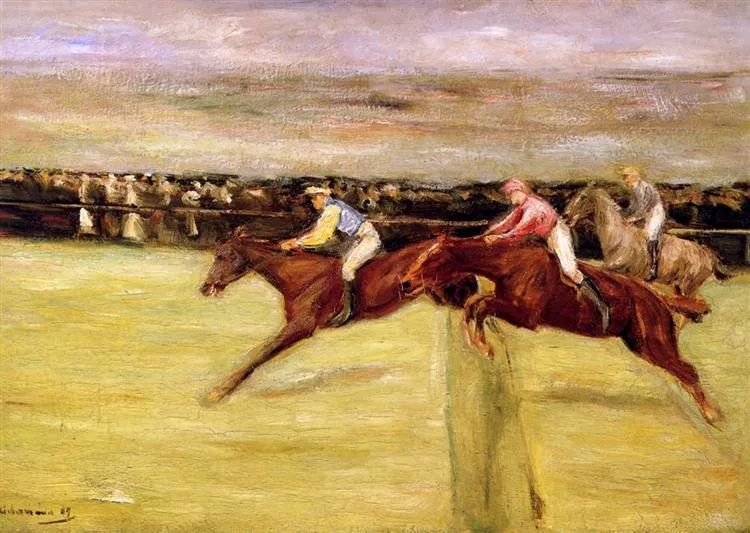

Max Liebermann

  

连岳叔叔：  

  

您好！

  

总是听妈妈提起您，我自己也特别喜欢看您的文章，其实在寒假就想写信给您，但却还是放弃了，今天又提起笔来，可能是心中实在憋不住了，就当我也是向自己倾诉一下吧。

  

我是一名初三的中学生，不久后我就即将迎来人生中的第一次大考，可能这只是我人生中的一件小事，但我总觉得自己最近心灵思想的问题好像愈来愈多，已经浮出水面了。之前我为释放自己的压力写了一篇文章，结果有人说我心里出现了问题，我很迷茫。其实在我小学六年级小升初那年，在妈妈的影响下，我天天写日记，但现在翻开那一年的日记本，我发现里面每天记录的都是“我好累啊，压力好大啊”类似的话，感觉字里行间充满着怨气甚至是痛苦，感觉回忆起来不是美好、快乐而是走进了噩梦。其实我觉得我压力真不大、我还不算累，对比起有些人，我这又算的上是什么，但自己好像总是过不去。之前看过一句话：“当你下定决心要努力时，是未来的你在和现在的你求救。”觉得很有道理，但自己又总没动力。

  

最近自己好像是快绷不住了，我自从开学以来，周一我拼命给自己打气，但每到周五，甚至才周四我就会大哭一场，几乎周周都是这样，我感觉自己有些不对劲。就在前几天我可以晚自习回家跟妈妈抱怨十五件不愉快的事，其实我自己知道都是小事，但就是不开心，刚刚我又哭了，可能是因为朋友的疏离、理科题的无绪，但我觉得最多还是自己的原因。

  

前几天，老师把我两位好朋友叫了出去，后来才明白老师是在给她们进行动员，说是她们还不够努力，让她们多向我学习。我其实觉得很惭愧，因为我觉得她们是比我努力的多的，她们每天都可以完成每一天的学习任务，而我经常弄到深夜还完不成，但老师这么说，我想努力去做到老师说的那样，可我发现我用真心对待的好友，两人竟开始疏远我，甚至有些恭维、斜视，我很不舒服，课间、中午一起回到教室后，她俩说是去上厕所，但我却清清楚楚的看到她俩在外面交谈，当初说好一起奋斗，但现在她俩总丢下理科不好的我去做数学；心中感觉此刻只是孤身一人。

  

其实独处也挺好，但……最近我们地区附近有所学校初一的学生轻生了，我觉得不可思议和恐惧。中考氛围很紧张。我的成绩在我们学校还不错，但在整个市来说那不算什么，我总是会给自己很多压力，总觉得自己这里不好那里也不好，成天叹气，作业感觉总是完成不了，苦行僧一般。但我受到的教育很好，妈妈爱读书爱写文章，总是鼓励我，有疑惑书会给你答复，家中有许多名著、传记，我的语文老师也是知识渊博，告诉我们要从容淡定的去学习，如果不是为了自己学，那考上大学唯一的结果就是不读书了，他也总是给我们思想上的指引，让我觉得我的思维丰富了不少。

  

我其实很讨厌这个矛盾的自己，我可以想的十分绝望，但有时又可以疗愈自己，但总是根除不了自己的毛病，我的理科是越来越拖后腿了，两个朋友都慢慢超过我了，之前我擅长的英语也开始有问题了，我对自己越来越没信心了。家人希望我能考个好大学，可我最初的梦想是成为歌手，但现在这个梦想似乎可有可无、陨灭了，因为没有什么人认为我可能，甚至我自己也认为考大学是我唯一的出路了。但我虽现在学习还不错，可好像从心底里我是不喜欢学习的，我不知道这样说对不对，也不知道这样说会有什么后果，因为几乎所有人都认为我是的爱学习的乖女孩，但我鼓起勇气说了出来，因为我十分在意自己的面子，在其实我也不好，我也追星，我也喜欢看好看的男生。

  

我这样似乎很愚蠢，我也对我能不能挺过后面几年而担忧，我感觉自己好矛盾，都快精神分裂一样。

  

一个愚蠢又喜欢落泪的小麻雀

  

* * *

  

一个愚蠢又喜欢落泪的小麻雀：

  

面临大考、大挑战，有压力、害怕是正常反应。没有实力，毫无希望，必然失败的人才不怕，那是破罐破摔的绝望，看起来特别平静。

  

害怕的一个重要体现就是夸大自己的弱点与夸大他人的强点，害怕的人总是低估自己的实力。其实越临近大考，实力的基本盘越难改变，知识公平的地方在于，它靠的是多年的积累，短期突击起到保持状态的作用，像是赛前的热身，并不是决定因素。

  

所以，大考比拼的往往是心理调适能力，你要有点怕，这才能唤醒自己的能量，但又不能怕得过头，不然就僵化变形，反而冰封了能量。这种恰到好处的平衡感，能帮我们度过一个又一个大挑战。它是一个终身学习的课题，并非一学就会，一会就精。但它又没有门槛，小孩也可以学，你现在就在学，只是你还没意识到自己学习的成效，比如你周五哭一场把压力去掉，这有什么值得检讨的呢？有这么好的事，我建议你要求自己每周五哭一场，这样你一周之内面对压力都会淡定，反正周五哭一场就好了。好的学习者都找得到释放压力，获得平衡的方法。有人读书，有人跑步，有人念经，有人打坐，有人大吃一顿，有人禁食一天，……各人有各人的方法，适合自己的就是好的，你现在的方法是周五哭一场，那就哭吧。

  

人的能量是有限的，平衡感就是让我们最高效地使用能量，不在自我撕裂中空耗。你害怕好朋友冷落你、超越你，你担心自己实现不了当歌手的梦想，你认为自己喜欢好看的男生是不乖，这些都是自我撕裂，因为你觉得这与你备考与学习相冲突。而找到平衡点后，一点也不冲突，圆融得很。首先，没有哪个女孩不喜欢好看的男生，无论她乖不乖，这是人性，没有错，正如连岳叔叔从像你这么小到现在，一直喜欢好看的女生，有了人生阅历，更知道人品、智慧才有长久的魅力，但人品好，有智慧的女生再加上好看，那不是更完美吗？其他问题，也都和你自己的学习不冲突，两个好朋友真的超越了你，你就不厉害了？不，是三个人都很厉害了。你上大学就当不了歌手？恰恰相反，你们这一代人都将受很好的教育，听众都大学生、博士生了，歌手不是大学生，你能打动他们、感染他们吗？

  

好好学习，人生就会好好展开。你现在的学习主要体现为考试，小考、中考、大考。以后没有考试了，人也是天天在学习的，知识不够，生活就会越来越难，只有知识，能让我们实现梦想。

  

祝开心。

  

连岳

  

（我的邮箱：lianyue@xmlykd.com，来信前请谨慎考虑，因为意味着只可能在微信平台公开回复，并授权我用于图书汇编。）

  

(又，我从3日到5日放假，停更，6日恢复更新。也祝大家假期好好放松。）

推荐：[我知道，你在偷偷变厉害，你自己却不知道](http://mp.weixin.qq.com/s?__biz=MjM5NDU0Mjk2MQ==&mid=2651684960&idx=1&sn=2ae71981e5189271d317af948870cd53&chksm=bd7f047e8a088d6823b51a59b9146f8f47aa1758083da9b3b0449c6db3dbd2256c20526d7514&scene=21#wechat_redirect)  

上文：[忍辱的公务员](http://mp.weixin.qq.com/s?__biz=MjM5NDU0Mjk2MQ==&mid=2651696054&idx=1&sn=28dcb841c7f7c49273a0934a7bfe8094&chksm=bd7f2fa88a08a6be8cf7cf2c950cc19066f2f5c1ffad37ff91f27b34d69ed44cbb3a08b75f79&scene=21#wechat_redirect)
