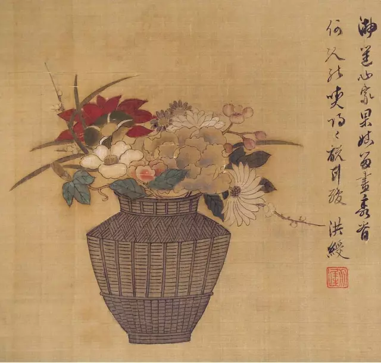
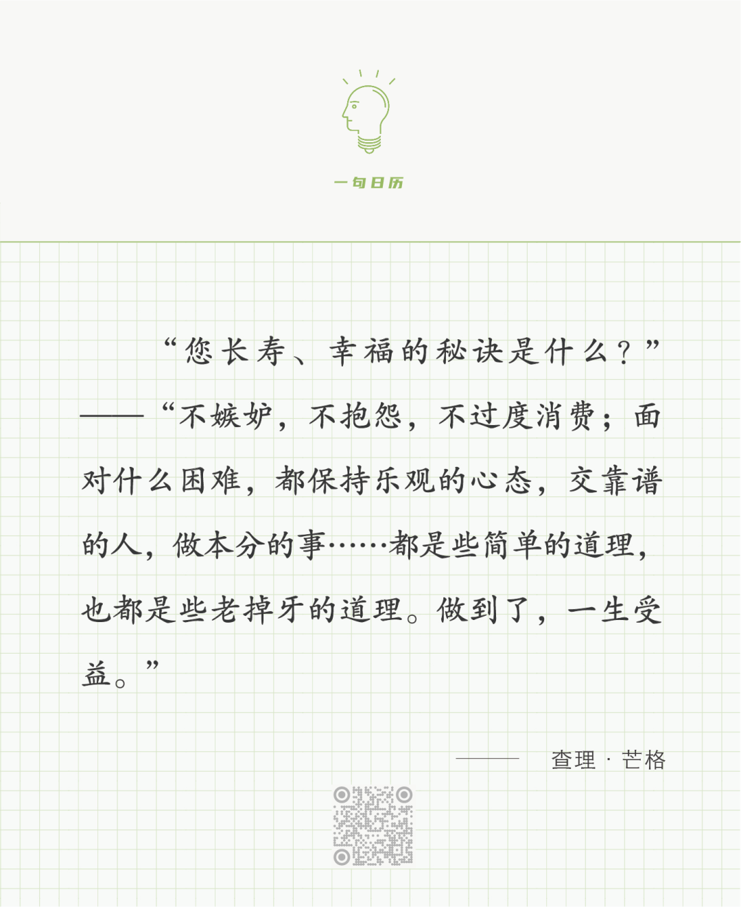

陈老莲

  

长按二维码可关注

  

能践行上面几条老掉牙的道理，幸福是一定的。虽然未必能像芒格那么富有，那么长寿。不过，有了幸福，人生是无遗憾的。富有、长寿的人生不幸福，那才如凌迟一般。

  

人生可能必走的弯路就是瞧不起那些老掉牙的道理。别说常人，去看看那些伟人传记，他们在年轻时也对老道理不服气，觉得一点用也没有。碰碰壁，然后就会知道老道理的好处。在老道理中开发出新应用。什么是传统？传统就是一些老道理足够老。什么是文化自信？文化自信就是我们的老道理够多、够好。

  

一些老道理，已经跨越文化、种族与国家的界限，可以指导一切人。只要人类存在，这些老道理就是幸福的基因。芒格说的那几条老道理就是。如果说人生有什么捷径的话，那就是越早遵守这些老道理，幸福来得越早。

  

老道理都不艰深，很好理解，但是执行起来，却需要日日修正。这是人生的不易之处，也是人生的有趣之处，不易之事做成了，才有大趣味。这是人性让人烦恼的地方，知道老道理的好，却经常违反它；可没这烦恼，人就成了机器，人不同于机器的地方就在于，人是在烦恼中得智慧的，违反老道理，生出烦恼，这才更知道老道理的好，越来越能遵守它，最后随心所欲不逾矩。富有与长寿，都有一定的随机性，求了未必能得到，而幸福是必然的，意识到了，行动到了，就能得到。

  

今天是第168期“下周很重要”，我们写下的那些好计划，就是修正每天的行为，以适应老道理。

  

推荐：[我为何每天感到幸福？](http://mp.weixin.qq.com/s?__biz=MjM5NDU0Mjk2MQ==&mid=2651679692&idx=2&sn=b6d2374f4d01910e8d7dc2a9f7567991&chksm=bd7fefd28a0866c4e3a043ef8573f49d38be1fb56cce902f2dd00d3e454d8ac8e4b9d6c4bc3f&scene=21#wechat_redirect)  

上文：[人生最低谷的最好策略](http://mp.weixin.qq.com/s?__biz=MjM5NDU0Mjk2MQ==&mid=2651698928&idx=1&sn=9da45f72366c55a0feec2884e4423bf3&chksm=bd7f32ee8a08bbf8b9231d66f3fcaef35e280694393cb6fd6539c8534a2a3f1815302fc99d20&scene=21#wechat_redirect)
