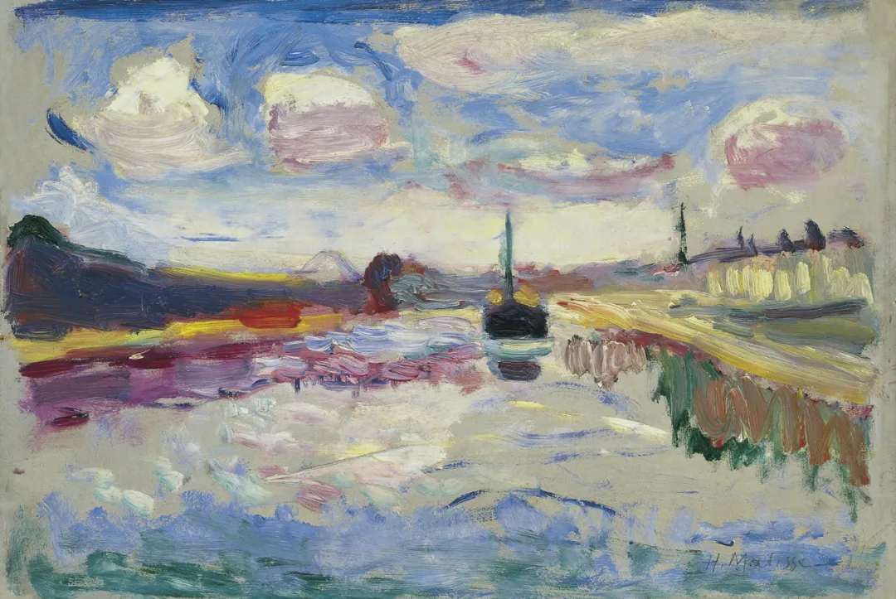

Henri Matisse

  

尊敬的连叔，

  

您好！

  

今天看到您写的 [“股票”的文章](http://mp.weixin.qq.com/s?__biz=MjM5NDU0Mjk2MQ==&mid=2651698220&idx=1&sn=83f38c1f887db785160809e65a57789d&chksm=bd7f30328a08b924a0284d3d948d88d175a1528b683a700eb292bc6f54d7e4c01fcdf19e32d6&scene=21#wechat_redirect)，真是有些小确幸，我最近也是为这个事几次想写，但怕打扰或者大概率没回复，就没提笔。

  

我家情况 比来信的那个多了前提：基本生活条件是不错的，但他要辞去现有的工作，卖掉其中一套大房子，多余的100多万用来“专职”炒股。最近他刚确认了 青光眼+干眼症，我内心之前是恨他 这么固执要炒，现在忽然觉得他也挺不容易的，也是想着做个事。

  

我们坐标南京，二线城市，双方都是独生子女，主要得益于我父母支持，有三套价值千万房产，双方父母各一套，自己小家庭一套，老家还有一套大几百万的店铺。先生外资企业十几年了，谈不上多好，生活福利没问题，但主要碍于这四年多和领导不融洽，上班一直别扭，加上父母还没来住，现在空出一套房子，先生想辞职，脾气平时很好，但在这种大事上特别犟，想专心炒股。他要卖掉一套我们名下的大房子（我们名下还有一套小几十平的，卖了剩不了多少钱）把两套商贷的还清，再买一套小三四十平公寓靠近父母用于我们小两口早晚休息，小孩起居+我们日常吃饭都在父母那，多余的100多万留着炒股。父母不同意，原本很好的生活，几套房，身体健康，都有份稳定的工作已经挺好了，但现在一团乱。

  

他每天上班花四五个小时研究股市，三四年前由于家人没同意把老家店铺给他抵押去炒股，就另外给了他四十万炒着玩，但这三四年没赚到什么，说是特朗普政策加疫情，但他说其他失败的人不是像他这样专心研究这门技术，他亏也亏过，经验也足，就差射门一脚。还有他年到四十出头，也深知再出去找工作不见得比现有的稳定福利好。他也虽是想赚钱，但都说十个炒股九个输，我也理解也想支持他做点自己的事，但这个事我们普通人见识真不敢，一般都是有闲钱炒炒，但他铁了心，说即使出去租房，也要辞职专门炒，说得再过激些，说即使离婚拿走他的一半，也要博一下，要不然再这样混下去生活没奔头……当然离也不是这么容易的事，相信法院也不会同意这种想法的离。

  

父母从小地方做小生意支持我们在二线城市三套房我们应该很知足了，他主要觉得钱都压在房子上，手上没有宽裕的闲钱生活质量不高……但外人看来就是钱多了，麻烦事就多了……别人都羡慕我们两家父母各一套，大家都住得自在，现在让我出去租房，就是租皇宫我也不想住别人的房子，我原本有自己的大房子，现在为了一个不太确定的抱负去租房或者住个小房子真不想。问他一年能保证赚到和现在一样么，他说这个也不能确保哪行都有风险，但他还信誓旦旦确定的是亏得越多，下面赚回的几率越大，炒股就是长期，长期肯定能赚……我们正常见识的人听到这些，都觉得不可思议。现在大房子就这么空了半年多了，不给租也不能卖。本来是同意卖掉后期换个学区，但家人得知他想卖了辞职，专职炒股就不同意卖了，一是卖了很难再买得起这么大的房+低房贷利息，二 这种偏执的想法太可怕，赚了还好不赚就是变相害了他，现在回头看当初不给他那几十万，这几年他没钱炒也就不会在这条路上越走越专了，毕竟这几十万也不是我们小两口的，是父母给的，但他现在貌似已经没有这个感恩之心了，只是认为我们不管他工作不顺，不考虑他的出路，手上没现金还在死守一份没有奔头的工作，不去做改变 （但我们真心觉得我们虽然没有太多现金，但有什么大事我们可以卖房变现，现有全家一年的收入 生活已经可以了，不能比整天出去旅游，大手大脚想买什么就什么）。

  

我们建议工作不顺心，大老爷们憋屈确实不舒服，可以换份工作（但他也知道出去找不到这样的养老工作，也不想换，但待着说又很憋屈），炒股继续，哪怕再多给点继续炒，即使全部亏掉还有个基本工作，但不能卖房专职炒，虽然他说他智商高，分析研究透彻，但我想那么多证券公司，智商能力强的，都能不需要朝九晚五上班，这种好事别人怎么不干？？他说我父母的房子不能动，但我们自己的房子他有权处理，这是没错， 这风险太大，万一最后输光了，他主要是性格孤僻+固执，会想不开，影响的还是整个家庭。我俩是自己相识相恋走到今天的，之前都很好，这个事上他却很坚定，不肯让步。我也不想因为这个走到非得离那一步，那样就真伤感情了。我自己有时也想要么就给他炒吧，输了才能回头，但能大概率预见的事现在干嘛不避免，就很闹心。

  

他说不给他专职炒股，让我们给他找条活路。当然他说的活路不是说在家好吃懒做等别人来养活或者干苦力赚钱，还是想相对体面 有奔头的事情做，我们给他找的出路，就是有份稳定的工作（他是做技术的），然后身体锻炼好，眼睛保养好，养育好小孩，小孩好，以后也是少花钱，少费心。他头脑灵活，那就再给我父母在老家的小生意多出点主意，经营好，父母的最后也是我们的，何乐而不为。

  

连叔您也是一直炒股的，看到的各种情况也多。若能简单就我们想法 给个Yes or No，给迷茫的我们一个指向灯，就真是万分感谢，因为马上五一就要 大家一起摊牌谈下这个事。本来想等着五一谈完再来问连叔您的，今天正好看到，就理清思路，连叔有个什么建议，五一能一次谈好了就更好了。

  

再次表示感谢，若有打扰也是抱歉！

  

本很快乐现在迷茫纠结的我

  

* * *

  

本很快乐现在迷茫纠结的你：

  

NO！nonononono。先给你这个答案。

  

你丈夫这种例子，说明钱不一定能带来幸福。如果一个人不负责任，不理性，不知感恩，又固执，那么，这样一个德不配位的人，越有钱烦恼越多，最后，他往往得把钱折腾光，归于贫穷，以证明自己只配过苦日子。你丈夫就是这种人。中国没几个人运气有他这么好，岳父母给千万的房产，他安心过日子就行。竟然厚脸皮闹着卖房炒股，这么无耻，中国也找不到几个。

  

值得庆幸的是，他没掌握家里的财权，他能随便卖房的话，别说3套房了，30套都折腾光了。你要对父母负责任，守住他们给你的资产。千万很难挣，你丈夫这种人败掉却太容易。别让一贫如洗等着老了的父母，那对他们太残酷。他卖房炒股的要求，你绝对不能松口，别以为房子多，卖一套他就清静了，亏完了，他很快会闹你卖第二套第三套，卖光为止。他闹得凶，可能正是因为看到你的动摇。你坚定一点，他就不闹了。即使他一直闹下去，让你心烦。那也比让他败光财产好，主要是败光了他还得闹。他就是一个极度自我中心的闹侠，富的时候闹，穷了更会闹。由他闹吧，闹到什么程度都不理。

  

投资是极度理性的事。固执、好面子、知错不改、一条路走到黑、撞了南墙也不回头，这些在你丈夫身上极其明显的人性弱点，成功的投资者都必须去除。一个人把原本富裕安宁的家庭折腾得鸡犬不宁，这本身就是非理性的、低智商的疯狂行为，与投资的理性追求南辕北辙。一个人不肯为家人的幸福低头、认错，怎么可能向市场低头、认错？必然输光。所有的成功，包括投资成功，都是从负责任开始，只有负责任，才可能发现错误，改正错误，从错误中学习，增长理性与能力。

  

祝开心。

  

连岳

  

（我的邮箱：lianyue@xmlykd.com，来信前请谨慎考虑，因为意味着只可能在微信平台公开回复，并授权我用于图书汇编。）

推荐：[可模仿的财富人生](http://mp.weixin.qq.com/s?__biz=MjM5NDU0Mjk2MQ==&mid=2651644723&idx=2&sn=ab8b7c236b663f775a6d01a4e7041ca1&chksm=bd7e672d8a09ee3b233c0000efaa65d651c2a6be0e283dee46b527fc9cf5eeca341b1fd9305b&scene=21#wechat_redirect)  

上文：[当你情绪低落时，应做什么？](http://mp.weixin.qq.com/s?__biz=MjM5NDU0Mjk2MQ==&mid=2651698098&idx=1&sn=594ccfd7ded8ef86e038374afc8095f0&chksm=bd7f37ac8a08beba099841b7f25644db53ba1dbba4a1a941b6cf2f0996a4f3e15e7af1c7b8dc&scene=21#wechat_redirect)
