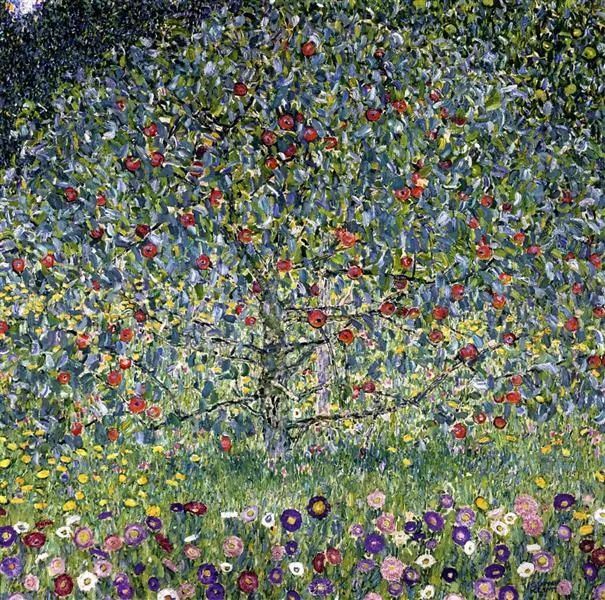
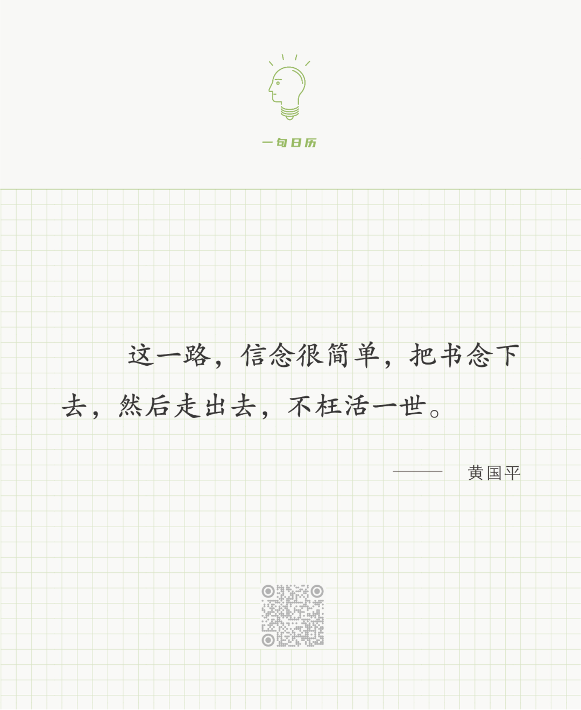

Gustav Klimt，Apple Tree

  

长按二维码可关注  

  

在中国，像黄国平博士这样苦孩子出身的博士，有很多。这样的苦孩子，除了义务教育的那一点资源，其他什么也没有，甚至还有各种各样的羁绊。他们一路杀出来，除了必要的一点天赋外，最主要的就是坚定的信念，必须靠读书改变自己的命运。这就是置之死地而后生，你知道自己只有一条路了，就不会犹豫、害怕、退缩。

  

当然，说一个人“不会犹豫、害怕、退缩”，并不精确。任何一个人，都会“犹豫、害怕、退缩”，甚至一天出现多次，多得像一棵树叶子一天被风吹动的次数。只是坚定的人很快复归信念，继续做事。不坚定的人，从此就不做事了。在一切能力中，定力是最重要的，在学校，没有任何考试考你的定力，而任何好成绩后面都有定力。定力就像树的根，扎得越深，抓得越紧，才无惧风狂雨骤。

  

人生要活得好一点，做成一件像样的事，需要的天赋，并不多，平均智商即可，也不需要你抢跑，也不必跑得多快。成长条件比黄国平差的孩子，极少数了。也就是说，在教育上，在自我成长上，人可以不必有任何焦虑，你具备的条件足够了。你需要的是自己的定力。你需要像黄国平一样，随时能回到信念上来。

  

今天是第169期“下周很重要”，写下一周的计划，有时能完成，有时只能完成一部分，但无论完成多少，定力都是在增加的，根都在长，这就足够了。

  

推荐：[真爱的一个刚性标准](http://mp.weixin.qq.com/s?__biz=MjM5NDU0Mjk2MQ==&mid=2651700093&idx=1&sn=cab525fa2558c1bbf1a9607ba645682d&chksm=bd7f3f638a08b675d388928ec916e5ddf3ebe3bca8ef40b92307d95d1674e9f7c5756cb81e86&scene=21#wechat_redirect)  

上文：[读书三阶段](http://mp.weixin.qq.com/s?__biz=MjM5NDU0Mjk2MQ==&mid=2651700184&idx=1&sn=579e50aa87b6a0e1461c8023c867e8cb&chksm=bd7f3fc68a08b6d083de903b9ac7600f92b44ee1e248980df9fba50f74d9fb41ade35e699c5f&scene=21#wechat_redirect)
