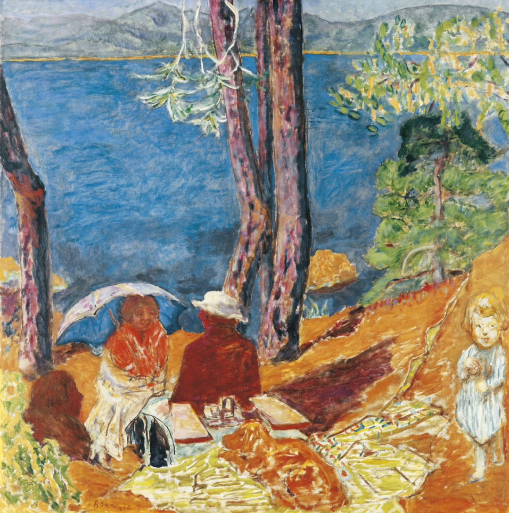

Pierre Bonnard

  

连叔： 

  

我今年29，一名国企员工，有车有房，过着非常普通的生活。她是一个在校研究生，很懂事、学习很好。我比她大七岁，她高中毕业我们在一起的，如今已经异地恋五年了（家在一个城市，她在外地上学，相距3000多公里，寒暑假在一起）。

  

刚在一起的时候，身边所有的人都觉得我两长久不了，包括我自己也没抱太大希望。但没想到我们这几年走来，不但很少争吵，还能彼此鼓励成为更好的自己，我们把不在一起时的孤单和想念转变为成长的动力。我把烟戒了、游戏也不玩了，每天看看书，写写东西；她脾气越来越好，学习状态越来越专注，去年从东南大学保送到复旦大学读研。大家的看法都由反对转为羡慕和敬佩。不管面对多大的风浪我们从不埋怨彼此，总是能携手共度。

  

然而，目前有个困难横在我们面前，我尝试了很多办法去处理，可现在依然困扰着我。因为快30了，家里催婚催的很紧，每天听着妈妈的催促、看着爷爷奶奶期待的眼神实在难以将自己置身事外。再加上我自己也想早点要孩子，所以，希望能早一些和她结婚生子。

  

本来我们计划的大学毕业就结婚，但她保研之后情况变了。先答应本科毕业结婚，后面改到研一结，现在说今年结，但就目前的进度看，今年大概率还是不行。

  

想研究生期间结婚要孩子，但一方面她读研的学业压力很大，寒暑假骤减，本身在一起的时间就很短，再加上她父母反对，外部条件很严峻；另一方面，她自己也不想这么早结，觉得自己没有准备好，不想这么早就定下来（她未来去哪发展我都是全力支持的，自己也做好随她离开家乡的准备）。

  

但如果不现在结，等时机成熟，她做好准备。保守估计，研究生两年加工作两年，还要等四年，届时我已经三十三了，再结婚生子，是我难以接受的，其中的风险也是我承担不了的。

  

前几天，我趁着小长假去上海找她，又聊到这件事。她说，关键还是她自己不想结。对此，我表示理解，也说了自己的想法。我认为，结婚生子这件事对于她来说，早有早的好处，晚有晚的好处，总体来说早和晚都可以。在我们两这个情境下，我对时间就更在意更敏感些，理论上应该更向着我。就像她忙，没时间我就尽量抽空来上海找她一样，哪一方不敏感，哪一方就多牺牲一些。她道理能听懂，也很想做些什么，但不知道为什么，就是很难做到。因此也很痛苦，很自责、很难过，自己无法达到我的期望。

  

这件事我觉得是因为我和她感情虽然好，但因为长久不见，亲密度和激情只能保持在维持感情基本线上，还远达不到能下定决心结婚的程度。而亲密和激情，又是异地恋难以解决的困局。

  

这个问题我想了很多，也检讨自己着急结婚这个诉求本身有没有道理。有些时候是觉得30确实该着急了；有些时候觉得感情那么好，再等两三年没啥；有些时候觉得什么事都要有个限度...总体来说，我依然想尽力经营好这一份感情，但又在很早之前给自己下了最后通牒，今年结不了就分手。

  

内心十分纠结和煎熬。

  

连叔，如何选择？是尽快放弃？还是继续想办法沟通？是继续等待？还是坚定推进结婚？ 

  

纠结的小胖熊

  

* * *

  

纠结的小胖熊：

  

你33岁结婚，她小你7岁，26岁，两人都在合适的年龄，看不出有什么需要纠结和煎熬的，这有什么难以承担的风险？没有。如果你爱她，根本不会在她如此年轻时，还在冲刺研究生学业时逼她结婚。

  

但你确实相当纠结、煎熬。这情绪的产生，不是源于爱她，而是源于害怕。你的长辈和你都意识到，学业这么优秀的姑娘，智力与见识慢慢打开，你就未必配得上她了。

  

你害怕失去她。她不再是当年的高中生，再聪明的高中生，都还懵懵懂懂，你大她7岁，在智力与见识上碾压她。现在她本科毕业，比原来成熟多了，你不再有优势。在上海再读几年研究生，找到自己的方向与事业，你年龄虽大，在智力与见识上反而处于劣势。她将比你好很多，这是你恐惧的地方。所以，你希望赶紧用结婚把她绑定，一结婚马上生个孩子。这样分散她的以精力，不至于变得那么好，或者，即使以后变好了，也早就是你的人，没那么容易离开你。她为什么现在不想结婚？一是还年轻，心思还在读书与事业上，二是意识到了你的这种算计，她也害怕了，想再让时间检验一下你。

  

人是很聪明的动物，有时候还有第六感，能够瞬间意识到他人内心深藏的真实想法。你的女朋友，又是人类中比较聪明的那一类人，你那点不好意思说出来的算计（我今天替你说出来了，你可能也不会、不敢承认），她早看清楚了。爱的本质是两个好，自己变好，也盼望爱的人变好。缺一不可。你现在缺的不是一，是二，你的心思已经变坏，而且害怕她变好，完全走到了爱的对立面。本质的东西坏了，形式怎么变并不重要，结果都不会是爱。你的当务之急是当个善良的人，真心希望女朋友学业进步，成为更出色的人，这样或许还有一点机会。

  

祝开心。

  

连岳

  

（我的邮箱：lianyue@xmlykd.com，来信前请谨慎考虑，因为意味着只可能在微信平台公开回复，并授权我用于图书汇编。）

推荐：[阅读为什么是最聪明的选择？](http://mp.weixin.qq.com/s?__biz=MjM5NDU0Mjk2MQ==&mid=2651633284&idx=1&sn=09765045a716d2f66d9220d49abd26e1&chksm=bd7e329a8a09bb8cd9cf76c6826d7738047c9e0b94ade1f54ea519bac602088564b34533487d&scene=21#wechat_redirect)  

上文：[这就是人生](http://mp.weixin.qq.com/s?__biz=MjM5NDU0Mjk2MQ==&mid=2651697605&idx=1&sn=9da2590e19f59f287551bea757a5c534&chksm=bd7f35db8a08bccdb4ded99d33d66f1fff83980ef2ca400f6b7d4e5825014829521f106c48b1&scene=21#wechat_redirect)
