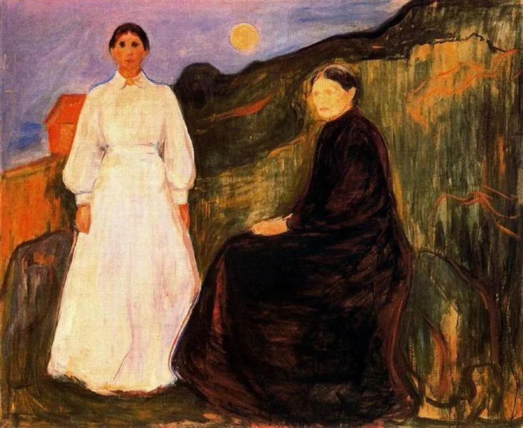

Edvard Munch

  

尊敬的连叔：

  

您好！是新关注您的读者，现已经养成了每天读您文章的习惯，您的文章总是像一个睿智又温柔的引路人，感谢您带给我的一些启发，最近因为家里的规划和父母产生了分歧，想请教一下您。

  

我是家中的大女儿，大学毕业后现已在省会城市工作，不需要父母再操心，家中还有个20岁的妹妹在上大学，以及两个12岁的双胞胎弟弟在上小学六年级；父母这些年攒了一些钱，大概有60万，其中有20多万的外债未还，他们最近计划在老家盖一幢房子，前后要花费30万以上；老家周围有很多户人家都开始盖两层的小楼房，虽然现在老家的房子有二十年了，但是不算很旧，而且五年前新盖了两个小房间分别住我们四个小孩。父母在家里现在的房子不那么好以及手里有些积蓄的情况下有了盖新房子的计划。

  

但我觉得有些不妥，老家的地段偏僻，交通不便，以后也没有拆迁的可能性；四个孩子上学之后回家的时间少之又少，父亲常年不在家，老家房子的好坏其实影响不大；30万用来盖房子以后也不会像买房一样能置换升值，甚至只会越来越不值钱。在老家盖房子属实不划算，感觉父母辛辛苦苦攒下的30万像打水漂了一样。所以提议让他们用相同的钱在我们当地市区付一套房子的首付，月供也完全能支付的起，虽然市区的发展水平仅仅是中国的四五线城市，但是生活、医疗条件也会更好一些，未来一到两年我们的城市也会通上高铁，交通会更加便利，房价也相对更有保障。而且现在买了以后两个弟弟结婚再置换也会更加有底气一些。以后母亲和弟弟可以在市区生活，可以让两个弟弟上初中高中更加方便，母亲也可以在市区找一个相对高薪的工作。

  

父亲母亲对于未来一直没有规划，总是走一步算一步的样子，父亲也是在一下有了两个弟弟之后才开始奋斗养家。这次回老家跟母亲沟通，他们的意思就是老家是根，怎么着也得有个房子，这样以后都结婚了回家才有地方住。但是我实在不能认同，我也把我的意见告诉了母亲，但是我能感受到父母有种老家的房子必须盖上才行。

  

虽然作为女儿我没有那么大的话语权，但是我还是希望家里人能发展的更好一点，父母能少辛苦一些，毕竟我的思想也有局限之处，所以求助于您，希望您能给我们一个建议，谢谢您。

  

瞎操心的孩子

  

* * *

  

瞎操心的孩子：

  

你这个心操得好，不是瞎操心，是真操心。我支持你的想法，你是一个有真才实学的孩子。从这点来看，你爸妈的教育也是成功的。

  

我挺佩服你爸妈，某种程度上说，他们现在可能是中国最需要的那类爸妈，努力工作，健康生活，多生孩子，而且对孩子负责。苛刻一点的人，可能会挑剔他们重男轻女。不过，他们照样把女儿培养成大学生，儿子出生后，自己增加奋斗精神。儿子重要，但也不亏待女儿，这就没什么可指责的了。在家庭生活中，只要结果是好的，增加了每一个人的幸福，那走的路径是什么，并不重要。生活的改善，幸福的得到，并不是写论文，一定要用逻辑与理性语言，只要对方能懂，并愿意改变就行。

  

你替爸妈设计的资产配置方案，比他们原有的计划高明得多，从保值、生活便利及工作机会诸方面，都是完胜的。遗憾的是，这些他们都理解不了。他们最容易理解的语言是什么？是一切为了儿子，奋斗、攒钱、盖房，都是为了儿子。跟他们说，过几年弟弟长大了，家庭在城里没套房子，姑娘瞧不上，娶媳妇是大难题。反正在农村已有房子，根还在，现在趁早在城里买套房子，一举数得，一是村里人羡慕，二是让弟弟尽快熟悉城市生活，将来和城市姑娘才有共同语言。就是想娶村里的姑娘，她们也更想嫁城里有房的小伙。这些理由并不高大上，不过都很正当，你爸妈听得懂，听得进去。

  

你是家里的第一个大学生，在智力与见识上，有提携整个家庭的责任。家庭在财务、幸福上的进阶，往往就是观念的提升，同样的工作有了更大的产出、更好的结果。完成这个责任的主要手段，就是找得到父母听得懂的语言，将你的方案与设想传递给他们，切忌教训他们，不要对抗，那样观念再好都没用，只是满足了“我比父母高明得多”“父母皆祸害”的虚荣心与怨恨心，对两代人都是伤害，也证明了教育与自身的失败，要找到他们的真实关切，顺着他们，开心聊天，将他们引领至更好的生活。

  

祝开心。

  

连岳

  

（我的邮箱：lianyue@xmlykd.com，来信前请谨慎考虑，因为意味着只可能在微信平台公开回复，并授权我用于图书汇编。）

推荐：[成熟度提升等于对抗度下降](http://mp.weixin.qq.com/s?__biz=MjM5NDU0Mjk2MQ==&mid=2651633245&idx=1&sn=922af7bc972354e771a8e3a3d6d4d898&chksm=bd7e32438a09bb553811f36cebca5262fdca191fe601d6a1e880ca8df00cc965a5d4e4abe4e2&scene=21#wechat_redirect)  

上文：[爱要做到两个好](http://mp.weixin.qq.com/s?__biz=MjM5NDU0Mjk2MQ==&mid=2651697703&idx=1&sn=291db27fd5ba36201a2b1c7ba25e53ee&chksm=bd7f36398a08bf2f77a8c92511d0708f438ace240cb818d091d3fe083bf165c1ccc09d359632&scene=21#wechat_redirect)
