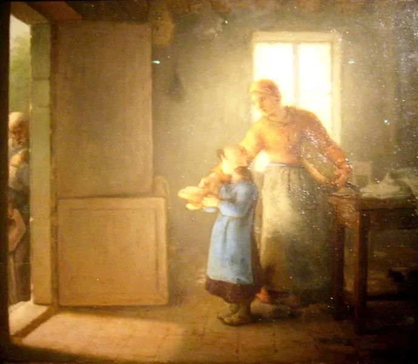

Jean-Francois Millet，Charity

  

尊敬的连叔：  

  

经常看你的公众号，真正是传递好观点，您表达的观点常常令我有耳目一新，醍醐灌顶之感。我现在也有一个困惑，不知道该如何处理比较好，希望能得到您的指点。

  

我是沪漂，在上海买了房，没能落户，但申请到了积分，所以两个女儿都可以在上海读书，我大女儿现在读高三，小女儿读初一。矛盾是发生在我和大女儿之间。

  

大女儿在市重点高中读书，成绩优异，今年将参加高考。在未来的展望，大学的选择上，我经常和她交流，我非常欣喜的看到，她的想法越来越独立，越来越实际，对自己的未来有清晰的要求。

  

但我开心的同时也隐隐有些不快。她想报香港中文大学（深圳）这个学校，无论学校声望，就业，还是学术这个学校都是非常好的，但这所学校是中外合作办学，学费加开销一年最少十五万。

  

我先生五年前去世，我一个人负担两个孩子，我是中专毕业，薪资不高，赚钱的能力有限，再加还有房贷，生活的压力还是很大的。我是把老家的房子卖了，才能应付这一切的开支。

  

家里的经济状况，我和两个女儿都说过多次，希望她们能节俭，努力，靠自己改变际遇。大女儿想报这个大学我表示了反对，我说我无法负担这样高的开支，除了卖房子，没有别的办法。她居然表示可以这样，她觉得我应该全力支持她。我们还大致算了一下，把目前这个两室一厅的房子换成一个一室一厅的小房子，大约能留几十万出来，供她读书，老家还有一套房子（是拆迁房，起码两年后才能分到手，所以现在卖不了）卖了付妹妹的教育费用。这个房子是我们唯一值钱的资产了，真要置换了，然后我们一家三口住一室一厅，生活质量会变很低，也没有任何退路了，生活变得更加被动，我内心是抗拒的。

  

我很为难，我不愿意看到资产缩小，我觉得凭她目前的成绩最少都能考一个一本，只要好好学习，都会有一个不错的将来，有必要额外花那么大价钱去读那么贵的学校吗？可是另一方面，我觉得应该支持孩子的愿望，我要钱干嘛呢，我要的是孩子们能更好，更开心。我也不愿意做一个宁可守着财产，不好好培养孩子的妈妈。

  

其实类似的这种矛盾在大女儿进入高中后，经常有碰撞。我想大女儿在上海读大学，周末回来辅导小女儿功课（这样可以节省补课费用，上海的补课费是以万计的），把妹妹也送到市重点的高中（只有市重点的高中可以住宿），这样我就可以去找一份薪水更高的工作，可以加班，可以出差，不用考虑离家远近（为方便照顾她们，我在家附近工作）。我认为做为拿了家里大部分资源的人（她补了很多课啊，花了不少钱）理应在自己有能力的时候回报这个家庭，不是回报我，而是为了让这个家更好。但大女儿不这么想，她觉得她要学的东西很多，需要做更多的事情，不一定有时间花在妹妹身上。我当时就气了，忍了几天，我写了封信给她，从矛盾说到利益，从真诚说到理想。但人要有切实体会才能真正明白道理，听到了看到了不等于明白。我觉得如果她真的明白了这个道理，可能现在也不会让我为难。

  

我不觉得大女儿有错，我觉得人就应该努力追寻自身价值，我真的是很高兴她有想法，有目标，可是当她真的追寻自身价值，与我发生矛盾的时候，我又不想支持她，我觉得自己好虚伪，不该这么双标。我也觉得照顾妹妹是一种道义，而不是责任，可以要求她帮助妹妹，但不能以她不帮就指责她，养育子女终究是父母的责任。

  

我目前的处理是不影响她的情绪，我答应她考上了就让她读（这个学校其实也是很难考的，英语单科要120以上），叫她好好努力。但如果以后真面临这个选择，我也实在不知道怎么办才好，我真要卖了房子支持她吗？既使她没考这所学校，我不必面临这个选择，但思想观念的存在，也会让这种矛盾一直都有，以后一定会有其它问题冒出来。

  

一边是想飞得更高的女儿，一边是想紧紧拉住她的我，我应该怎么办呢？

  

盼望能被连叔选中，得到指点，谢谢！

  

一苇以航

  

* * *

  

一苇以航：

  

你大女儿并非如你说的没错，而是错了。她的错，与你这个妈妈一些问题没有想清楚，有些原则不敢坚持有关。

  

追求个人价值没错。但有个前提，它不能损害他人的价值，它应该增益他人的价值。这样的人生之路才能走得稳、走得远。人类从不同的路径，都得出这个伟大结论。儒家说“己所不欲勿施于人”，佛家说“自利利他”，市场经济说“为他人创造价值才能赚取自己的利润”，中国的执政党说“为人民服务”，这都是同一件事。如果认同人可以无条件地追求个人价值，那偷与抢就是合理的，冷酷地欺压、盘剥家人也是对的。有人这么做，一部分原因是本性低劣，天生愚痴，眼里只有自己。还有一部分原因是后天的教育缺失，没人告诉他应该做一个善良的人，甚至教反了，把他教得不善良。

  

你的大女儿现在不善良的苗头非常明显，再不纠正，她过几年，可能就彻底无法纠正了。受害最深的，就是离她最近的人，你这个母亲，还有她的妹妹。当然，她自己的一生也就浪费了。纠正最好的办法就是不同意卖房供她读大学，家里不能只考虑她一个人，妈妈收入有限，这房子要为妹妹提供更好的学习环境，两个孩子成年后，这房子还是妈妈将来养老的依靠。这些她本来应该想到，既然她想不到，或不愿意想，那当妈妈的，就该大大方方说出来，这就是最重要的善良教育。她只能去读一个与家里财力相适应的大学，这样的好大学有很多，不仅不能变卖家里的房产，在读大学时，最好还能适当勤工俭学，自己挣一部分生活费。

  

当父母的，为孩子尽了责任，考虑一下自己的利益，为养老做做计划，这是没错的，经济越是一般，越要早点考虑，这也是减轻孩子将来的负担。切忌告诉孩子“父母的一切都是你的”，这不是慷慨，不是爱；这是诱惑孩子变坏，这是害。既然父母都这么说了，那么孩子唯我独尊，巧取豪夺，残酷无情，又有什么不行的？不都是我的吗？你们不是从来都为我活吗，那我现在要你们死，你们为什么不马上死？

  

孩子不善良的念头就是思想中的癌细胞，不能养大它，别认为这次满足她，她以后就会变好。不善良的念头一发现就要掐掉它，就像癌症早期发现，及时治疗，都不是事，放任不管，到了晚期，往往就没办法了。

  

学习好，有知识，文凭高，这只是教育的一部分。更重要的是思想好，孩子是温暖的、体谅他人的、有同情心的、有感恩心的，总而言之，是一个善良的人。不善良的人，连爱他的家人都冷酷压榨的人，学习再好也没有价值。

  

你拒绝大女儿不切实际的、不善良的求学计划，她或许会闹，必然会哭，你要坚持住，她现在流的泪水，就是她的毒素与杂质，流得多是好事。

  

祝开心。

  

连岳

  

（我的邮箱：lianyue@xmlykd.com，来信前请谨慎考虑，因为意味着只可能在微信平台公开回复，并授权我用于图书汇编。）

推荐：[老实一点长大](http://mp.weixin.qq.com/s?__biz=MjM5NDU0Mjk2MQ==&mid=2651693735&idx=1&sn=a31d27d97a6d244295197fb1bece4fbb&chksm=bd7f26b98a08afafb58ebf0525b76042434e459bb322f1c8e5b3d48fbd46628af51f6a7581cb&scene=21#wechat_redirect)  

上文：[西藏爱情故事](http://mp.weixin.qq.com/s?__biz=MjM5NDU0Mjk2MQ==&mid=2651699283&idx=1&sn=de8a58864ebf3d91d6e864daf5fc5961&chksm=bd7f3c4d8a08b55bac11ac5367fb0e89843f619e122e8e877749eca9092759096f0761825d1c&scene=21#wechat_redirect)
