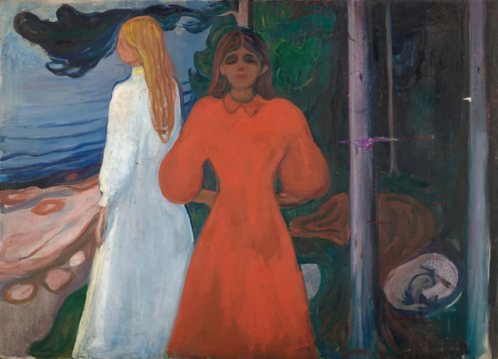

Edvard Munch

  

连叔好，

  

关注您的公众号已经2个月了，是您的一位读者（我朋友的小姨，她是一位大学老师）推荐给我，让我梳理您的读者回信，来解决我自己的婚姻困惑。2个月看了不少您的回信，您传输的价值观带有足够的正能量，您真诚地鼓励，规劝每一位来信者，每当看完您的回信，内心充满了温暖。小姨鼓励我给您写信，咨询下您的建议：

  

我和老公是北漂，我们是本科同学，在北京无房，无户口，我32岁，他34岁，恋爱10年，结婚4年，我是211研究生学历，工作5年，他是二本学历，工作8年，目前我年薪50W+，老公10W+，老公要跟我离婚，我们没有出轨和背叛，我们感情还可以，他觉得配不上我，极度自卑，有些抑郁了，他已经决定要回他老家工作，offer已经收到（工资跟北京相同），今年5月底就回去了。而我回去找不到合适的工作，工资是在北京的1/5。我只有两个选择：1离婚， 2跟他回老家 ，连叔我该如何选择？

  

补充信息：

  

1）老公是大男子主义，东北人，接受不了目前的收入差距，是个自尊心极强的人，我已经试了所有的办法，都没有办法让他当个小男人，他自己一直觉得能有所成就，可事实证明他可能就是没有办法挣到很多钱（没有好的学历，证书和大公司的经验），一年来他都郁郁寡欢，跟我没啥交流，不开心，不快乐。

  

2）他这些年来，研究生没有考上，证书也没有考出来，工作也没有什么好的起色，说为了我来北京，做了自己不适合的行业，现在想转行，又觉得晚了，活着都是为我而活，丧失了自我，想要找回自我，找回自我的方式就是离开北京，回到竞争压力小的二三线城市。

  

3）在他老家，我们有一套房子，不用担心什么户口问题，孩子上学问题。而在北京，凭我们的收入，很难在几年内买的起房子，父母都帮不上忙。

4）我对他还有感情，我已经习惯了他的陪伴，我不介意他挣钱少，但是我担心他的健康，跟我在北京待下去，他可能得抑郁症。

  

我的困惑：1）离婚：我舍不得10多年的感情，我们曾经感情还不错，他曾经对我非常好 ，大龄二婚剩女，可能要单身度过余生。2）如果我回他老家：收入会大幅下降，他的状态也不一定会好起来，我不甘心放弃北京的工作机会。

  

连叔，女孩子就应该以家庭为重，尊重老公的意见吗？那我自己的事业和理想呢？我该如何选择呢？

  

希望得到您的回复，非常感谢。

  

一个孤独的求助者

  

* * *

  

一个孤独的求助者：

  

他的病是观念病，大男子主义就是一种观念，为了符合这个观念，他必须和一个全方位弱的女性成家，而你恰好相反，全方位比他强。

  

在北京，包括在发达都市区，大男子主义是没市场的。也就是说，在这种地方，人们见惯了强大的女性，在恋爱与婚姻关系中，对女性比男性强，甚至全方位强，不认为有什么奇怪的。在北京，有谁会嘲笑你的丈夫？可能更多是羡慕他找了个好老婆。他在这么友好的环境都呆不住，要逃回老家，其实他最真实的心思只有一个：离婚。

  

你跟他回老家，并不是一个选项。一是在北京你强他弱的历史，大家迟早会知道；二是在他老家那个环境里，你不会突然变弱，他不会突然变强，再过几年，你的收入又是他的数倍，全方位碾压他。在那个环境里，他可能真要生不如死。观念有病，到哪里都有病，到一个更适合他生病的环境，他只会病得更重。你委屈自己跟他回老家，在你看来是牺牲，在他看来，分明是追杀。你跟他回老家，最后的结局也一定是离婚。

  

真爱有一个标准，必然希望爱的人比自己强。就像父母都希望孩子比自己强。恋爱与婚姻也一样，你总是因为一个人的强而爱他，这个强可能是颜值，是能力，是才华，是成就，是教养，是品格，这些强一直在，一直在增强，你的爱才基础稳固。若是这些强不在了，消失了，爱也就消失了。害怕对方更好、更强，这种感情属于嫉妒和仇恨，两个人靠得越近，也就越痛苦。或许，他努力过，但是大男子主义的病根太重，改变不了，那你要快刀斩乱麻，趁年轻，赶紧重新开始。

  

祝开心。

  

连岳

  

（我的邮箱：lianyue@xmlykd.com，来信前请谨慎考虑，因为意味着只可能在微信平台公开回复，并授权我用于图书汇编。）

  

推荐：[我为什么这么高兴？](http://mp.weixin.qq.com/s?__biz=MjM5NDU0Mjk2MQ==&mid=2651640981&idx=1&sn=87e14cdaa8c858ca1e568ec71779fbd3&chksm=bd7e508b8a09d99de10ba66f42fd6f705b0dd8028b0098c23ce8b59fcfa2d4517ba932bec42a&scene=21#wechat_redirect)  

上文：[作业与游戏，和一位二年级小朋友谈时间管理](http://mp.weixin.qq.com/s?__biz=MjM5NDU0Mjk2MQ==&mid=2651699826&idx=1&sn=950b86adfcfc65559205aef11c4478f1&chksm=bd7f3e6c8a08b77a0214bf6e1fceccce549df2b51919fc1575cb18f8c81442491b59757a004c&scene=21#wechat_redirect)
