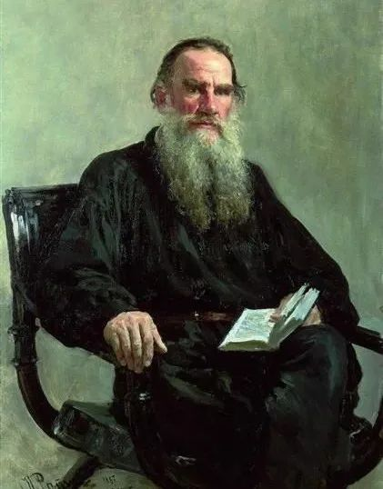

Ilya Repin，Leo Tolstoy

  

今天是世界读书日。天天应该都是读书日。人长眼睛为了什么？为了摄入信息，而书，是最高效的信息。因为可以读书，一个人和一切人类的最高级智慧联结起来。所以，人不是要不要读书的问题，而是人必须读书。

  

但人不是天生爱读书的，读书需要一大段时间的专注，消耗大脑能量，总会让人觉得苦、不耐烦，要达到日日如此，以苦为乐，最后乐而忘苦，不让你吃读书的苦，你反而觉得是最大的痛苦，这过程是漫长的，分为几个阶段：

  

第一阶段是引导和他律。孩子学识字，在家长与老师的帮助下开始读书，从图画到文字，从少到多，从简单到复杂。其中最重要的书籍，教科书，更是反复阅读。这一过程一直延续到大学毕业，他律因素慢慢退出，最后再没有考试、成绩、证书之类的刚性标准衡量你读书的质量。

  

第二阶段是自律。你不读书，似乎也可以混下去。在这个阶段，不少人就逐渐放弃读书了。这是读书的关键阶段，保持一定的阅读量与一定的阅读体系，不是读一些轻松的书，而是每年还是能啃下一些厚书、难书。

  

第三阶段是真诚。读书不是为了炫耀，也不是脱离自己生活的第二张皮。读书就是为了完成自己，是你飞快进化的手段，它是你唯一的那张皮，撕了你就活不下去。我见过太多在第一阶段就停止的、不爱读书的人，非常执着地宣称自己爱读书，要混进第三阶段，这种虚伪危害最大，知道一个书名，看了点简介，就敢于扯淡，误人误己，让无法分辨的人从此瞧不起读书，瞧不起读书人，这是断人慧命的事，尤其是断自己孩子的慧命。

  

芒格说过，我认识的聪明人，没有不爱读书的。其实，只要一个人完成上面三个阶段的读书修炼，起点低，也会变聪明。停止在第一阶段，再聪明的人也会变笨。到了人生的中年以后，你认识的聪明人，当然就是爱读书的。时间一拉长，人是装不了聪明的。

  

在世界读书日的今天 ，我推荐一个作家的作品。他就是读书人都认识的列夫·托尔斯泰，把他的三部主要作品，《战争与和平》《安娜·卡列尼娜》《复活》，加起来两千多页，按顺序读完。如果你原来读过，那就再读一遍。

  

为什么？因为列夫·托尔斯泰是检验一个人是否真爱读书的最好标准。

  

他的作品量大，读完短则两三个月，长则半年一年，没一定的阅读力，没有自律，最多读到50页，就会放弃。一年下50次决心，每次都是如此。

  

他的作品好，是人类智慧顶峰的少数几个作家。从遣词、造句、结构、思想，皆是一流。小说家往往不是思想家，甚至更容易传播愚蠢的想法；思想家往往写不了小说，或只会写拙劣的小说。他兼具了一流小说家与一流思想家。把他这三部作品吃透，你想写小说也不太成问题了，当然，思想更不会歪。

  

他是一个真正的人。他一生努力、挣扎、思考、写作，想让国家成为更好的国家，想让人成为更好的人。他的三部作品都是围绕着人的成长而写。在国难中成长，在家难中成长，在错误中成长。这些成长的场景，将在人类社会中一再重演。

  

读过列夫·托尔斯泰的人，一再读列夫·托尔斯泰的人，才是完成读书三阶段的人。

推荐：[我知道，你在偷偷变厉害，你自己却不知道](http://mp.weixin.qq.com/s?__biz=MjM5NDU0Mjk2MQ==&mid=2651684960&idx=1&sn=2ae71981e5189271d317af948870cd53&chksm=bd7f047e8a088d6823b51a59b9146f8f47aa1758083da9b3b0449c6db3dbd2256c20526d7514&scene=21#wechat_redirect)  

上文：[真爱的一个刚性标准](http://mp.weixin.qq.com/s?__biz=MjM5NDU0Mjk2MQ==&mid=2651700093&idx=1&sn=cab525fa2558c1bbf1a9607ba645682d&chksm=bd7f3f638a08b675d388928ec916e5ddf3ebe3bca8ef40b92307d95d1674e9f7c5756cb81e86&scene=21#wechat_redirect)
