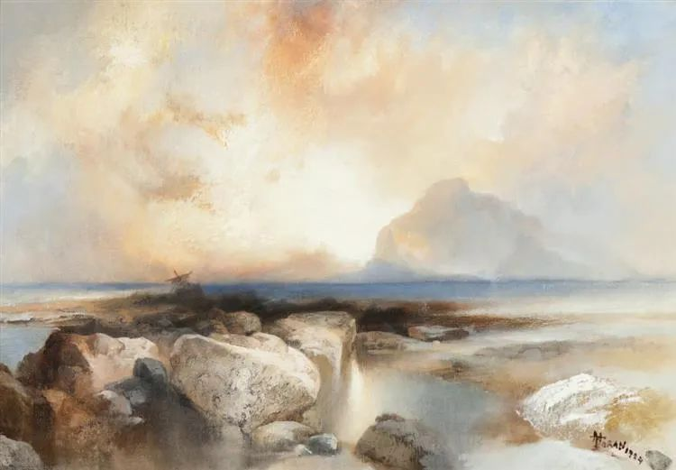
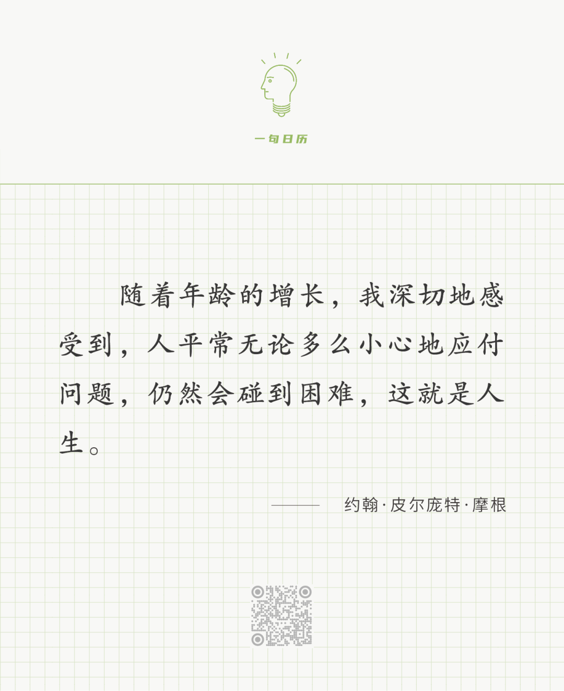

Thomas Moran

  

长按二维码可关注

  

这就是人生的困难悖论。无论你能量再大，多有知识，多么富足，你总会碰到困难。能力越大，责任越大，说的就是这么一回事。责任是什么？责任就是解决困难。能力越大的人，解决的困难也越大。就像我们解决自己肚子饿的小困难，而袁隆平解决所有人肚子饿的大困难。

  

见困难就躲，逃避责任，给人增加困难，那能力就会越来越小，就像力气不用就会变小。这种躲避困难，是人的本能，如果真能躲掉困难，换一个舒服的人生，那倒也值得。可惜是越躲困难越多，躲到后来寸步难行，因为能力太小，别人轻而易举的事，对你来说难如登天。

  

这就是人生，逃，困难追着你，战，困难等着你。权衡一下，战的选择更合理。逃则无处可逃，日常生活中都充满困难。战则在战胜小困难的过程变强就是了，而大难题不常出现，出现了就意味着我们的人生要升级，或是能力，或是观念。某种程度上，我们是靠困难生长的，所以，困难出现时，不要烦，要像牛看见草一样，吃掉它就是了。

  

今天是第167期“下周很重要”，之所以写入计划，往往是有点难的事，这些事才能给我们营养。

  

推荐：[疫情对房价的影响](http://mp.weixin.qq.com/s?__biz=MjM5NDU0Mjk2MQ==&mid=2651637293&idx=1&sn=d20f15236eb43f04a2d20f81327e5bb1&chksm=bd7e42338a09cb25217b4db7562043b9d471ce7e7a2abf7cd82b370d0a7198e7a9499c3712ef&scene=21#wechat_redirect)  

上文：[为什么学生只有好好学习的唯一选项？](http://mp.weixin.qq.com/s?__biz=MjM5NDU0Mjk2MQ==&mid=2651697338&idx=1&sn=9cb64c7eba0478e510aa40479fb9bd0e&chksm=bd7f34a48a08bdb2f2567cdfd8149b7ec5077cb12dde57b34dc7b8a45a28d5354309a49f1075&scene=21#wechat_redirect)
