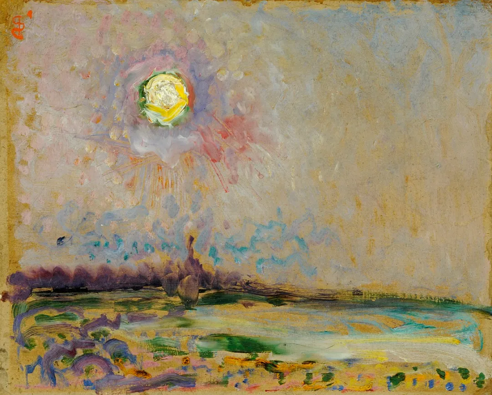

Jan Sluyters

  

连叔：

  

展信悦，经朋友的推荐阅读你的文章几年了，受益匪浅，但是最近我的工作生活却越来越迷茫，找不到方向，不知道以后的路怎么走。

  

目前我和老公都在上海，我87年，他84年都来自苏北农村家庭，骨子里都有严重的自卑感，觉得自己不如别人，原生家庭贫穷，学历不高，都是大专，所以前面的很多年都在默默的奋斗，从一个月270元的出租屋，到现在在上海有一套房，无锡有一套房。老公考了本科，我考了会计中级职称。但是现在我们却找不到以后的路该怎么走。首先有一个孩子，2年级，孩子学习一般，也让我们夫妻操碎了心，在上海以我们的收入也落不了户，目前户口落在无锡，孩子这样，我们关于未来规划的每一步都小心翼翼，唯恐耽误了孩子，却发现对孩子的学习越来越力不从心。其二，我今年换了工作，可能走了狗屎运，进了一家类似国企的企业，但是工作内容却不是我想像的那样，简单基础，感觉没有技术含量。我骨子里是悲观的人，总觉得万一我再失业了咋办，就不好找工作了，尽管朋友都说我运气好，找了一家好公司，我却一点不开心，我想奋斗，我想有更好的发展，却迫于生活的压力，不敢随意辞职。我老公目前处于汽车行业，公司效益不好，可能随时都有失业风险，我不知道未来该怎么走，才能对我，对孩子，对我们这个家庭更好。

  

一个找不到路的人

  

* * *

  

一个找不到路的人：

  

你现在只要做好一件事，你，你的孩子，你的家庭就会更好。那就是放下自卑。你仍然太自卑。

  

很多人在人生之初都有自卑。这是难免的，人类像其他一切物种一样，在竞争中生存，竞争的一大策略就是攻击，让对手让出资源，甚至失去性命。自卑者，往往就是被攻击者，最后总觉得自己不行，还没开始竞争，自己心理已经放弃。自卑者能否走出这个自卑，就是成长的一大关键，否则就将陷入永远的自我否定，最后证实对自己的攻击是正确的。

  

地域歧视是最廉价的攻击武器，因为出生地不同，我就天然优越于你，用起来多么顺手，就像全国闻名的苏南苏北歧视链。从你身上也可看得出来，这种歧视给你植入了太深的自卑。最大的自卑就是你可以不自卑时仍然自卑。自己有了好工作，那不过是狗屎运，没什么可高兴的；丈夫工作不好，那他一定会倒霉。再好的生活，都会死于这种自我诅咒。你们上海一套房，无锡一套房，资产赢过绝大多数中国人人，有什么可怕的？你们的儿子即使一直成绩不好，又有什么关系，你们的成绩也不好，但认真生活，不也上海一套房，无锡一套房。再说了，他的人生起点可不是贫穷家庭，他家在上海有一套房，无锡有一套房。

  

不要怕经历过自卑，某种程度上，这比你当初那些对手的自大更好，他们认为自己天然高人一等，偷懒了，没学到本事，一事无成，到大家都长大了，成熟了，早放弃地域歧视这种幼稚毛病，他还只能靠地域歧视获得优越感，他不知道，他在观众心中的地位有多低，有多可怜。而像你这样的自卑者，为了证明自己拼命奋斗，不知不觉，就上海一套房，无锡一套房。

  

你们自己的成长史，就是你们家独有的文化基因，是其他人没有的教材。你们在教育过程中，自己要善于提炼自己的成功点，是哪些人品与方法让你们一直走在正道上，我想，不外乎诚信、善良、努力、用心、踏实之类，用自己的亲身经历，你讲起来特别有说服力，这些品质将让你的孩子一生顺利，不管他成绩如何，不管他是否也将经历自卑。

  

你现在要做的就是放松，欣赏自己的成就，对自己说：你做得真好，以后没什么事难得倒你。

  

祝开心。

  

连岳

  

（我的邮箱：lianyue@xmlykd.com，来信请谨慎，只会在微信平台公开回复，并授权我用于图书汇编。）

[荐文](http://mp.weixin.qq.com/s?__biz=MjM5NDU0Mjk2MQ==&mid=2651633429&idx=1&sn=2458cd8c2c967e23ed71bee773e1bad1&chksm=bd7e330b8a09ba1dbf14722390fe40a11f89925ab32bc0dbc98b273f5e95193f67fc7ae380be&scene=21#wechat_redirect) [上文](http://mp.weixin.qq.com/s?__biz=MjM5NDU0Mjk2MQ==&mid=2651702443&idx=1&sn=37bcf4bc5a0e7fc3b5e0909c26c7e917&chksm=bd7f40b58a08c9a35b36a32734b382574b99ae47304ff59f7ff38761f74533b42c302049c5b0&scene=21#wechat_redirect)
