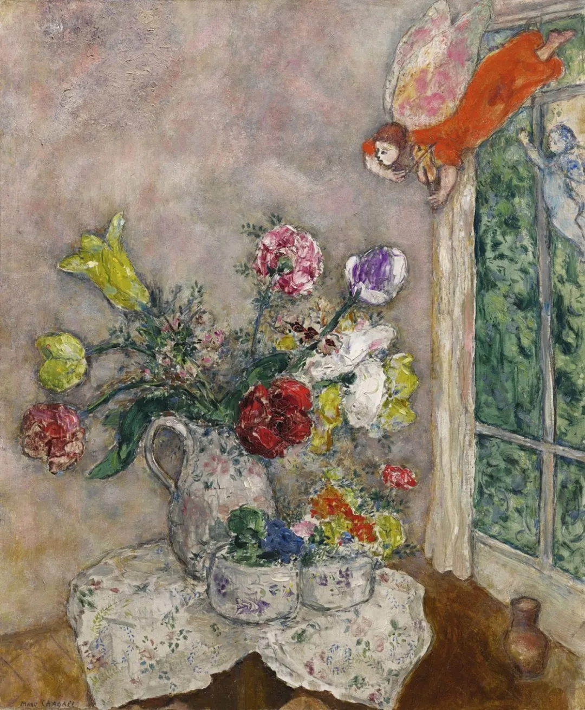

Benvenuto Benvenuti

  

亲爱的连岳叔叔您好，  

  

我想跟您聊聊我的爸爸。他的脾气非常不好，没有妈妈温柔，没有奶奶更疼爱我，但是我知道他每天送快递非常不容易，可是我是实在受不了他的脾气。

  

今天发生的一件事导致我哭了一个小时。原因是，今天一回到家我写作业，老爸在家不知道在干啥，我写完作业后，就开始玩妈妈手机，老爸之前没有看见，等他看见后大声对我吼到不能玩手机，之后老爸就走了。

  

我以为没事，结果呢，还没玩一会老妈就叫我吃饭，我就说马上来，马上就来，又接着玩了一会，老爸就开始发他的火爆脾气，让我快过去吃，我也放下手机过去了，老爸嫌我走的慢，又吼我，我过来之后看到碗里的面，我说我不爱吃这个面（妈妈接我放学时说过今天晚上不做饭吃面条），老爸就说你不要挑三拣四的，我还看见面条里有我不爱吃的肉和我吃腻了的鸡蛋，但老爸还是逼着我叫我快点吃，继续对我发火，我说我可不可以不吃肉跟鸡蛋，只吃面条，老爸坚决又生气的说不行！当时我就哭了，还说不吃就揍我（以前我不听他话时他也揍过我，被老爸吼是家常便饭，挨揍一年最多不超过三次），之后我一边哭一边把面条吃完了，肉和鸡蛋最后还是偷偷给妈妈吃了，后来我一个人上楼哭了一会，妈妈过来安慰我，我心情才平静下来。

  

说到这里，我还在生我老爸的气。为什么只要我做了让他不满意的事，他对我不是吼就是凑，我绝对是他亲生的。

  

一个八岁半的二年级女生（小包子）

  

* * *

  

 亲爱的小包子：

  

我告诉你一个家庭秘密，别看你爸爸能吼你，还能揍你，你却比他强得多。比如这件事，你最后还是如愿不吃肉和鸡蛋，并得到了妈妈的安慰。而爸爸得到了什么？什么也没有，他还得气鼓鼓地去工作，因为生气，工作出差错的可能性变大，还会导致被人责怪。在这次冲突中，你才是赢家。

  

父母被孩子惹得大吼大叫，甚至动手揍人，那正是他们最虚弱、最可怜的时候。在发生这件事之前，他们是正常说话的，温和地讲一些规则和道理，如果孩子接受了，事情就不会恶化。比如你不是未经允许玩手机，或在被制止后立即不玩，或者吃饭时不挑食，事情都还可控，遗憾的是，多次机会你都没有把握住。话说回来，孩子使用手机的第一条纪律是：在父母（或监护人）的允许并监督下使用。否则的话，手机一定会毁掉孩子，别说你只有八岁半，就是十八岁的高中生，在手机的诱惑面前，也可能失控。你爸爸看你偷玩手机时那么生气，这正是因为他爱你且具有相关的教育常识。有些父母爱孩子，但没有教育常识，放纵他们玩手机，孩子最后只能玩成一只成瘾的可怜虫。你爸爸比他们负责任。

  

负责任的人，都会辛苦一些，负责任的父母，比不负责任的父母更辛苦，有更多的吼叫。为什么要自讨苦吃？那就是因为爱。你完全不理会爸爸，继续偷玩手机，挑食，哭闹，你最后都会赢，爸爸除了绝望地吼叫几声，偶尔打一下你，再没有别的办法，他还是得照样乖乖地工作、养家。他只要爱你，就注定是软弱的、可以由你欺负的。如果一个孩子一直利用这点逼迫父母让步，那他最后就会变成一个不负责任的孩子，一个没有爱的孩子。虽然今天你知道了你比你爸爸强，但不要用这大能量去伤害他，而要用来帮他，用来负责任，准时高效地完成自己的任务，玩手机前获得允许，吃饭不挑食， 这些都是你可以做好的事，做了，你爸爸能感受得到你的爱，他的脾气将奇迹般地好起来。你为什么要当一个负责任的孩子？也是因为爱，你已经可以用爱改变你爸爸。

  

祝开心。

  

连岳

  

（我的邮箱：lianyue@xmlykd.com，来信请谨慎，只会在微信平台公开回复，并授权我用于图书汇编。）
