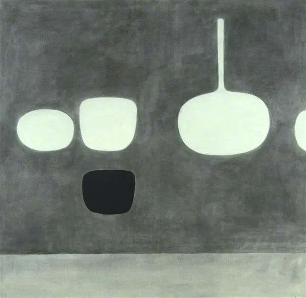

William Scott

  

连叔：

  

您好！

  

今年是我第四个本命年，希望在这个本命年里改掉几个坏习惯。

  

我有很多坏习惯，就不一一列举，重点想在今年改掉两个坏习惯，一、无节制的打游戏，二、无节制抽烟。

  

我接触游戏是从对着黑白电视机的小霸王游戏机开始，那时就觉得游戏闯关很有趣，渐渐的就迷上，然后是街机，后来网吧出现，开始玩传奇网游，大话西游...，最后到随时随地可以玩的手游。玩游戏已成了一种习惯，只要有时间就会拿起手机玩会游戏。就如同喜欢看书的人，只要有时间都会看一会书。虽然在虚拟的游戏世界里面能找到快感，但是走出游戏，回到现实世界里，感觉自己是一个一无事处的人，或者说就是一个一无事处的人。以前这种感觉就像薄薄的云烟，似有似无，但是随着年龄及亲友圈人们的改变，这种感觉越来越强烈，内心试着想改变这一坏习惯，但却一次次的被自己行为给打败。

  

大二的时候跟着狐朋狗友学会了“小回笼”和“大回笼”，然后香烟就没间断，进入社会香烟也续着，后来在烟瘾比我还大的领导下，我的烟瘾进一步增大，发展到如今一天一包烟的地步，如果交际一天两包烟。最近入睡中隐约感觉到咳嗽，咽喉有时也发出沙哑声，意味着我的肺已经出现问题，肺癌是早晚的事。

  

我就是一个十恶不赦的人，身上充满着罪孽，对家庭不负责，对公司不负责。我们一家五口人生活在一起，父亲六十多岁还在超市上班，母亲负责家务，接送孙子上学。有时候我还嫌父母唠叨比较烦，我们房贷已经还清，有一代步车，由于当时按揭买房没考虑老人，所以目前的房子不够住，想换个三室的，但是三室的房子现在购买需要准备两百五十多万，这几年的积蓄离这个数字还差非常多，又想着在外地买个便宜点的，就当投资先供着，等将来孩子大了，留给孩子，可能这辈子就这样度过。公司规模不大，每月领点薪水，过普通老百姓日子还可以，空闲时间我又拿起手机玩游戏。但是每次和老婆开车出去，看见身边同学都混得有模有样，心里难免会了罪恶感，身为丈夫，父亲，儿子……多重角色的我，没有一点深入角色，就像一颗巨婴。做为丈夫的我，从没给爱人买过一件像样的礼物，做为父亲，我从没用心带孩子痛快玩过，每次都敷衍，父母亲年事已高，做为儿子的我，从没考虑他们生病或者百年以后该怎样安排。古人云：树欲静而风不止，子欲养而亲不待。有时想想自己是满满的愧疚，但是愧疚之后又恢复到潇洒中，就如同杀人如麻的人敬佛一样。

  

游戏伴我二十载，香烟伴我十五年，人生最美好的时间都留给了游戏和香烟，或者说是人生最美好的时间都被游戏和香烟糟蹋，但又深爱这种感觉。最近我又拿起四书五经，重新翻阅，希望借助这些能洗去我污浊的心灵，让它焕发出耀眼的光芒。人生在世数十载，剩下的几十年我不想再虚度，希望在剩下的几十年能活出个人样来。

  

连叔，我现在要怎样去修正人生的履历才能使我这一生不被游戏和香烟所遮蔽。

  

罪人一个

  

* * *

  

罪人一个：

  

36岁还年轻，你有房有车，生活经营得不错，至少是及格的，对自己的评价也不必过低。

  

我知道这种低评价的来源。由于昨天决定回你这封信，潜意识一直在开动，导致昨晚梦见自己在买烟，边买边疑惑：我什么时候破的戒？一瞬间，也是充满了懊悔、痛苦、怀疑与自我攻击。我也有过10年烟龄，从17岁到27岁，知道戒烟很难。想戒而戒不成时，自我评价就处于低位。烟就是这么邪的一个东西，它是一切不良成瘾物的最高级代表，给你带来一连串的损害，除了身体发臭，牙齿变黑，癌症高发这些生理损害，还有自我否定，自我攻击，自我放弃的负面心理。为了得到这些身心损害，你还得花钱买，很难不让人觉得自己犯贱。

  

但一个人真想戒烟时，反而不难，放下再也不碰就是了，突然间干干净净的切割，不要什么过渡。仿佛顿悟成佛。我就是这么做的。你现在也到了这个临界点，放下即可。戒烟成功，释放出惊人的心理能量，原来压抑得多低，现在就能弹跳得多高。以后人生碰到困难，需要改变，只要想到自己戒过烟，你都不会认为是个什么事，马上做就是了。人要做成一件事，第一步往往是戒，戒贪，戒懒，戒骄，戒痴，戒怒，戒怕。烟都能戒，这些都能戒。

  

当我们知道一个道理时，第一反应是自己知道得迟了。这是错的。第一反应应是喜悦。朝闻道，夕死可矣。求学是一生的事，人生最后一天都有道理可知，那才是幸福的。每个人，每个时代的人，都有其独特的求学路径，达到自己的“闻道”时刻。人生总要战斗的，只是形式不同。这个时代，不要你打仗，不要你救国，不要你忍饥挨饿，但可能通过游戏瘾与烟瘾给你制造痛苦，提醒你的责任所在。你能赢的。

  

祝开心。

  

连岳

  

（我的邮箱：lianyue@xmlykd.com，来信请谨慎，只会在微信平台公开回复，并授权我用于图书汇编。）

[荐文](http://mp.weixin.qq.com/s?__biz=MjM5NDU0Mjk2MQ==&mid=2651632281&idx=1&sn=c03588a578c8e6fa48bc6feb8fe53cd1&chksm=bd7e36878a09bf91f7e478dcba7362eb4bded2ee30e8a08202adee3a6bdae88b375a0719f7bf&scene=21#wechat_redirect) [上文](http://mp.weixin.qq.com/s?__biz=MjM5NDU0Mjk2MQ==&mid=2651704426&idx=1&sn=9aa7e7c1a6fd2ce6432d1c95326cedc2&chksm=bd7f48748a08c162bfcd25445073e691444ed9e6258262510c7e0c68b40e4c57604dca92489a&scene=21#wechat_redirect)
