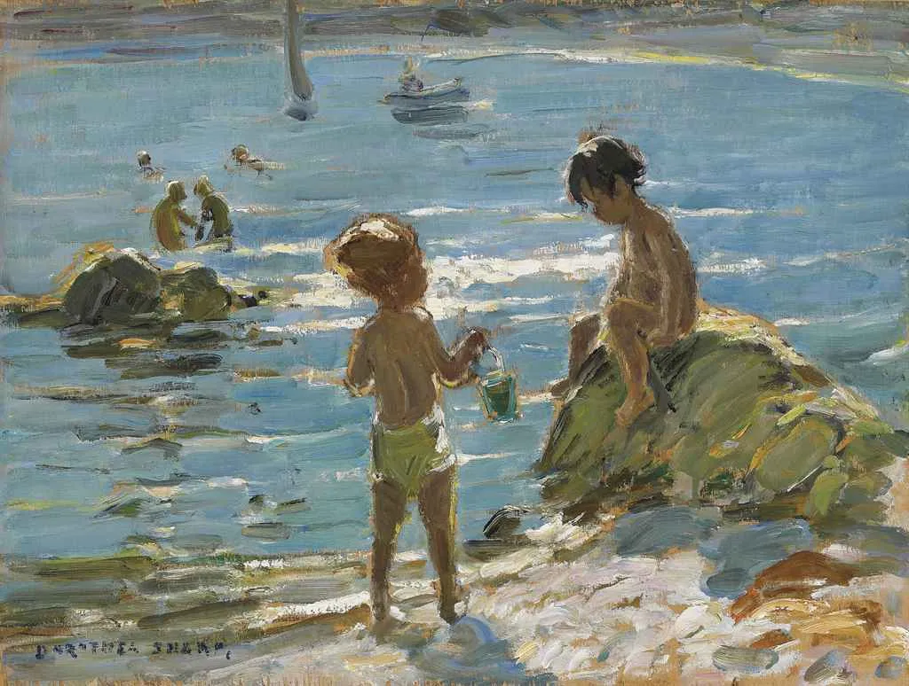

Dorothea Sharp

  

连叔：

  

您好呀！在老师兼朋友的推荐下，关注您好久了，很喜欢您在文章中表达的思想，今天来向您求助啦。

  

我是一名17岁的大一女同学，在大学生活中我常常感觉如鱼得水，有了更多的时间去做自己喜欢做的事儿，竞选班干部成功了，参加学院学校的各种比赛也都拿到了心仪的名次，总之，就是还不错～

  

最近，我遇到了一个很棒的男孩子，严格来说也不是最近遇到的，只是恰好走进了我眼中。

  

他是同一个学院不同专业的学霸，学习超级认真，上周我参加学院的演讲比赛，有一个视频的剪辑是他帮我剪的，为了表达感谢，我请他吃了零食。

  

然后，我们的联系就渐渐频繁了起来。他主动加了我的微信，知道我有演讲比赛后，告诉我他会往前面坐一点；他买了一只蜥蜴，问我怕不怕，我说不怎么常见到，就不怕，他说那送到了，让我摸一摸、喂喂食，说他的蜥蜴应该会喜欢我的；因为是同一个学院的，还是同一个辅导员，所以我们两个班的关系挺好，前几天一起举行了活动，我感觉他应该是喜欢我的（可能是我有点自想多了叭），活动结束了，我发现他的微信状态变成了“斯人若彩虹，遇上方知有”；前天我去教室写完作业之后看到他的QQ状态是“恋爱中……”；昨天晚上他分享了歌曲给我听，说是他最近循环播放的歌曲，巧的是，歌曲是关于喜欢和恋爱的，就感觉挺神奇的。

  

在此之前，我对他也就是欣赏其学霸光环，但是现在，我明确的感觉到自己喜欢他。

  

一旦开始喜欢一个人，我就会变得很敏感，很容易影响心情，他长时间不发消息时，我会觉得是不是我想多了，但一边又宽慰自己，他可能是不太好意思总是发消息叭；我是个很外向的人，但是自从意识到自己的心意之后，就有点不敢跟他打招呼之类的。

  

遇见一个喜欢的人挺不容易的，我不想随随便便说放弃，但是我也不知道怎样才能让我们的关系更进一步。多多少少因为成绩的原因，我还是有一些自卑的，我的成绩在我们班只能算是中间往上一点点，而他是隔壁班绩点排名第一/二的同学……

  

很迫切的希望能够得到连叔的回复，祝安好！

  

ZZ

  

* * *

  

ZZ：

  

你爱上他了，这就是开始恋爱足够理由了。成绩只是班级中上，这并非限制，把成绩提高就是了。这也是恋爱的好处之一，它让人有强烈的改善自己不足之处的动力。

  

他是不是喜欢你，恋爱的那种喜欢，这还不能确定。当你爱上一个人时，你容易过度解读他的信号，把鼓励与善意理解为爱。他是鼓励你的，对你有善意，这个基础也足够了，爱只能从善意与鼓励升华而成。你要做的，是多接触，常向他请教，请他吃东西，也吃他的东西。像他一样，分享歌曲。而分享讨论自己阅读过的书，能够引发更持久的、深刻的观念交流。但要注意，不要把分享变成讨好，刻意迎合他的喜好，分享的东西未必是你喜欢的、感动你的。这只会让你降格，即使得到了爱，这种小心翼翼的讨好将抑制你的发展，使你失去自我。

  

爱是你的真实足够有吸引力，知道这点，你就不会害怕，不会累。因为你不必伪装，不必迎合，不会违心顺从多数，也不会违心叛逆多数，你就是一个真实的你，真实的水平，真实的观点，包括真实的困惑。保持这份真心，一起学习，一起玩，一起进步，到了某一刻，你们的手有意无意握在一起，舍不得放开，持续时间长达10秒以上，那就可以确定，你们相爱了。

  

爱是需要学习的，大学阶段是学习爱的最好阶段。大学之外的世界，年纪更大的成年人，有一些欺骗、虚荣、利用、恶意将以爱的名义出现，在那个环境才开始恋爱，成本往往高得多。不是说大学没有这些不利因素，而是比例小得多，多是两个大一点的孩子一起开始探索爱。由于这个年龄段特有的不稳定与多变，这些大孩子的爱，可能来得快，去得也快，今天爱这个人，明天又爱上另一个人，难免也会尝到心碎的感觉。这并非不值得，因为如何分手，如何心碎后迅速坚强，更珍惜自己，而不是放弃自己，是爱最重要的技能。没这个技能，人就会陷入错误的感情难以自救。人这一生，总会遇上错的人，错的事，世界是发展的，有时对的人与事也可能变错，没有分手能力的人，最后总要被某种错绑架走的。所以，会恋爱的人，人生其他一切也会更好。

  

去恋爱吧，不要怕。如果成了，你学到了爱，两人一生还可以爱那么久，想想都幸福。如果不成，你也学到了爱，将来更不可能错过那个值得爱的人。

  

祝开心。

  

连岳

  

（我的邮箱：lianyue@xmlykd.com，来信请谨慎，只会在微信平台公开回复，并授权我用于图书汇编。）

[荐文](http://mp.weixin.qq.com/s?__biz=MjM5NDU0Mjk2MQ==&mid=2651637306&idx=1&sn=d41e5694cf498a18984561ff0ca749bc&chksm=bd7e42248a09cb3216f0316afdeac41892461225b0e8d96aea328e626a6412f8a070fabe13aa&scene=21#wechat_redirect)         [上文](http://mp.weixin.qq.com/s?__biz=MjM5NDU0Mjk2MQ==&mid=2651704803&idx=1&sn=82b0b20d6c26f0a9e6cb6d1df16428e0&chksm=bd7f49fd8a08c0eb2b07da99d6d6c526166b9d30f71970a64533d98c66460d43b2b17c6b972c&scene=21#wechat_redirect)
