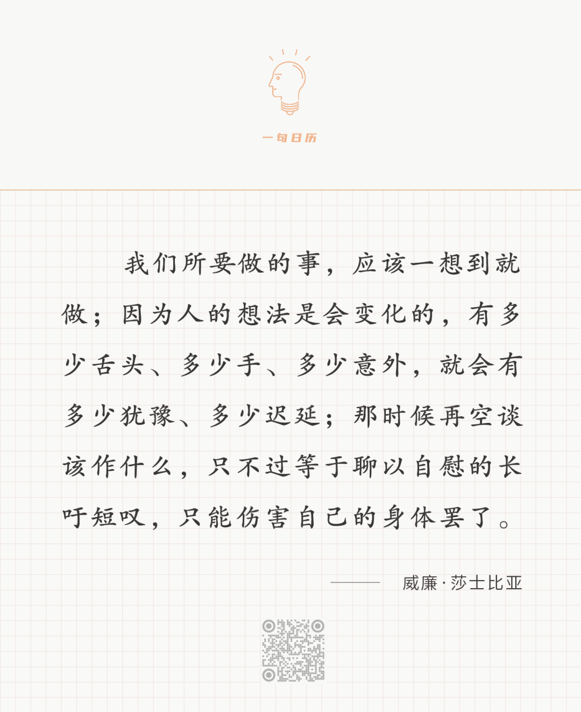

  

长按二维码可关注

  

一切想法都是猜想，有的正确，有的不正确。只有去做，去行动，才能甄别出正确的想法。这是什么？这就是人的进化。把正确的想法用行动转化为人成长的现实。

  

人类已经发展很久，他人做过无数尝试。我们在行动前，已经知道一些想法是正确的，只要我们去做，就一定能够进化。人的进化是加速的，所以，你的未来一定比现在好，人类的未来一定越来越好。这是生而为人的福利。

  

但你不做，就放弃了这福利。与动物无异。人与动物，人与人的差距，就在于有没有去实践正确的想法，有做的，做得多的人，自然领先于没做的，做得少的人。舜不过是深山里的一个野人，后来因德行掌管天下，靠的是什么？孟子说，就是靠他的行动力惊人，闻一善言，见一善行，若决江河，沛然莫之能御也。人有把善言善行内化的能力，没有大到江河奔涌之巨力，只不过日日滴灌的微力，也是前途不可限量。

  

今天是第172期“下周很重要”，按计划中的善言与善行去行动，去进化，更好地进化。

  

[荐文](http://mp.weixin.qq.com/s?__biz=MjM5NDU0Mjk2MQ==&mid=2651633621&idx=1&sn=391a0f3c513ddea2708e27325d612143&chksm=bd7e33cb8a09badda47207058a3e48ba471917439ab9505ce5fae513acf1100fa953f0fda36b&scene=21#wechat_redirect) [上文](http://mp.weixin.qq.com/s?__biz=MjM5NDU0Mjk2MQ==&mid=2651705359&idx=1&sn=157dcf27aef22c663598b1d43858ec48&chksm=bd7f54118a08dd0700b8377d69072007bc74aff9cbbb5efcd14715a9b522bc3ad8f7c0db9df4&scene=21#wechat_redirect)
