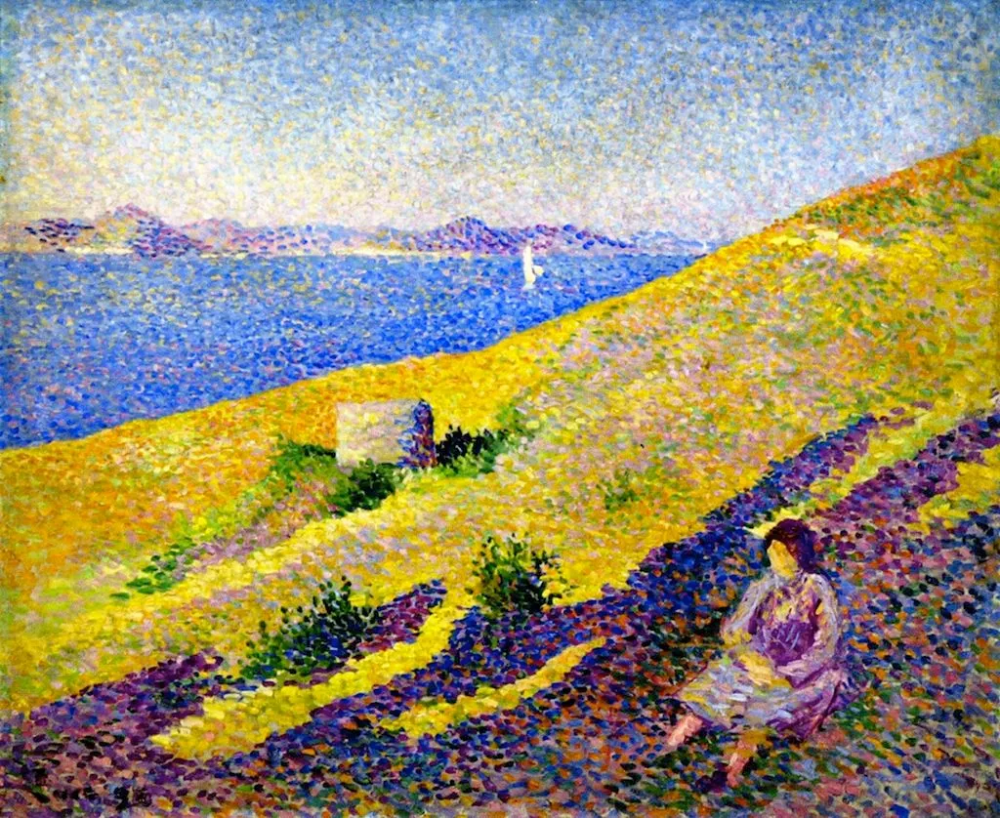
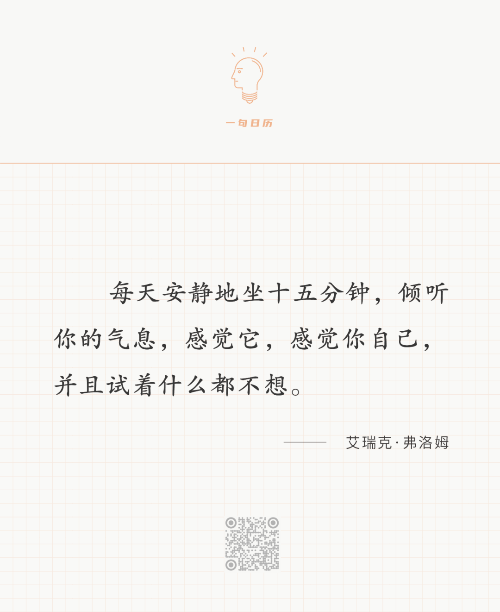

Maximilien Luce

  

长按二维码可关注  

  

念念相继，人在意识流之上随波逐流。  

  

意识流有好的，人在阅读、创作、完成有意义的工作时，会进入一种忘我的状态，即所谓的心流，不知疲惫，可能忘了吃饭，甚至奇迹般地忘了手机的存在。

  

但人天然具有的是坏意识流，典型体现就是无尽刷手机时产生的感觉：无聊、空虚、悔恨、但又身不由己，无法停止，就像掉入了大洪水。  

  

坏意识流无处不在。从坏意识流中逃生，是最基本的生存技能与智慧。这一步做到了，人才会有好意识流，在这条正确的河流之上，我们才可能到达幸福的、有意义的目的地。庆幸的是，方法很简单，当你意识到坏意识流涌动时，胁迫你时，静坐15分钟即可，当然，短一点，长一点，也行。这就是“无为而治”，15分钟后，大洪水退去，清静降临。

  

今天是第170期“下周很重要”，计划就是好意识流之上的航标。我们会偏航，也难免误入坏意识流，但有计划就一切不怕，我们随时可以纠正。

  

[荐文 ](http://mp.weixin.qq.com/s?__biz=MjM5NDU0Mjk2MQ==&mid=2651700184&idx=1&sn=579e50aa87b6a0e1461c8023c867e8cb&chksm=bd7f3fc68a08b6d083de903b9ac7600f92b44ee1e248980df9fba50f74d9fb41ade35e699c5f&scene=21#wechat_redirect) [上文](http://mp.weixin.qq.com/s?__biz=MjM5NDU0Mjk2MQ==&mid=2651702005&idx=1&sn=e5df948015f549c76e05345efebb9c48&chksm=bd7f46eb8a08cffd43e1337213f3fa1374875d1bc1a290b0504c27e5946afc11940c7f2ef726&scene=21#wechat_redirect)
