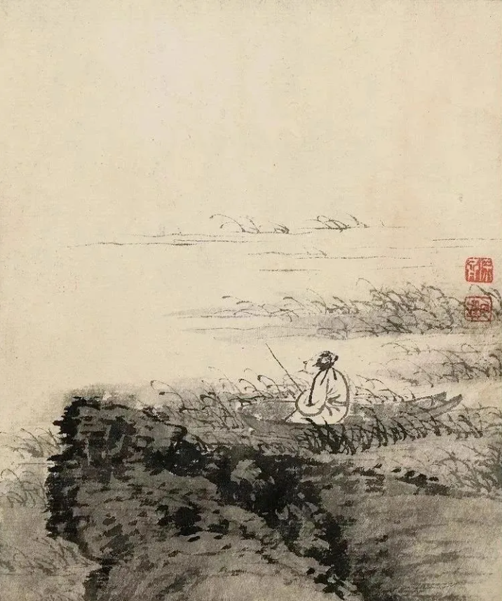

  

连叔您好！

  

感谢您每天一篇温暖的文字相伴，始终触及我的内心，给我以踏踏实实生活的感觉。

  

我是一个离异单亲爸爸，独自带娃两年有余（男孩，十岁，孩子听话且比较优秀），前段婚姻是对方出轨（没有直接证据，其实是我懒得去查），且对方缺乏基本的儿女心和家庭责任感，两年前在对方出现彻夜不归且连续多日不与孩子交流的情况下，感情破裂，在对方明确表示不愿意回头之后我起诉离婚，经过了一场焦头烂额的离婚官司之后，我和孩子继续走上良性发展的生活轨道。两年多来我努力工作，为了方便照顾孩子我辞职在家从事外语文字翻译工作，有灵活机动的时间可以支配多陪伴孩子，目前月收入万元上下（居住在江畔的一个三线城市），有房有车也略有存款（约三十万，为了今后孩子的教育成长在默默积累），空窗期那么久，毕竟我也还算年轻（刚40岁），虽然与孩子相互陪伴走下去也未尝不可，但内心还是希望能遇到适合自己的人生伴侣共度今生。

  

今年年初通过朋友介绍认识一个女子，在同一城市，相距半小时车程，情况与我相仿（事业单位工作，也是离异带一男孩，五岁，前夫出轨后她选择要孩子），我们相处了约三个月，双方情感在慢慢升温，互相也明确了各自的情况，双方一有空就见面，我也乐于陪她逛街看电影吃饭，毕竟爱情是需要努力经营的，关于男朋友该做的也都尽力做好（比如鲜花、衣饰和礼物），到了节假日两大两小也一起吃饭玩耍，我们交流顺畅，已有约定继续相处半年后再考虑结婚一起生活，今年五一小长假我们郊游了半天，本来约好来我家吃饭，后对方因故取消。目前碰到的感情问题是：

  

假期结束之后，对方忽然变得很冷漠，微信也不主动回复，总是说自己很忙（开会、开车、在家陪孩子不方便），早中晚我是我在致以问候，每日不断，但对方似乎无动于衷，与五一之前的表现大相径庭，冷漠却不提分手，让我很是费解，我先在自己身上找原因，目前没发现我出现了什么问题（我问过她，她也没说我做错过什么事情），那么是不是她还没有完全考虑好而变得迷茫，抑或是最严重的情况是她变了心，不提分手是而想默认分手？我的确是很喜欢她，相处的这段日子也是几年来最开心的时光（陪伴孩子获得的快乐除外），我只是想踏踏实实地继续自己的生活，如果是她背叛承诺，我主动提出分手也未尝不可，体体面面也是男人的一种担当。已经纠结了快一个多礼拜了，烦请指教，希望能得到您的回复，谢谢您！

  

祝工作顺利，一切安好！

  

爱足球爱电影爱生活的一枚蜀黍

  

* * *

  

爱足球爱电影爱生活的一枚蜀黍：

  

她显然是犹豫了。既然你喜欢她，那给她时间犹豫，第二次婚姻的好处就是更理性，更务实，返朴归真。

  

她冷了，你一头热，觉得不体面，然后有了怨恨，离开的最后决定，往往是情绪反应。人在第一次恋爱中，会犯这种错误，情绪容易战胜理性。当然，我也不建议你一头热，因为那样确实不体面，效果也不好，对方从厌烦走向轻视，也不利于她的理性。也不能为了挣回体面，报复性地更冷淡，那将演变成潜在的对抗。

  

此时的最佳策略是镜像反应，她热一点，你热一点，她冷一点，你也冷一点，像面镜子一样。既有体面，又不把她赶走。人比镜子灵活，不是完全的对等反应，可以比她更热一两度。这样的你，又有体面，又有温度，看似被动，实则主动。这种“有情而不累”的方法，只有内心强大的人才可掌握。人不能无情，无情就不是人。爱人、爱家、爱世界，这是人之真情。但爱又会引来固执、焦虑、恐惧，求不得的痛苦，这是爱的累，爱的连累。有情而不累是这样一态度与方法：我爱你，但你不接受我的爱，我也不会怎么样。不仅爱人是如此，爱理念、爱世界、爱一切美好都是如此。

  

你处理第一次不幸婚姻干脆利索，照顾儿子有条不紊，生活工作游刃有余，这样的大丈夫，何患无妻，理当有情而不累。

  

祝开心。

  

连岳

  

（我的邮箱：lianyue@xmlykd.com，来信请谨慎，只会在微信平台公开回复，并授权我用于图书汇编。）

[推荐 ](http://mp.weixin.qq.com/s?__biz=MjM5NDU0Mjk2MQ==&mid=2651628044&idx=1&sn=7a14bcf1b10d12f76dcb914aa9d76f64&chksm=bd7e26128a09af0445569d49e12df4ddce1dcca83691faa3d00000dd9390fd0f726910a8eb26&scene=21#wechat_redirect) [上文](http://mp.weixin.qq.com/s?__biz=MjM5NDU0Mjk2MQ==&mid=2651703779&idx=1&sn=80d435363dff68d4c2250f6fa32149a8&chksm=bd7f4dfd8a08c4eb72c804627f1b405f9ec2f77607164b82f386986337e167525c52599697fd&scene=21#wechat_redirect)
