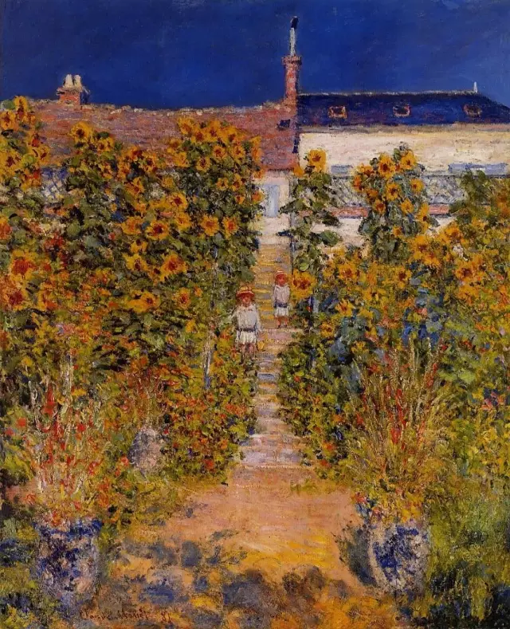

Claude Monet

  

连叔您好：

  

我是一位初二的学生，最近发生了一些事，让我感到有些难过与不知所措。

  

我从初一开始就对一位男生很欣赏，对他有很高的好感，到后来慢慢的演变为了喜欢，我们班是重点班，我和他都是班前十，我在年级排名十五左右，他处在年级前十，成绩波动大，有时四十多名，有时会进前五。

  

那个男生很优秀，是一个很幽默，阳光的人，但又好像有些腼腆，也有些自卑。初一时我的座位离他较近，在和他相处的过程中，我发现他是个很善良，温柔的人，他的温柔藏在小细节中，是温柔而不自知的人，他开玩笑有分寸感，有点傲，也有点不靠谱，他不是标准意义上的好学生，但有绝对正确的价值观，只是比较懒散，对自己并没有那么严格，这点我觉得他和我很像。因为他比较“狂”（在我看来应该是傲），所以没少挨老师训，在网课期间达到顶峰，我有留意到，在网课期间挨了几次严重的批评后，他的情绪也很低迷，好在后来调整回来了，成绩也上升了。

  

但我发现，他好像总是一副懒散的感觉，上课是认真听的，但对待作业并不是很认真，像是没尽全力努力一样，老师也是因为这个才一直把他拎出来训，不过也不至于训的太狠，毕竟他成绩还不错。期末考后我找他聊天，开玩笑说这次应该也超不过他了，（我一直都是把他当目标的）他说感觉没考好，不够努力，觉得自己不配他人的关心（大概是这个意思？），我便安慰他，后来就淡淡的结束聊天了。可是最终成绩出来，他却考的很好，我虽然也进步了，却没有他考的那么好。

  

对于这点，我为他高兴，也发现了自身存在的一些问题，我也是属于那种不够努力的人群，总是佛系对待，最后不上不下落得个中庸的水平，简而言之就是不够自律，关于这点，我也一直在改进，现在也找了新的目标：和我不同校的闺蜜一起考进八大。也在慢慢的变好。

  

但由于我喜欢那个男生，所以很多时候都会有控制不住的情感流露，我会忍不住去找他聊天，想和他发展成好朋友，但我实在是太明显，太明显了，在这个期末考过后，他好像终于确定了我是喜欢他的，于是就开始躲我。这很难以启齿，但事情确实是这样发展的，有时想找他问题目他也是已读不回，我又难受又抱歉，仔细想想，我真的太自私也太不理智了，不能把喜欢好好的藏住，还总想去接近他，关键是对他造成了影响，我真的感到很抱歉，但又有些委屈。

  

我在喜欢他的这个过程中，是有找过母亲和闺蜜倾诉的，母亲说，这个年纪有喜欢的人是很正常的，但藏在心里，默默的和他一起进步就好了，千万不能影响学习和心情，她说这是很美好的情感，以后我回头看的时候，是会感叹青春的美好的，我觉得母亲说的很有道理，我也是这么想的，但有时候我真的控制不住，总会去在意他（当然，成绩没有下滑，还进步了），也会因为他难过伤心，母亲对我因为他而变化的情绪很是无奈，她说她不希望自己的女儿因为任何一个人而受到伤害。我觉得现在这个年纪说那些情呀爱呀的还早，但我确确实实是被那个男生所吸引了，出现现在这个情况，我觉得很难过，对那个男生也很愧疚，我不应该影响他，也不应该把这些表露出来的。虽然我现在也不清楚他到底知不知道。

  

现在我打算好好的提升学习，不要去管那么多了，母亲说让我有个性一点，不要因为别人影响心情，我会努力这么做的，但我还是会把他当做目标，争取在初中生涯中超过他一次。

  

感谢连叔这么耐心的读到现在，以及，我真的感到很抱歉，我该怎么做？我还应该主动和他交流吗？我这样是否是对学习不够认真的表现呢？请问您给我一些建议嘛？谢谢您！

  

祝您和连太平安喜乐，万事顺意。

  

橘子

  

* * *

  

橘子：

  

你没做错什么，不必抱歉。最有力的证据就是你和那个男生的成绩都在进步。喜欢一个人，并向他表达自己的喜欢，这是对他的肯定，尤其是你这么优秀的女生。他在内心也是感谢的，只是年纪小，还不知道如何表达。同时既要感谢一个人，又要拒绝一个人，就是成年人也很难把握这个分寸，以他现在的能力，只能躲躲闪闪了，不必怪他。

  

喜欢一个人，但对方并不接受，当然伤心。这是人正常的情绪反应，一生都是如此。只要没有引发两种严重后果，这伤心反而可以转化成动力，就像你决定初中一定要在成绩上超他一次。

  

这两种严重后果是什么？一是自我否定，别人不接受我的喜欢，那一定是我不好，然后自怨自艾，自暴自弃，证明自己足够坏；二是无限纠缠，缠到自己不要尊严，缠到他以为你只可能喜欢他一个人，对你又是不屑，又是当成自己的奴隶，予取予求，这样，不仅自己毁了，也用纵容把对方毁了。所以，被拒绝后最好的态度就是保持正常，不卑不亢，既不惭愧、抱歉，似乎低他一等，也不更亲密，似乎要讨好他，更不要因爱生恨，变成攻击他，否定他。

  

你的自我剖析，单纯、透明、热烈，像阳光一样，这种真诚是极有力量的品质，在人的成长中发挥关键的作用。子思说，至诚如神。真诚在做人做事做学问上有着神一样的力量。人变得软弱、无能、犯错误，那往往就是失去真诚，从而失去了对自己对他人对世界的真实判断。

  

看到你和她倾诉过这次感情，我就知道，在给你真诚品质上，你妈妈功不可没。或许你会说，好像也不是每次都能解决问题，妈妈也不是都能说服我，有时甚至还能看到妈妈不知所措，力不从心。最重要的价值不是这点，而是母女的沟通渠道是通畅的，你可以和她述说一切，你不害怕，不隐藏，不欺骗，一次又一次，成千上万次的交流，就把你的真诚养大了，养强了。

  

有些问题暂时没有答案，有些问题没有标准答案，有些问题需要时间积累才有答案，有时候交流难免还会有情绪，甚至不开心，但一定要记住，你和妈妈的真诚交流本身就在长力量。你青春期到了，有时情绪起伏会比较大，有时生出逆反，这容易关闭与妈妈的沟通，或令沟通的质量变低，那都是不利于成长的。越是碰到难题，越要记住，与妈妈真诚沟通本身就是在解决问题，尤其是你的妈妈还是一个负责任的、高明的教育者、引导者，不要浪费这么大的资源。

  

替我向你妈妈问好。

  

祝开心。

  

连岳

  

（我的邮箱：lianyue@xmlykd.com，来信请谨慎，只会在微信平台公开回复，并授权我用于图书汇编。）

荐文：[致孩子](http://mp.weixin.qq.com/s?__biz=MjM5NDU0Mjk2MQ==&mid=2651628113&idx=1&sn=8d1afb849fe9816e62a9e59010d72150&chksm=bd7e264f8a09af59f0715a84c252a733f8720fb8078b945c50550b3d81b1500797521730e5c6&scene=21#wechat_redirect)  

上文：[好工作的标准](http://mp.weixin.qq.com/s?__biz=MjM5NDU0Mjk2MQ==&mid=2651707442&idx=1&sn=ddde5b3b2f0e950352cd66a644f39627&chksm=bd7f5c2c8a08d53ad881050cc5e26369b32d1d6114b3d175b58735579a49951cefbd7a65dd27&scene=21#wechat_redirect)
