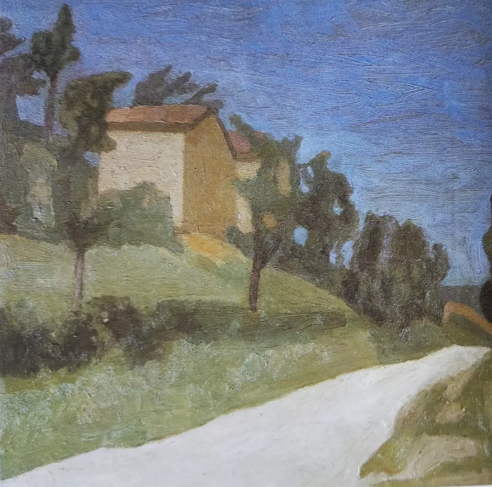

Giorgio Morandi

  

尊敬的连叔，

  

您好！

  

展信佳，祝您和连太以及所有的读者朋友身体健康、事事如意！

  

给您写信是有事相求，求您指点：我该如何修自己的心?

  

我是80后，在旁人眼里我很幸福：在深圳有房有车、儿女双全、先生对我很好、孩子可爱……我却经常不开心，想要离开这个家，奔四的年龄，心智还很不成熟。

  

我上学时成绩比较好，因为觉得父母赚钱辛苦想早一点出来工作所以选择了读中专。毕业后在熟人介绍下做过车间流水线工人、文员、采购，感谢老板娘赏识手把手教我，在我离职时的职位是经理助理兼外贸跟单部组长。离职的原因是26岁相亲认识了一位男士，他在深圳我在东莞，结婚后我到了他所在的城市。现在回想起来，可能也因为自己的工作压力大，为逃离工作找了一个借口。

  

到深圳后，因为和之前职位有比较所以找工作一直不太顺利，前后找的几份工作时间都不太长。接着怀孕生子，一胎、二胎，我成了带两个孩子的全职妈妈（孩子爸爸下班也会帮忙，但孩子和他不太亲近）。虽然这是我的自愿选择，但总有不甘，产后抑郁让我一度对生活绝望，经常会抓狂和不想活了（没有到医院确诊和治疗），有时候站在窗边很想跳下去，终究缺乏勇气：我走了，我的父母和孩子怎么办？

  

随着孩子渐渐长大上学，我参加了自考（今年可以领取本科毕业证），找了一份兼职的工作，也经常参加孩子学校义工活动和社区的活动，但我内心还是很空虚，自考本科文凭没有太多用处，在工作中时常自卑，感觉和社会脱节。另外我个人喜欢安静和干净的环境、注重细节，这对先生和孩子来说要求有些高，所以生气时我会说一个人搬出去住这类的气话；他们对我做的饭菜挑三拣四或掉饭菜时我就不想做饭给他们吃…… 我都不知道自己这是怎么了，缺乏耐心和爱心。

  

我一方面害怕我这样的性格对孩子造成影响，另一方面也觉得自己苦。我现在开始尝试吃素和学习佛学，可能时间不长、悟性不够，所以帮助不大，仔细想想也不知道自己究竟要什么，请连叔骂醒我，万分感谢。

  

雨苗

  

* * *

  

雨苗：

  

在你心中，有几个更好的人生：没读中专的话，读了大学，现在可能是学者、教授、专家。没有离开公司的话，现在可能处高职，拿高薪，甚至成了企业家。不是生孩子、照顾家庭的话，一定能在深圳找到合适的工作。

  

你好强、聪明，确实能够实现这些“可能”的人生，这就让你心里不甘愿。不甘愿，则生出委屈、不快乐、一切颠倒痛苦。有许多人幸福的条件具备，他们就是不幸福，源头就在于有一颗不甘愿的心。幸福是心学，心不甘愿，世界给他再多，也不会幸福；心甘愿，得到少也会幸福，一箪食，一瓢饮，在陋巷，颜回也快乐。

  

有些人因为奸诈、懒惰、虚荣、不负责任，人生越活越凄凉，他们应该后悔自己当初的选择。可你不是，你的每一步选择都是因为爱。因为爱父母，选择早一点工作；因为爱男友，选择到深圳；因为爱家庭，选择生孩子、照顾他们。被爱引导的路，就是最合适你的路。这就是佛说的，每个人都有自己的成佛之路。你学习佛学，这不错，佛学是最好的心理学，也要求人甘愿走正道，要舍身求法，甚至得为众生入地狱。佛学学通了，人是宽容的，平等的，不会用吃素、念佛等形式贬低别人，抬高自己。《心经》说得了大智慧的人，心无挂碍。无挂碍故，无有恐怖。你心不再挂碍那些“可能”的另外人生，不再挂碍“没用的”自考本科，不再挂碍一定要在家庭之外证明自己，你就会发现，没了自卑，没了不甘愿，当下的环境，就是自己悟道的环境。

  

没多少女性愿意当全职家庭主妇，但许多最后却得当。这种不甘愿的情绪很容易被挑拨、被放大、被恶化，一些判断力低的人就走向仇恨异性、仇恨爱情、仇恨家庭、仇恨孩子。甚至见了别人幸福就两眼冒火，非说点仇恨语言不可。不幸成为这样的人，那是徒有人形，精神已堕为畜生和饿鬼。

  

一个人为了爱成为全职家庭主妇（或主夫），不可怜，不可怕，只不过家庭是你的道场。你有最好的受众——你的孩子，他们天生爱你，信任你，根本不在乎你的文凭。你让他们成为幸福的人，高尚的人，造福世界的人，这怎么只是做点家务呢？这是佛在说法，佛在做功。佛有万千形象，在你家就有三种，一是认真工作的老公，一是努力成长的孩子，一是家庭主妇的你。

  

祝开心。

  

连岳

  

（我的邮箱：lianyue@xmlykd.com，来信请谨慎，只会在微信平台公开回复，并授权我用于图书汇编。）

荐文：[道理虽好，孩子必须过他们的一生](http://mp.weixin.qq.com/s?__biz=MjM5NDU0Mjk2MQ==&mid=2651637134&idx=1&sn=cd4edab7c20a41963fb5c0b826f163df&chksm=bd7e41908a09c8865a83a211307257674c70a7d8f36974bafc7bb076582ce1821e64395fedcb&scene=21#wechat_redirect)  

上文：[去进化，更好地进化](http://mp.weixin.qq.com/s?__biz=MjM5NDU0Mjk2MQ==&mid=2651705610&idx=1&sn=7354758d65e5e0c2aac471180fecdff2&chksm=bd7f55148a08dc022d9a08b8182805e412e0d949488286641e5b20f7a0af954125a8c284f28d&scene=21#wechat_redirect)
