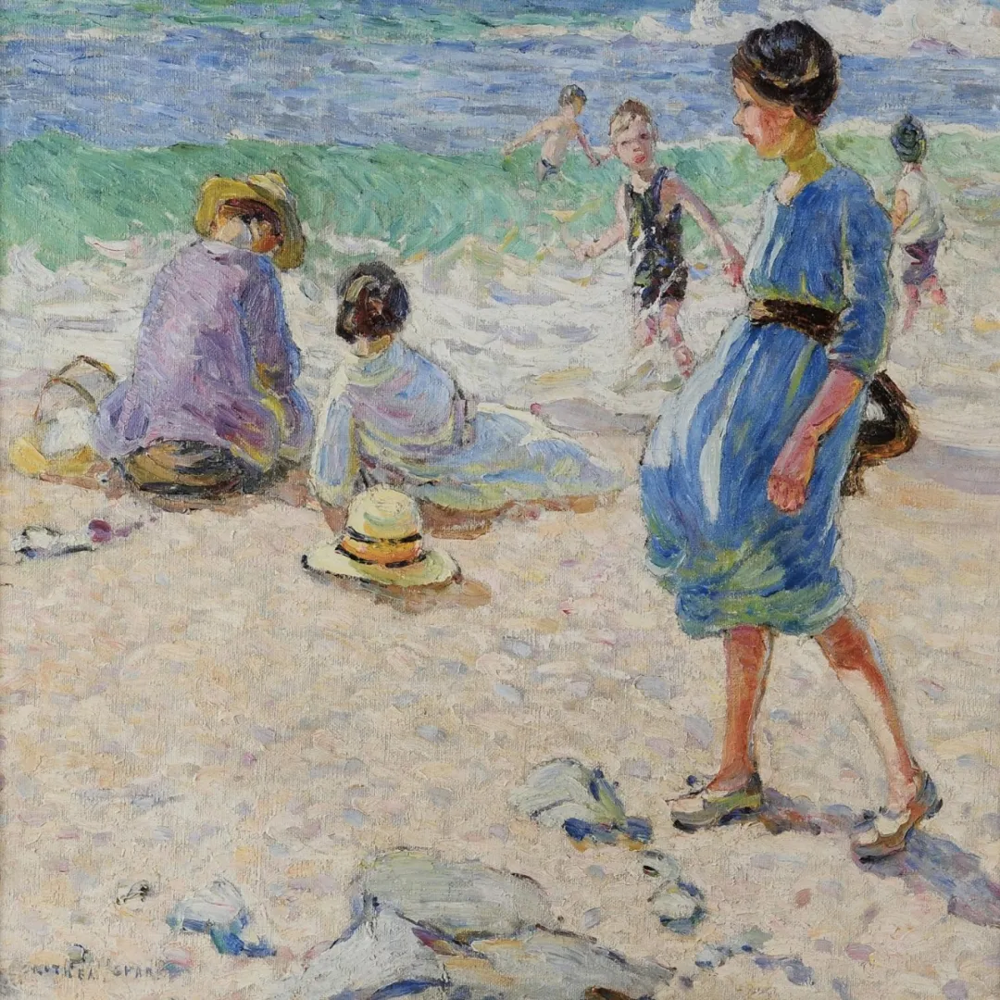

Dorothea Sharp

  

长按二维码可关注

  

人想做大事是对的。人想影响一个国家，影响全人类也是对的。整个人类文明，也受益于做成了这种大事的人。

  

但奇怪的是，谁也不会拿一件大事给你做，你做的总是小事。你也不可能面对全人类，你总是面对一个、或几个具体的人。你只想做大事，那就无事可做。你只想影响全人类，那就无人可影响。倒回来想，这说明小事就是大事，无法影响一个人，也就无法影响全人类。我们总是身处小事，而这些小事蕴含着大事。大事的基因藏在小事里。

  

吃饭睡觉，上班下班，读书思考，人每天做的不外乎这些小事。没想通时，很容易觉得它们枯燥乏味，甚至“压迫”人性，想找更激动人心的生活。想通了，你觉得它们全是韵律美，让一个人的成长有了稳定的环境。吃好饭，上好班，读好书，睡好觉，及至让一家人吃好饭，上好班（学），读好书，睡好觉，你的事就逐渐做大了。你有本事让一国人吃好饭，上好班，读好书，睡好觉，你就是古往今来最伟大的人。

  

今天是第171期“下周很重要”，别小瞧你写计划做的那些小事，天天做好，就是大事。

  

[推荐](http://mp.weixin.qq.com/s?__biz=MjM5NDU0Mjk2MQ==&mid=2651633452&idx=1&sn=0788830a5066142ca7d42f085a1c88db&chksm=bd7e33328a09ba248dbf2ef206ec7fedfa0f9d67c83379d3c6c1f19b8148501f2e57c6424f09&scene=21#wechat_redirect) [上文](http://mp.weixin.qq.com/s?__biz=MjM5NDU0Mjk2MQ==&mid=2651703520&idx=1&sn=2827a9fcd39dc62e1db92258ac040b9b&chksm=bd7f4cfe8a08c5e8b3067a902ab790e0b370290d928da3ef7e4ce0039fee52b358e77d1bcff2&scene=21#wechat_redirect)
