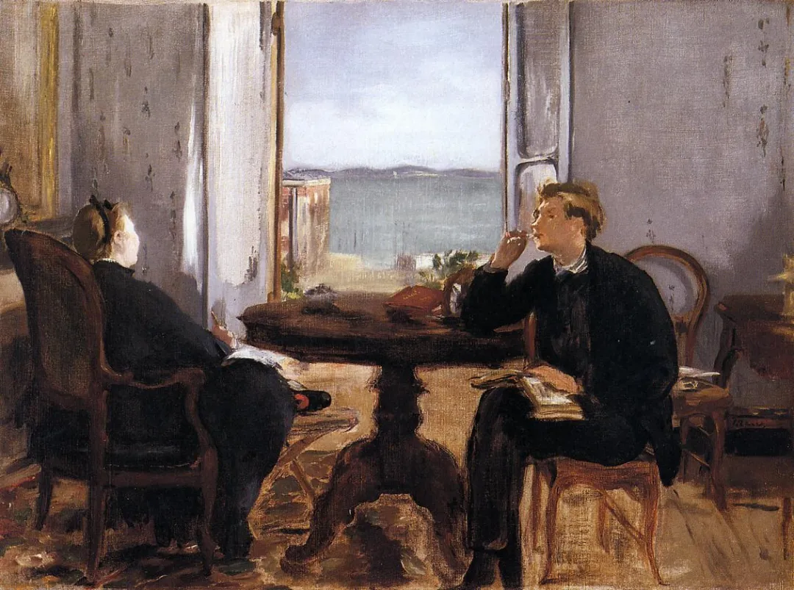

Édouard Manet

  

连叔，

  

我突然觉得活着好累啊，第一次觉得这么累，我丧失了活下去的信念。因父母很早就相继离世，心疼妹妹年纪小，以前没想过死，因为我有妹妹要养，我得努力活下去。她今年21岁了，2年以后大学毕业了，她也要开始工作了，想想时间过得真快呀。好像眨眼一瞬间，她就长大了，感谢父母给了我一个妹妹，人生艰难时也有勇气继续走下去。她长大了，我也算对父母有了交代，她结婚的钱也攒够了，不至于男方家里看不起。今年再攒一攒，给她老家买套小点的房子，万一，我是说万一，如果她婚后过得不幸福也有退路，如果婚姻美满幸福是最好了。她性格开朗乐观，人长得很漂亮，比我聪明，性格也好，我相信她一定可以过得很幸福。妈妈以前跟爸爸生气的时候总说，我真得活够了，等两个女儿长大了，我就安安静静地死。没想到竟会应验到我身上，也许不久的将来，我某天就会安安静静地躺在父母坟前离开。只是现在我还不能死，买房的钱还差一点儿，我真的很想很想撒手不管，什么都不管，我不想要继续下去了，我真的累了。我没什么大本事，真的感谢我的雇主没嫌弃我学历低给了我工作，感激工作中所有给予过我帮助的人。我没有朋友，好在这些年把钱都攒下来了，妹妹也平平安安健健康康的长大了。如果哪一天我完成任务真的走了，这就当作我的遗书吧。不想单独写给妹妹，对她太残忍。希望她这一生都可以健康平安，不用为钱发愁，爱情圆满。好像这一辈子都对物质匮乏感到深深的恐惧，我不是科学家也没有对世界有什么贡献，这副身躯可以捐，我已经咨询好了器官捐献，希望我还能有点用吧。

  

祝连叔身体康健，万事顺遂～

  

夏天

  

夏天：

  

不是科学家，不是大人物，也可以对世界有贡献。在我看来，你对世界就有贡献。把妹妹养得这么好，怎么不是贡献？人活着，往往不是靠远在天边的大人物的滋养，而在靠像你一样的身边的好人激励。评价一个人的最重要的标准，就是看他是否对家人负责，是否对家人温柔。这条做好了，就是有大本事的人。这样的人，不仅经营好了自己的家庭，还影响着所有接触过他的人。中国的传统价值把“齐家”放在人成长的一个关键位置，是有道理的，齐家做得好，就是之前的修身做得好，之后甚至可治国。

  

你和妹妹两个人组成的家庭，经营好，难度很大，目前为止，却没有难倒你们，你这个家长当得漂亮。妹妹将来的幸福，她的开朗乐观，她的良好教育，她的聪明漂亮，固然是重要因素，更重要的是你这个姐姐的保护与指引。娘家是这样的姐姐坐镇，天下没有任何婆家敢小瞧她，也只有好人家才配得上你们，这点可以极其自信，不好的人家我们不要。

  

这就是说，你对妹妹的责任，并不是在她大学毕业，给她在老家买了房子就完成了。在那个时候你自杀了，那就像你请她吃饭，她刚坐上桌子，看得欢喜，你说，我烹饪的任务已经完成，一把掀了桌子，对她是更大的折磨与摧毁。你死在父母的坟前，或死在任何地方，谁料理你的后事？不就是那个痛苦万分，茫然失措的妹妹吗？从此后，她或许就开心不起来了，甚至会模仿你的行为。

  

妹妹大学毕业时，你们刚开始享受人生的大餐，你最辛苦的阶段结束，可以进入一个比较放松的阶段，摘下围裙，坐下来和妹妹边吃边聊。你是已经在社会竞争中立足的人，其他人不是无缘无故对你好的，是你的责任感很有价值，这比文凭重要多了，有文凭没有责任感的人，一文不值。按你现在的路径走下去，物质不会匮乏，富足也在前面。你成为幸福的姐姐，这更是责任，作为妹妹一生的保护神，这才能给她无尽的依靠与能量。这样的你们，才能成为自己孩子的幸福源泉。

  

你也要对连叔负责啊。通过这次邮件，我们的人生就有联系，命运开始交错，任何一个人好，另外一个人都会更好，我们都要好好努力，万事顺遂。

  

祝开心。

  

连岳

  

（我的邮箱：lianyue@xmlykd.com，来信请谨慎，只会在微信平台公开回复，并授权我用于图书汇编。）

[荐文 ](http://mp.weixin.qq.com/s?__biz=MjM5NDU0Mjk2MQ==&mid=2651642780&idx=2&sn=ea14ca3f8ceeb84add553bbbfa301f4f&chksm=bd7e5f828a09d694ff0864711df23cf5932657d8719badc60acfa179180dd5f2958f8f6db737&scene=21#wechat_redirect) [上文](http://mp.weixin.qq.com/s?__biz=MjM5NDU0Mjk2MQ==&mid=2651702443&idx=1&sn=37bcf4bc5a0e7fc3b5e0909c26c7e917&chksm=bd7f40b58a08c9a35b36a32734b382574b99ae47304ff59f7ff38761f74533b42c302049c5b0&scene=21#wechat_redirect)
