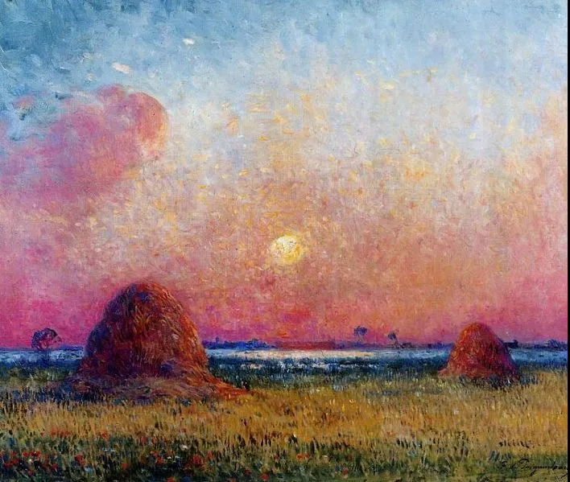

Ferdinand Loyen Du Puigaudeau

  

连岳老师：

  

您好。

  

最近一个亲戚家的孩子考上广州天河区的教师编制了。在毕业前拿到了铁饭碗。我很开心，也很羡慕。

  

然后我又觉得自己很差劲。考研考公全都失败了。因家境一般，要养活自己，就去工作了，在普通的公司从事普通的岗位。

  

现在毕业10年我的大学室友凭一己之力拉全家脱贫，前几年还在深圳买了两套房子。而我和我老公智商情商能力运气都很一般，靠着省吃俭用，才在小县城买了两套房子。和我同学比起来真是人与狗的差距。

  

我发现我家小孩是亲生的，和我一样普通。并没有其他家长晒出来的有某一方面的天赋特长。

  

连岳老师，您的读者群里面有资产过亿的创一代，有百十套房子的拆二代，有埋头拉车的励志楷模，还有我这样资质平庸的底层劳动者。真是惭愧 。  

  

祝您和您的团队工作顺利，健康幸福。 

  

 一棵不怎么样的柚子树

  

* * *

  

 一棵不怎么样的柚子树：

  

很多人瞧不上“普通公司的普通岗位”，这是职业规划中最误人的。年轻人开始找第一份工作，如果带着我非要到“不普通”的公司，坐个“不普通”的岗位，那就意味着失业。

  

绝大多数公司是普通公司，这个社会是靠它们支撑起来的。而更绝大多数岗位是普通岗位，公司的特殊岗位只有一个，就是老板。很多人要找一个“不可替代”的工作，这也是错的，什么人都是可以替代的，老板做不好，市场也会把他淘汰掉。

  

一个人在一个普通岗位上，工作内容甚至只是端茶递水，跑腿打杂，以为就没学问了？学问大得很。这些看起来人人会做的工作，做得好，做得稳，才难替代。从管理者的角度看，最不喜欢的员工就是那些本职工作永远粗糙，却老认为自己能做大事，他们的职位才是最不安全的。

  

能用一份普通工作养家，这是值得自豪的成就。瞧不上普通工作，一般就连带着瞧不上普通人。这种分别心、攀比心一起，再无安宁，见比自己好的人，羡慕是轻的，再重一点，就是嫉妒、仇恨；见比自己差的人，滥施同情是轻的，再重一点，就是傲慢、自大。往哪个方向摇摆，你都错了。你也不会对自己好，因为你嫌自己普通，你也看不惯普通的家人，总以为他们应该更有出息。

  

心错了，生活就会错。你有一亿，反应是一样的，与十亿的人比，是嫉妒仇恨，与千万的人比，是傲慢自大。你考上了铁饭碗，与升迁快、受重用的人比，是嫉妒仇恨，与考不上的人比，是傲慢自大。

  

普通人的幸福生活，最重要是把心放好了。再普通的人，对你的伴侣、你的父母、你的孩子来说，你都是独一无二的，对他们负责，让他们看见你就笑，想到你就觉得踏实，这就是幸福，这才是不可替代的。这点你怎么会做不到？可能你做到了，却不知道它的美。

  

心好，尽力，这样的人生是幸福的。大富大贵，除了个人努力，还要看天意，没有，你也是幸福的。

  

祝开心。

  

连岳

  

（我的邮箱：lianyue@xmlykd.com，来信请谨慎，只会在微信平台公开回复，并授权我用于图书汇编。）

[荐文](http://mp.weixin.qq.com/s?__biz=MjM5NDU0Mjk2MQ==&mid=2651645764&idx=1&sn=a0de5f4558466e57d7bec4f5aa75a80b&chksm=bd7e635a8a09ea4c7b5a962ee4140ca0d978202d9276f859cfa5a9dffea8bb792d9f2e128cc3&scene=21#wechat_redirect) [上文](http://mp.weixin.qq.com/s?__biz=MjM5NDU0Mjk2MQ==&mid=2651702726&idx=1&sn=f5c6718a10edf957573e67d21d611e85&chksm=bd7f41d88a08c8cee2aad7990007b4909ada6cd2e6909ddcc3759e32f79ec3e788996b1dbdb4&scene=21#wechat_redirect)
