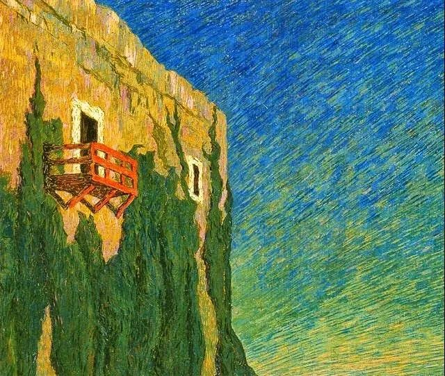

Benvenuto Benvenuti

  

连岳老师您好：

  

早几年的时候开始关注您的公众号，一直非常欣赏您正能量的思想，以及不刻意讨好读者但又非常真诚的态度，而且在看待房产投资这件事情上，我与您保有高度一致的肯定观点。

  

最近一直看您给读者解惑，也想跟您聊聊自己的困惑，可能不是什么火急火燎的人生大事，却一直隐隐约约在困扰我，希望连老师能指点迷津。

  

先说说自己的基本情况，身在一线城市，四口之家，两个孩子，我和先生同在金融行业，工作稳定但行业竞争也大。得益于上一辈和自己对于房产投资的执着，通过两代人的努力，在魔都攒下了N套房产，市值能有个几千万，虽然比不上真正的高资产家庭，在魔都应该也能算个小中产了。

  

在外人看来，有房有车，家庭和睦，工作稳定，已经是比较理想的状态了。但我心中始终对目前的工作状态不太满意，首先是不喜欢这个行业，也不擅长精心计算，虎狼竞争，所以一直处于混一天是一天的状态。我想辞职，去做一些我真正喜欢的事情，但是可能真的赚不了什么钱。

  

因为倒腾房子，身上背着几百万的房贷，现金流也不是特别充裕，这份工作虽然收入算不上很高，但公积金什么的都交得比较足，很大程度地缓解了我的房贷压力。

  

如果辞职了，我的那份收入和公积金就没有了，整个家庭的现金流压力就大了，我在考虑要不要卖掉一些房子，还掉贷款，然后去做自己喜欢做的事情。但是这个想法，我有些负罪感，我的父辈为我积攒下来的房产，原封不动地给了我，让我现在的生活少了很多压力，多了很多可能性，我非常感激他们。我是不是应该同样为我的下一代这样考虑？全力为他们攒下足够多的资产，为他们将来的生活打好基础？我的任性会不会给下一代带来影响？

  

有时候我想自私一点，为了自己的生活任性一下，又时不时地被下一代的负担所困扰。

  

连老师，人到中年，还有资格为了自己自私任性一回吗？盼复！ 

  

一个犹豫的人

  

* * *

  

一个犹豫的人：

  

如果把任性理解为不管不顾，让别人支付自己冒险的成本，那么，任何一个人，是穷是富，都没有任性的资格。

  

如果任性理解为符合自己当下的最优解决方案，那么，任何一个人，都有这个权利。资产多的的人，这种权利还大一些。毕竟钱可以解决很多问题。人努力挣钱，不就是为了选择多一点吗？所以，在这个层面，你可以任性。只要和丈夫达成一致就行。然后按你的计划出售一部分房产，还掉债务，去做你想做的、可能是低收入、无收入的工作。要反复确认的一点是，你保有的资产仍然可以让一家人在接下来的日子里体面生活，即使你丈夫以后也像你一样任性。

  

每一代人都只想着把钱留后下一代人，这种做法在逻辑上不成立的，总会有某一代人没出息，不成器，积累的财产全传给他，刚好败光，那就是大悲剧。君子之泽，五世而斩。五世还是厉害的，过不了当世的有得是，太多二世一看也是败家子。财富是大能量，不会只留在某个家族中，它总在流向更配得上的人。

  

如果我们挣钱的时候，目光能远一点，远到五代之后，那财富就不会伤我们。控制财富能量的标准是什么？我们的祖先说得很好了，《大学》里说：仁者以财发身，不仁者以身发财。财只能让身更好。身是什么？包括你的肉和灵，肉要更健康，灵要更高尚，这个财就是好的。不义之财刚好相反，成本是肉与灵都腐败。

  

你想做一些喜欢的、收入不高的事，这属于以财发身。一是自己的身体可以放松（当然，前提不是家人更累）；二是许多事确实是社会需要，但无钱可挣，这些事让穷人去做是不道德的，只能富人去做，相当于回馈社会。

  

财富其实是责任的另一种体现，对自己，对家人，对社会的责任，财富越多，责任越大，不仅要用它发自己的身，还要发其他人的身。知道这点，那一个人是忙是闲，是投资是消费，总是不会犯错的。  

  

祝开心。

  

连岳

  

（我的邮箱：lianyue@xmlykd.com，来信请谨慎，只会在微信平台公开回复，并授权我用于图书汇编。）

[荐文](http://mp.weixin.qq.com/s?__biz=MjM5NDU0Mjk2MQ==&mid=2651638068&idx=1&sn=ea0d37e928a0300ef85d0ca1cc70ca18&chksm=bd7e4d2a8a09c43c09ebce22e5694eb2acb7b065ca7ef6b076f7ad79af5380d0e5617de39690&scene=21#wechat_redirect) [上文](http://mp.weixin.qq.com/s?__biz=MjM5NDU0Mjk2MQ==&mid=2651702982&idx=1&sn=fdec301da1aadea2dd1b42cca20d0fa7&chksm=bd7f42d88a08cbce6703b07ded804417e81216bae504a6110783ea64a416784fefd118d1958d&scene=21#wechat_redirect)
