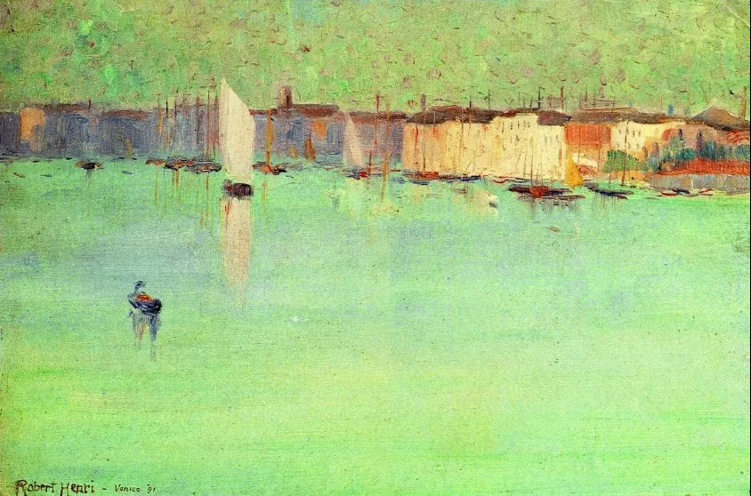

Robert Henri

  

尊敬的连叔，

  

你好，最近在梳理您的读者来信，希望能给自己指引一个方向。冒昧来信，是因为怀揣着一份侥幸，如果您有空，请帮我看看病吧。

  

是关于结婚和金钱观的。我男友的情况：性格开朗乐观，独生子，艺术一本毕业，外地人，目前在我所在的二线省会城市当音乐老师，学校很好，以后可以子女上学，他每月4千多的工资，工作6年没有存款，热爱交际。前年底他父母首付买房，贷款30年，他父母现在帮还。我的情况：性格偏执悲观，极端吝啬，不舍得花钱。挺善良的，工作也算认真，喜欢看书，不善交际。以前在北京读了大学和硕士，认识男友且母亲做了一次手术后，放弃北京高校工作，回到家乡，幸运的是找到了本专业的工作，而且比北京工资高得多，也是老师，在大学工作，上课挺累，但是是我热爱的。因为不讲究吃饭和穿衣，毕业三年攒了30几万。

  

我的第一个疑问是：我是不是金钱观有问题？我总想着省一点儿，不必要的不想花钱，出去吃饭几十块的小馆子挺好，衣服以前的也没坏，不想买新的。不是我忍着，我是真的没什么吃穿的欲望，而且觉得东西多了是一种累赘。但是给家里购置东西，带母亲检查身体我非常舍得，甚至觉得，挣钱就是为了在遇到大事的时候不害怕。这一点可能是受到母亲的影响吧，她总是想给家里人买东西，自己舍不得。但是我男友的家庭不这样，他家父母比我家条件好一点儿，这么多年很讲究享受，我男友学乐器、考研、找工作都花了家里很多钱，以至于他现在认识我以后才觉得应该省一点儿，用他朋友的话说，他没缺过钱，自然不知道省钱。这就让我很担心，我总是焦虑，以后没钱生活怎么办，我的工资养家，还要面临父母养老和孩子教育，我希望能有一个厚实的肩膀依靠啊，我这个人对自己和别人要求都高，我希望我的男人比我强，让我仰望，如果他做不到，我控制不住自己的脾气，不尊重他，他会很难受的。

  

这就是第二个问题，我到底应该和他结婚吗？我们会幸福吗？他对我很好，一块钱都会想给我花，我又心疼他赚钱不多，所以总是出现两个人抢着付账的情况。去年疫情期间，他被怀疑得了白血病，我当时想的是砸锅卖铁我也要给他治病，好在是虚惊。我以前觉得我这么一个悲观的人，遇到这么阳光的他，包容我，照耀我，我可真是幸运，说到这，真想哭。可是连叔，人要面对生活，普通的日子需要钱啊，一说到这里，我男友就说我太消极，别人挣几千块钱的也很幸福，没人饿死，攒很多钱，也带不走。可我想的是，如果手头不攒着一点儿，我心里没底啊，而且我现在还喜欢攀比了呢，看到身边的人找的对象不错，我挺灰心的，明知道这样不对，还控制不住。

  

摆在我面前的，如果要继续结婚，那么我就得调节心态，改变别人不太可能，我先改变自己吧。如果放弃，我担心遇不到这么善良真诚的人了，真遗憾。哈哈，爬了很多山，发现最难越过的还是生活，以及我这个有些病态的心理啊，请您指教，也请您点醒，像我这种人，怎么才能幸福呢？

  

纠结迷茫的小鹿

  

* * *

  

纠结迷茫的小鹿：

  

你不是吝啬。为了照顾妈妈，放弃北京高校工作的人，怎么是吝啬？男友生病，你准备花大钱的人，怎么是吝啬？吝啬的人肯定不会抢着付账。你是一个慷慨的人。

  

生活节俭，善于攒钱，这不是吝啬。这后面有自律，有智慧。这也是中国人的传统智慧。有那么一段时间，很多人怀疑这个智慧，超前消费，寅吃卯粮。这带来一系列的问题，靠债务生存的年轻人不仅经济上是脆弱的，也必然导致责任感缺失，短期思维盛行，然后是智商的下降，陷入各种各样的骗局，一家出这样的一个人，基本就毁了一半。如果两三代人普遍这么生存，这个国家也就折腾掉了。所以，你是代表着未来，你是必然复兴的主流。没错，更没病。存钱固然不能解决所有问题，但不存钱所有问题都能解决你。

  

大多数人在你这个年纪，达不到你的高度，他们需要更长的时间学会自律，生长智慧。他们也需要一些外在的压力催生责任感，比如照顾家庭，偿还房贷这种投资式的债务，都逼迫他们认真工作，量入为出。你男友就是这样一个人。只要他没有借贷消费，透支投资，债务缠身，那吃点喝点，爱玩爱闹，那还是正常的年轻人，没必要看扁他。

  

当一个人特别聪明，领先得特别多时，他常犯霸道、焦虑的错误，在他看来简单明了的事与理，别人再三再四不会，他难免不耐烦、生气。在亲密关系中，这样做并不会让另一个人进步得更快，只会激起他的不耐烦与生气，抗拒心理一起，进步得更慢了，甚至倒地不走了。这就是聪明反被聪明误。你不能犯这个错误。真正的聪明，既不能丢原则，又要有耐心，给人成长时间，允许他今天进三步，明天退两步。你把握的方向对了，他总走得远的。等一个人笨笨地往前走，这是爱。

  

祝开心。

  

连岳

  

（我的邮箱：lianyue@xmlykd.com，来信请谨慎，只会在微信平台公开回复，并授权我用于图书汇编。）

点击左下角阅读原文可进入连岳读书
