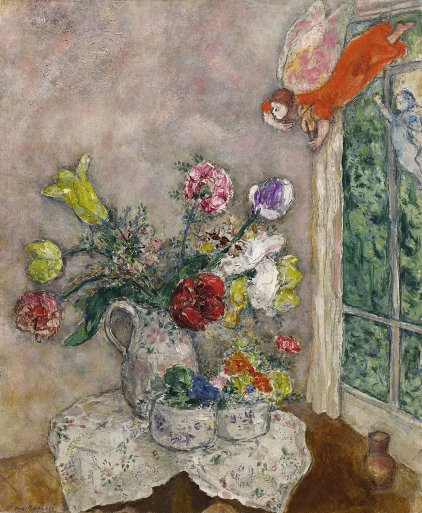

Marc chagall

  

亲爱的连叔，

  

关注您的公众号很久了，今天第一次跟您写信。其实并没什么需要向您求助，只是想把最近发生的一件小事，与您分享，像对一个认识了很久的老朋友那样。

  

女儿今年上一年级，六一要到了，前些天老师选了第一批入少先队的孩子，一共17个，没有她。实不相瞒，我有点难过，因为身边朋友和同事的小孩都入队了，有的还当了带头宣誓人，是的，我们家就是唯一的那个普娃。

  

回到家，孩子还是一脸无忧无虑的样子，开心地跟我分享今天老师选了哪些人入队了，说自己一定能是第二批入队的。不知为何，看着她糊糊的样子，我一下子就恼火了，我问她你思考过为什么老师不选你吗？30％的入队率你都够不到，说明你的表现是多么的差，你得有点上进心呀！

  

孩子一下子被我说愣了，然后就哭了，她说可是我就是不优秀啊……看着孩子伤心的样子，我很自责，很后悔没有控制好自己的脾气。

  

凭心而论，孩子学习考试成绩都还可以，但不是最好的那种(满分)，所以在班上并不耀眼。没有上过幼小衔接，拼音写字是弱项。性格晚熟，个子小，有点懵懂，自理能力不强，当不了班干部。因为从小非常喜欢读书，知识面比较广，所以上课回答问题非常积极，话很多，老师认为她有点小得意，比较浮躁，知道的多，但学的不踏实。综合来说，她不属于乖巧懂事的那一类，也不属于勤学稳重的那一类，没有入队也在我的意料之中，只是一时不能接受这份失落以及对她晚熟的无奈。其实女儿有什么错呢？不优秀不是她的错，相反，她这么的自信，这么的乐观。当我们大人把所有不满的情绪发泄与她，弱小的她，又能把情绪释放去哪里呢？是我伤害了她。

  

我平静了下来，拥抱她，安抚她，然后带着她一起到楼下散步聊天，告诉她我的担忧，一起分析了她的问题，让她明白自己和别人的差距，需要把缺点再改正一下，需要再努力一点，也鼓励了她，约定陪她一起努力，帮助她。并且告诉她，我爱我的女儿，无论她优秀还是不优秀，我都会一直爱她。

  

晚上洗澡的时候，她说妈妈我给你讲个故事吧，春秋战国时候楚庄王原本贪图享乐无心治理国家，有一天他的一个谋臣问他:"山上有一只鸟，一停三年，不飞也不叫，是怎么回事呢？"楚庄王恍然明白说的是自己，于是他回答说：“这不是普通的鸟，它是一只凤凰，不飞则已，一飞冲天，不鸣则已，一鸣惊人。"从此以后楚庄王开始专心朝政，把把国家治理的很好，成为了春秋五霸之一。她说我就是那只凤凰。

  

实不相瞒，我被她说哭了。是的，她是在安慰我，她其实是那么的爱我。不管她会不会一鸣惊人，但在我心里她就是那只凤凰，她是最好的。

  

这几天一直被她说的这个话所温暖和安慰，所有的不安和焦虑都被治愈了。分享这个故事，只是希望那些和我一样受当下教育氛围影响而焦虑的妈妈们，能再多一点耐心，孩子们比我们想像的更柔软、更纯粹、更爱我们。陪伴并不漫长，爱是最重要的力量，成长的路，我们要一起走，可以慢一点，可以更快乐一点。 

  

贝贝的妈妈

  

* * *

  

贝贝的妈妈：

  

你的结论很对，爱是最重要的力量。我想，所有的妈妈都会接受这个观点。

  

但是，爱要落到实处，却不容易。不问青红皂白，什么都爱，那是溺爱，他身上的不优秀，肯定要去掉，你不能爱，他自己更不能爱，否则，孩子就会被耽误。所以，爱的本事是，你得分得清什么是优秀，什么是不优秀。把优秀当不优秀，把不优秀误为优秀，那么爱又会错乱，把孩子引到歧途。

  

有些优秀很容易发现，成绩好，当班干部，第一批入队，都是显而易见的优秀。人的思维惯性是，认为优秀的对立面就是不优秀，就得批评。有时这么想是对的，有时这么想却是错的，因为优秀的对立面可能是更优秀。教育是个复杂微妙的精细活，差之毫厘，谬以千里。教育切忌喊口号，也不能生搬硬套，这就是庄子所说的，凫胫虽短，续之则忧；鹤胫虽长，断之则悲。野鸭的小短腿不会太短，仙鹤的大长腿也不会太长，对它们来说，都刚刚好。

  

你的贝贝没有第一批入队，“回到家，孩子还是一脸无忧无虑的样子，开心地跟我分享今天老师选了哪些人入队了，说自己一定能是第二批入队的。”这让你恼火，因为你看到没有第一批入队的不优秀。其实用心一点，就会发现，她在此刻展示了更优秀的一面：她不嫉妒，欣赏赞叹更优秀者的成就，她也不躺平，坚信自己能追上优秀者。天生拥有这品质的孩子，是得到厚爱的孩子。大多数人的一生，是要和嫉妒心做斗争的，种种毁灭性的坏情绪，也和嫉妒关联。嫉妒只看得到别人的有，不珍惜自己的有，这就是贪；嫉妒憎恨别人的成就，这就是嗔；嫉妒有个填不满的无底洞，这就是痴。其实，无穷尽地拿自己的孩子去和别人的孩子比，也与嫉妒有关，永无宁日。他是小鸭子，你嫌他腿比别人短，他是小仙鹤，你嫌他腿比别人长。孩子本来是个好胚子，却被这日日对比的无明火，烤得变了形。

  

孩子更纯粹，更柔软。这句话也是对的，孩子本性的善良，还未被涂抹、遮蔽、损害，一片天真。父母要能够识别这善良，珍惜它，保护它，让它生长，使其强壮。孩子是父母的老师，他往往能够提醒父母遗忘了什么珍贵的品质。成长不只是孩子的事，父母更需要成长，这样才能引领自己的孩子，这样也才配得上自己的好孩子。

  

珍惜自己的孩子。

  

祝开心。

  

连岳

  

（我的邮箱：lianyue@xmlykd.com，来信请谨慎，只会在微信平台公开回复，并授权我用于图书汇编。）

  

推荐：[致大孩子](http://mp.weixin.qq.com/s?__biz=MjM5NDU0Mjk2MQ==&mid=2651628326&idx=1&sn=7b67d7815022bdc86233c2d94ed4e60f&chksm=bd7e27388a09ae2eaf0bafa842422b8678153b2dabc3c85e4c95ba2dd8ac2dbe4c23cd51b441&scene=21#wechat_redirect)  

上文：[孩子和妈妈的真诚沟通，有何等的大力量](http://mp.weixin.qq.com/s?__biz=MjM5NDU0Mjk2MQ==&mid=2651707709&idx=1&sn=6518b5b643e6a1d3f9ec433f83b2458b&chksm=bd7f5d238a08d4351332776fd74c2675e993b44c7d9c4de0db3e69b098b2fd48d6c8424762df&scene=21#wechat_redirect)
