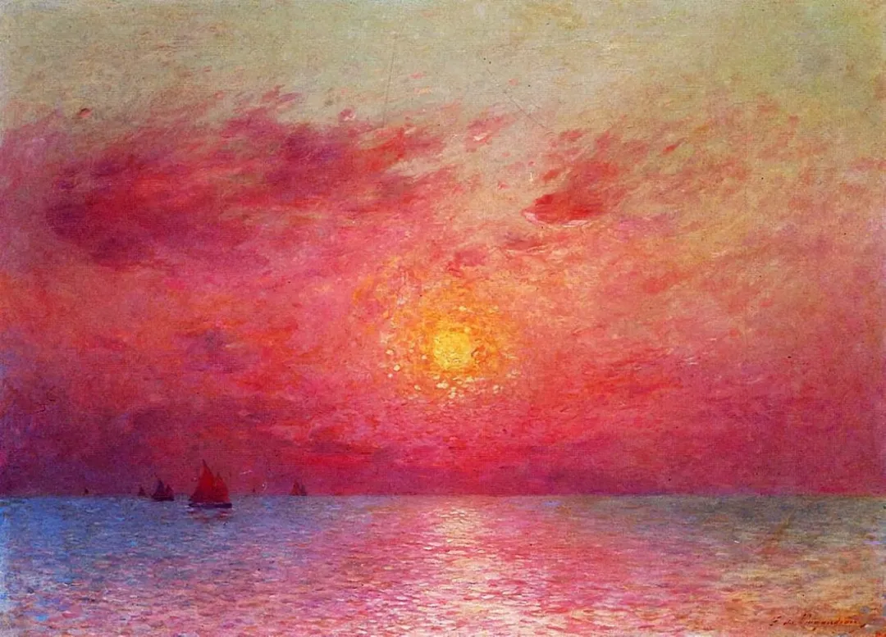

Ferdinand Loyen Du Puigaudeau

  

连叔：

  

您好。

  

我是一位一线城市40岁的医务人员，女博士，普通人家背景。虽然读到博士，但是科研水平一般般，临床水平还行，但属于整体能力有限，双商普通那种。目前有1房有1车，有积蓄，但是买第二套房有点困难。父母双全在老家，关系不大好，经常会收到我妈妈50多秒的语音留言，希望我多关心她。爱人同样医生，非常忙，关系还好，事业属于上升期，但是对买房处于拒绝状态。孩子小学，成绩一般般，我对她要求不高，估计马上叛逆期到了。按理，我应该知足，生活比上不足，比下有余。但是我越来越对未来很迷茫，脑子里有2个小人在斗争，时而患得患失，时而欢欣鼓舞。常常上班时会怀着上坟的心情，感觉压力大于动力。工作方面，医患关系的紧张，科研和临床的压力，上下级之间的关系，我常常有抑制情绪，自己是属于不精明的那种，后知后觉。我自己也明白这种状况不健康，但每天晚上睡觉前都想着，要不要辞职然后全职？但是动动脚趾头也可以想到，全家都会反对，理由很简单，已经算是有经验的医生了，都熬到现在了，应该继续坚持下去，再努力一点，可能未来会更好一点。我出去开会交流时，发现和我年龄一样的女医生，如果混的不怎么样，可能都会类似想法，年龄增长，上升空间有限，体力明显下降，还有繁重的工作，上有老下有小的状态。但是看到很多男医生会非常的积极向上，我就很佛系，有点无所谓了。只是每当看到孩子不大满意的试卷也会自责，幻想如果全职是否对孩子有益？

  

我也学着比尔盖茨结婚前那样，把自己继续工作或者辞职全职的优缺点罗列比较了，结果就是：坚持下去，收入可能会高，但是家庭会不能兼顾。我也在想象连叔的回答：你已经比很多人好啦，学历够高，有经济基础，不应该辞职，应该珍惜当下，找多多看书，多多运动，陪伴家人.......所以我取名叫苦恼又自知的人。我有朋友全职在家里，说很无聊，想着出来上班，但是上班了会有更多的烦恼。研究表明，女性每天要说够2万字，我想着每天都能顺利地说够，一旦辞职就不能说够了，可能会更加抑郁，所以，我心里都很清楚明白未来的路，但是没有勇气坚强地走下去，总觉得未来很艰难，很痛苦。希望能看到您的回答，非常感谢！

  

一个医生

  

* * *

  

一个医生：

  

我也不支持你辞职当全职主妇。

  

全职主妇的压力其实更大。你自己及其他人的期待很容易预见：既然全职了，那孩子自然应该样样拔尖。但了解概率就知道，在任何一个时空，普通孩子必然占大多数。从孩子的智商、成绩、技能来衡量，父母是大概率失望的角色，如果家有全职主妇，有意无意间，她背的锅更多，失望将加倍。养孩子，从爱的角度，成功率才是高的，只要不刻意摧毁父母与孩子天然的相爱，再普通的孩子，都会是世上对你最温暖的孩子，别人家的优秀孩子，顶替不了他。而是否相爱，和妈妈是否全职主妇没有关系。

  

再来说说医生这个职业。先看一下大趋势。去年以来中国的防疫成功，中国的医疗系统作用巨大。医护人员，地位与收入持续上升，是必然的。伤医、医闹、通过小概率事件抹黑医护群体，将被严厉制止，医护的执业环境将更好。指望医生的收入特别高，这在中国不现实，中国可能是世上少有的想在医疗上给所有人基本保障的国家。天下大同的梦想不只是中国人的空话，能力到了，他们是要玩真的，这也注定一些高收入、高技能的人员（比如医生）必须做出一定的牺牲，无论你愿不愿意。但医生达到一个匹配其教育投入及重要性的体面收入，肯定能实现。也就是说，医生的收入会高，但不可能特别高。

  

而收入不是医生成就感的唯一来源。医生是世上少有的大正业，你治好一个人的病，甚至只是安慰了一个病人，得到的反馈全是正面的，没有任何一个人因此不开心，病人更有再生的幸福。大多数病人得的只是普通的病，普通医生都治得好，这些病没办法成为医生的论文，帮助他们科研突破，从这个角度，或许会让医生觉得乏味、重复、无聊，甚至不耐烦，但只要想到，再普通的病治好了，都能给一个人、一家人带去快乐，每天能给人这么多的快乐，除了医生，不多了。

  

你观察一些医生，他们执业时间越长，地位越高，越温和，越有耐心，律己越严，这主要不是因为他们经济压力小了，生活的烦恼少了，而是他们认识到自己的一切都是治疗，胸怀、善良、微笑、温暖。自己即是药，能治世人苦，一个医生，每天都能享受这个成就感，不会舍得辞职，不会舍得退休。你也将是这样一个医生。

  

祝开心。

  

连岳

  

（我的邮箱：lianyue@xmlykd.com，来信请谨慎，只会在微信平台公开回复，并授权我用于图书汇编。）

[荐文](http://mp.weixin.qq.com/s?__biz=MjM5NDU0Mjk2MQ==&mid=2651642780&idx=2&sn=ea14ca3f8ceeb84add553bbbfa301f4f&chksm=bd7e5f828a09d694ff0864711df23cf5932657d8719badc60acfa179180dd5f2958f8f6db737&scene=21#wechat_redirect) [上文](http://mp.weixin.qq.com/s?__biz=MjM5NDU0Mjk2MQ==&mid=2651704426&idx=1&sn=9aa7e7c1a6fd2ce6432d1c95326cedc2&chksm=bd7f48748a08c162bfcd25445073e691444ed9e6258262510c7e0c68b40e4c57604dca92489a&scene=21#wechat_redirect)
