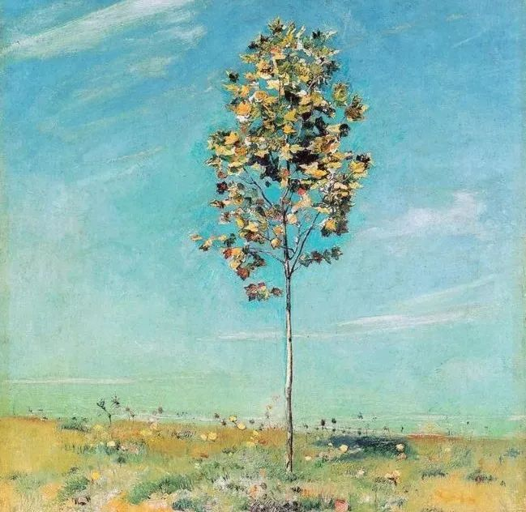
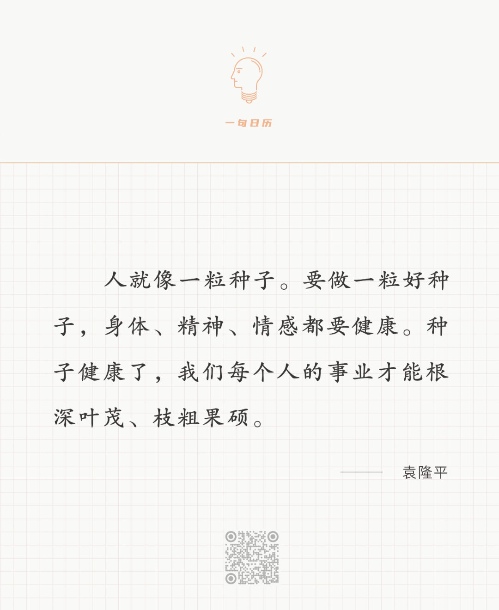
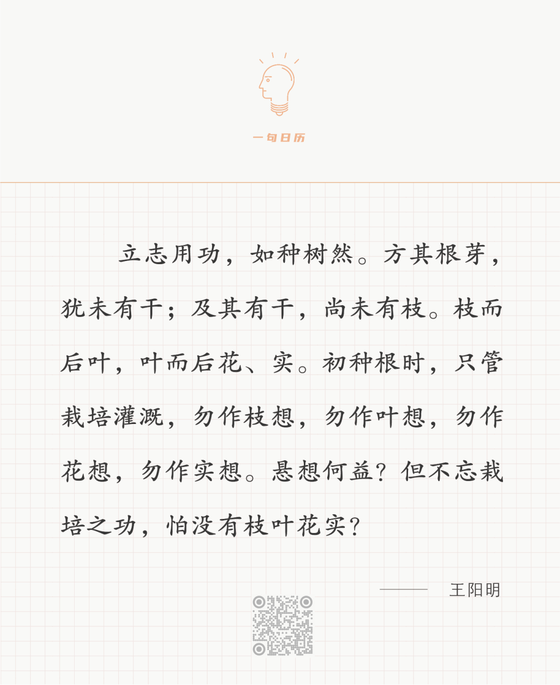

 Ferdinand Hodler

  

  

长按二维码可关注

  

好种子再小，你耕种时也不会担心，因为你知道，只要等到收获，它将百倍千倍地增长。漫长而伟大的农业史，让人学会耐心，从种到收的那段时间，无法减少，急了没用。

  

人由一粒受精卵分裂生长而成，一切都源于一粒极小的种子。婴儿出生时小猫一样大，父母并不担心他将一直这么小，知道他必然像树一样长高长壮，只是时间问题，10多年后，他就是美少年。在肉体成长上，人们保持了农人的耐心。

  

人不同于植物的是，他还有文化基因，这才是人与人之间的真正区别。文化是看不见的，也不写在受精卵里，它由心灵、精神、情感、技能、习惯构成。它是后天由传统继承、家庭与学校教育、以及自我教育完成。无论一个人是否知道文化基因这回事，他必由文化基因控制，他没有好的文化基因，就必有坏的文化基因，所以，一个人必须拥有好的文化基因，这样才能成为一粒好种子。

  

在文化基因上，人们往往只看到技能这个末节，而且还失去耐心，希望一步登天。技能重要吗？当然重要。任何一个领域的顶尖人物，都是掌握了最好技能的人，就像学霸，一定是分数最高的几个人。但是没有心灵、精神、情感与习惯的支持，技能不能持久，也很难给人带来的幸福。心灵、精神、情感与习惯好了，技能也能慢慢变好，即使技能一般，这个人也是幸福的。好的文化基因让幸福人人可得，只要你有健康的生活习惯，有“己所不欲勿施于人”的精神，有善良的心灵，有爱，那么，无论你是任何人，院士也罢，文盲也罢，高官也罢，平民也罢，美人也罢，路人也罢，圣人也罢，凡人也罢，你都将是幸福的。

  

这就是王阳明所说的，立志用功如种树。好的文化基因要靠耐心才能长大。

  

  

长按二维码可关注

  

今天是第173期“下周很重要”，完成一天天的小计划，就是在栽培灌溉好的文化基因，像棵树一样长大。  

  

荐文：[幸福是心学](http://mp.weixin.qq.com/s?__biz=MjM5NDU0Mjk2MQ==&mid=2651706901&idx=1&sn=6a8837794325a7c79663a066d93d3b89&chksm=bd7f520b8a08db1d48d79d092884a4ef3f32103ccb7ac20eeefc353ce5ca20dc52957ddca7f6&scene=21#wechat_redirect)  

上文：[一生都该是少年模样](http://mp.weixin.qq.com/s?__biz=MjM5NDU0Mjk2MQ==&mid=2651707047&idx=1&sn=770f02550ccf574b08df875d08a2bab0&chksm=bd7f52b98a08dbaf02b09e562bcb570a2a0ad0b129a6c0edd92840a56356e2d0a7a6db3be8e5&scene=21#wechat_redirect)
