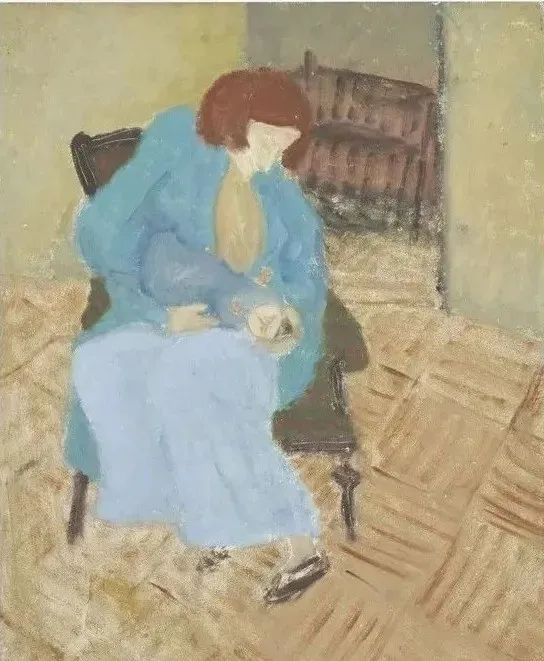

Milton Avery

  

连叔：

  

您好！

  

此刻的我，正是一位产后两个月，抱着宝宝的二胎妈妈。十月怀胎的不容易，前后得到一女一儿的恩赐，我很感恩，也颇感幸运，但是，我内心真的难受……

  

可能今天的触动点是结婚四周年，但是柴米油盐的生活，真的磨灭了很多浪漫，两年前丈夫辞去以前较为辛苦的工作，至今没再上班，虽然他在股票上颇为得意，收益不错，但是我每天下班回来看到他手机不离手，王者荣耀不断，我真的很恼火。或许我应该满足，他不赌不嫖，感情忠一，基本上家庭开销，包括孩子的喂养、车和人的保险都是他负担，但是我觉得他不上班，交际圈缩小，性格也改变不少。我觉得股票投资跟工作其实可以处理得不冲突，要不找一份清闲的工作都好，只是他似乎很满足现状。为了他工作的事情，我们真的吵了无数次，这件事情，他累我累。二胎后的我也在放产假，两个人每天24小时消耗，也磨灭我们对彼此，对孩子的耐性。今天中午出去吃饭庆祝，但是那情那景不是我想要的。他不爱我吗，也不是，月子期间照顾到位，现在如果我要出去，也是他带娃，但是他很爱我吗？也不算，经常叫他做点什么，他都在看股票或者打游戏，他的原话就是带娃带到怕。难道婚姻真的是互相折磨到天长地久吗？总之我们好的时候很好，不好的时候我恨不得掐他两刀。

  

可能今天的触动点是得知工作上的失意，由于我放产假，错失了比较好的上升机会，让我欲哭无泪。想到过几个月继续上班，顿失期待。前几年我因为家庭孩子，放弃薪水较高的工作，对于现在的工作，很大程度上觉得成就感不好，认可度不高，薪水不丰厚。但是我依然在努力，我不想就这样一辈子，即使我之前怀孕6个月，我依然没有放弃别的更好机会，虽然失败了，或许我还会继续寻找更好的工作。

  

可能今天的触动点是我怒吼我三岁的女儿，实在太调皮了，实在太欠揍了，但是或许这才是小孩子的快乐，我为我的怒眼、我的雷鸣声而惭愧，但是我却越来越控制不住。我知道我是一位控制欲很强的妈妈。我不想孩子因我而害怕成长，每天育儿的矛盾，让我痛不了拔。

  

越来越多这些触动点，越来越多情绪，我知道我矫情，我知道只是因为我太多期待，太多不满足，太多不愿意，我也很想改变自己，我也很想做一个理想的人妻、人母，只是，我觉得好像失去了自己一样……我很想逃脱、挣脱，但是我不知道逃去哪里？

  

我忍不住想我妈妈，如果她还在，或许一切都不一样，或许我可以跟她诉诉苦，或许我吃一顿妈妈做的饭菜我会舒服很多……只是，相隔的我们，终将只能把爱埋藏在心里。妈妈，我不想做人家老婆、做人家妈妈，太难了，我能否好好的做你怀抱中的女儿？

  

最近哭太多，最近想很多，无处释放，所以才深夜给您写信，我知道，明天还是要放下一切，好好努力生活。

  

谢谢！打扰了。

  

祝，母亲节快乐！

  

一个妈妈

  

* * *

  

一个妈妈：

  

人为什么愿意当妈妈？除了DNA的复制命令以外，一定还有别的原因。

  

当妈妈意味着一连串的失去。失去身体的美，失去工作或晋升机会。当然，身体的美可以恢复，工作与晋升机会也可再得，但毕竟失去过。

  

而当妈妈的得到，也并不踏实，这些得到都伴随着风险。

  

先是得到了一个丈夫，但可能恋爱时看走了眼，他未必值得嫁；可能他会变坏，误你半生。

  

还得到了一个新家庭，但当上女主人也意味着更多的家务，处理更复杂的关系，承受更大的经济压力。

  

最后得到了一个、或二个、或多个孩子，但他是能否顺利成长，有没光明未来，这些大恐惧也随着孩子一起到来，在他成年之前都很难消失。

  

你为什么哭？就是这些风险趁你产后情绪比较低落一起用力威胁你，而你并想不出什么办法化解消除这些风险。此时控制欲就会变强，所以有些妈妈容易变得唠叨。控制欲越强，越在意生活中的可有可无可左可右的细节，就像一个骑手想控制马匹身上的每一根毛，这样的骑手很辛苦，很努力，却会失去比赛。

  

变成强迫症、控制狂，也是当妈妈的风险之一。你对孩子发完脾气后害怕而懊悔，就是你对失控的恐惧。如果我们控制欲过强，我们自己首先是受害者，无法容忍自己的失控。其实，当妈妈偶尔发点脾气怎么是失控呢？那是正常的。人太累、太辛苦、太害怕时，应该允许发点脾气。妈妈发了脾气，孩子就不爱她了？就有心理阴影了？不会的，妈妈之后的一个亲吻，一个拥抱，甚至是一声道歉，只会让孩子更爱一个真实的人。体会这种感情的冲突、调整、平静与深化的过程，本身就是一种情感学习。相爱的人，这种模式会一再出现。

  

接受人生存在一些风险，让我们平静。这样，那些不安的事情，容易看到其价值。你不再逼老公非得还有一份清闲的工作，毕竟他已经能养家了。你也不怕他交际圈小，男人做好本分，对家庭负责任，就是最好的交际，人人高看一眼。很多所谓的交际，不外乎吃喝玩乐，声色犬马，学坏的可能性会变大。你产假失去了上升的机会，可已婚已育的你，再回职场，另有一重竞争优势。凡事这么想，就少吵很多架，生活美妙很多。

  

你当妈妈吃的苦，你妈妈也吃过，你女儿将来也会吃。人为什么愿意吃这些明知的苦？因为这些苦带来了无尽的爱。你怀念妈妈的话语、饭菜与怀抱，这就是爱，一个被爱的人，他死了也还活着，一个没人爱的人，活着也相当于死了。任何深沉的爱，夫妻之爱、母子之爱、父子之爱、人爱人类、爱世界，只有经过一番苦苦挣扎与苦苦经营，才能建立，才够真诚。

  

祝开心。

  

连岳

  

（我的邮箱：lianyue@xmlykd.com，来信请谨慎，只会在微信平台公开回复，并授权我用于图书汇编。）

[荐文 ](http://mp.weixin.qq.com/s?__biz=MjM5NDU0Mjk2MQ==&mid=2651633960&idx=1&sn=47ea81d87a8814284dbcf5522ef12331&chksm=bd7e3d368a09b42008b88cc72b4d6e02afdbdb4cf1d285903066ccceac1f80d35c9022fb89dc&scene=21#wechat_redirect) [上文](http://mp.weixin.qq.com/s?__biz=MjM5NDU0Mjk2MQ==&mid=2651702177&idx=1&sn=28b30aa9eb7acf1a875c5a06f4449954&chksm=bd7f47bf8a08cea93fffebec623229068934f1acc13e7e33b57071c8b8104e54162dd8847b86&scene=21#wechat_redirect)
