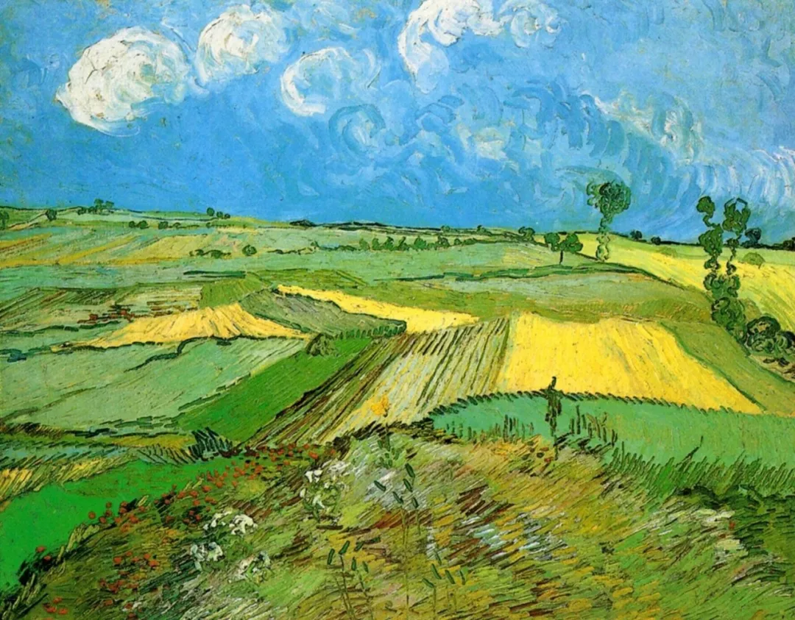

Vincent van Gogh

  

连岳老师您好，

  

我是一个初三快毕业的学生，之前初二的时候辍学去追寻我的“梦想”，想打上电竞职业联赛，想走上kpl的舞台，在这之前，我的学习成绩是全校第6。曾经的我一度认为自己在电竞这方面是个天才，可惜事与愿违，天赋这个东西挡住了我前进的道路，在一个临界点停滞不前，家里也不是特别富有，我便放弃了这个梦想，却也从那个时候开始颓废，在家里躺了一年多。

  

现在临近中考了，最后一周7天的复习时间，我想尝试偷点分，至少能上个职高也好，于是便回到了学校。由于不想见到同学，因为当时说要去打电竞的这件事被我弄得人尽皆知，怕他们笑我追梦没成功还被抓回去考试，所以老师就给我安排在办公室复习，并且说好了不会有同学来办公室。我知道7天时间复习两年的、学习一年的内容像是天方夜谭，可我也很努力地在学。

  

可就在今天下午，一个两年未见的同班女同学却出现在了办公室，且距离我只有一步之遥，她是我曾经喜欢过的一个女孩子，只是没有表白，整个学期都是以普通朋友的身份相处着。我认出了她，声音、样子、低马尾，都还是原来的样子，因为当时我在和老师讨论一道题，所以她也通过声音认出了我，虽然没说什么，但我从她的眼神中还是看出了一些东西，一些说不清的东西，那个瞬间我害怕了，我开始焦虑了，心里全是“你怎么会来这里”、“我要怎么解释啊”……以至于她走了之后到现在，我根本没有心思去继续学习，想睡觉也睡不着，满脑子都是她的影子，甚至明天不想去学校了，考试也不敢去了……我该怎么办呢？希望您能为我解惑或者…教教我怎么对待感情中的事吧，谢谢。

  

一个孩子

  

* * *

  

一个孩子：

  

是的，天下没有不透风的墙，你重回学校学习的消息，同学们估计已经知道了，你可能处于舆论的中心。接下来几天怎么过？保持镇定去学校，然后去中考。即使有人围观你。这几天的学习效率与中考成绩，其实并非重点，重点是你展示了纠正自己错误的能力，这种能力，人要经过努力学习才有，你一个初三生就有，实属难得。有了这能力，人生犯了错误，走了弯路，还可能自新。否则的话，一次错误就断送一生，那样太可惜，太脆弱。

  

你的弯路并不少见。只是有的孩子被电竞、手机带偏以后，就回不来了。因为承认错误没有面子，怕人嘲笑，他们索性将错就错，一躺不起。有种极有欺骗性的观点认为，电竞与手机应该让孩子从小随便玩，他们快乐地满足后就失去兴趣，有免疫力了。这就像说要让孩子从小随便接触酒精、烟草、毒品，这样他们才不会上瘾。孩子的判断力与意志力还很弱，有害的成瘾物对他们的杀伤性是最大的。成瘾了，就需要保持并增加摄入量，才能不停满足。孩子掉到这个无底洞里，父母就像看你溺水而无法救你，其中的痛苦，非文字能够描述。你能走出来，是个小小的奇迹，可以想见，你的父母师长此时心里的喜悦，仿佛见你起死回生。从这个角度来看，也不要怕同学议论，你做的是一件正确的事，你终于承担起自己的责任了。他们即使现在不理解，以后也会佩服你。再过十来年，他们就会像我一样，知道你现在的改过有多不起。

  

当然，少年时代的学习时光，大段浪费后，必然会付出成本。学校的课程设置是层层推进的、精密的逻辑体系，走神一节课，都得花加倍的功夫补回，更别说你缺席了一年多。对接下来几年、甚至十几年的辛苦，要有思想准备，你不再是全校第6的学霸了，你要从最后开始追。

  

无论你将来读职高也好，没能进入大学也好，人生总是能证明自己的，善待家人，忠于职守，有信用，持续学习，远离恶习与损友，恪守这几点，积累十来年，无论你有没有大学文凭，你都是受人尊敬的，你的人生都是美好的，会有一个好姑娘在将来等你。

  

祝开心。

  

连岳

  

（我的邮箱：lianyue@xmlykd.com，来信请谨慎，只会在微信平台公开回复，并授权我用于图书汇编。）

推荐：[世上无快钱](http://mp.weixin.qq.com/s?__biz=MjM5NDU0Mjk2MQ==&mid=2651632500&idx=1&sn=a742894c775c41533cf179f1bdc4d891&chksm=bd7e376a8a09be7c9ad70fb6335ced8cc36648b1f257042d43c6e4cc9504d45dc1ee002bd002&scene=21#wechat_redirect)  

上文：[青春与血泪给了深圳，最后却要回老家，如何才能想开？](http://mp.weixin.qq.com/s?__biz=MjM5NDU0Mjk2MQ==&mid=2651710948&idx=1&sn=1cf6e0e74a3f07d5367c32ad6f6eba95&chksm=bd7f61fa8a08e8ecb34af9e106c72bf69e80582f7e7931a94081d0822d0a08c6d6828e67841a&scene=21#wechat_redirect)
