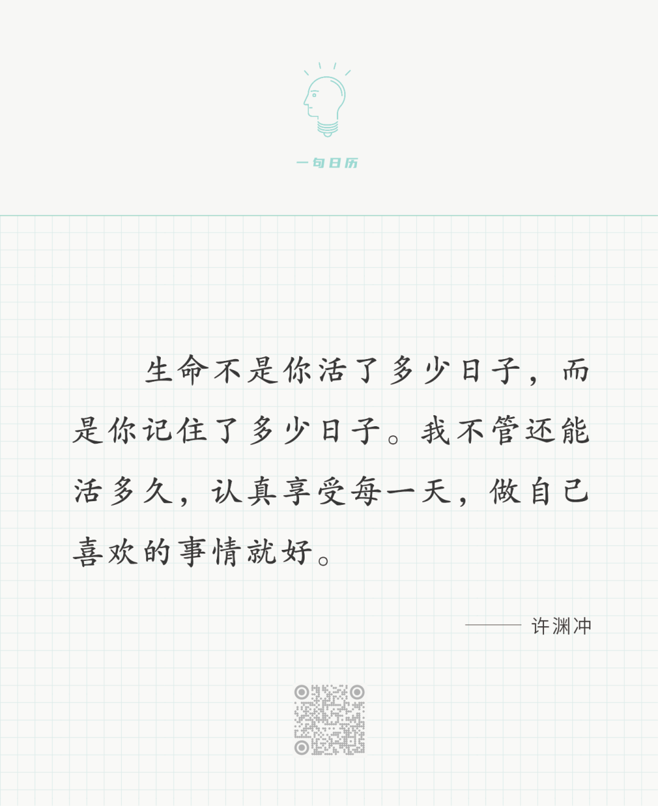

Camille Pissarro

  

长按二维码可关注

  

时间表面上是客观的，一天24小时，不增一秒，不减一秒。但它更像主观的，如许渊冲先生所说，不记住的时间，就不算是活。这就是说，一天可能是0小时，不存在，一天也可能是无限长，成为永恒。像许先生这样的创造者，他的一天，他的一生，通过他的作品，一直被人记住，他的生命就不会结束。  

  

做自己喜欢的事，同时，这事也为人所喜欢。悦己悦人。这就是真正地活着。许渊冲先生喜欢的事，是翻译，尤其是将几乎不可译的中国古诗译成外文。所以，不能误解他说的喜欢。他喜欢的，不是许多人喜欢的偷懒、混日子、投机取巧，而是实实在在的、艰苦的创作。他说的喜欢，应理解为尽自己的责任。翻译家的责任是翻译，但翻译本身很辛苦，只有意识到它是自己的责任，这辛苦才会转化成喜欢。  

  

责任感是真正的喜欢之源。不然的话，人生哪件事不苦？识字苦，学习苦，工作苦，养家苦，没有责任感，则事事逃避，天天偷懒。有了责任感，才会在人生的每一个阶段接受那些苦，驾驭那些苦，最后由苦生乐。责任感并非负担，而是最持久的快乐之源。  

  

今天是第175期“下周很重要”，人之所以订计划，就是每天有些事要用责任感才做得好，做完它们能生出真喜欢，也证明自己真活着。

  

推荐：[工薪阶层的财务安全与幸福](http://mp.weixin.qq.com/s?__biz=MjM5NDU0Mjk2MQ==&mid=2651672157&idx=1&sn=501ea311930371644be410222723adad&chksm=bd7fca438a084355de4771fb611e8def781c1e04308e98095825546aba113c1f84a8bc102fe8&scene=21#wechat_redirect)  

上文：[一个起死回生的孩子](http://mp.weixin.qq.com/s?__biz=MjM5NDU0Mjk2MQ==&mid=2651711111&idx=1&sn=f321fb749229c295e0d2f66e22cd1313&chksm=bd7f62998a08eb8f525fe0f6007c8bac3d2a27a5dcf00a2f0dabb37f847b2d2f735c5f0c9a07&scene=21#wechat_redirect)
