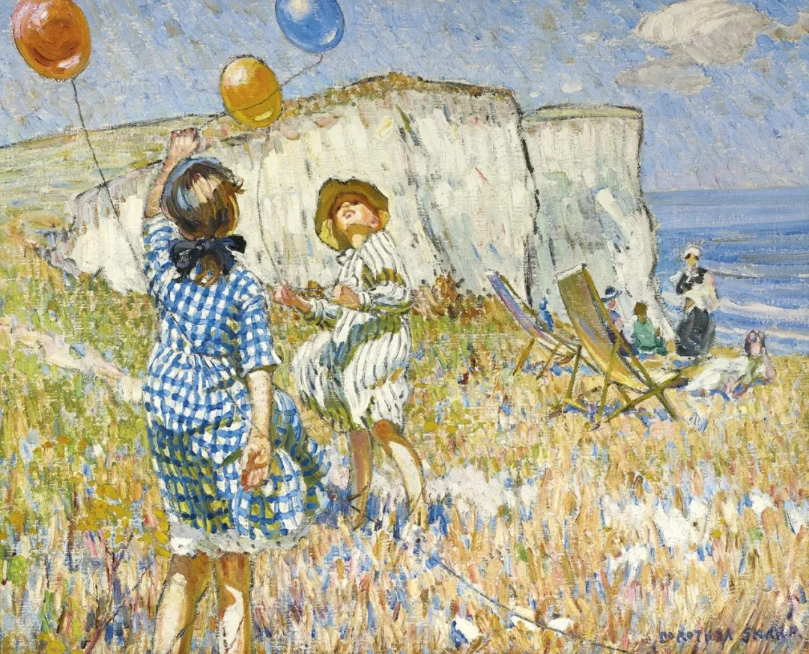

Dorothea Sharp

  

连叔，您好：

  

关注您是因为妈妈，她是您的忠实读者。我是一名六年级的快乐学生，最近几天有件事情把我的快乐之心打入海底，令我郁郁寡欢。

  

我有一个好朋友，用大人的话就是他身上有种社会人的气息，满嘴都是网络用语，可能是因为这点吸引了我和他成为朋友。他到我们家玩，虽然妈妈觉得他和我习性太不一样，但是觉得我应该和不同类型的人去相处，所以一直都是热情招待。每天上学也会给他多带一份奶一份水果，直到有一天妈妈忘准备了，他勃然大怒，我气愤地表示我带吃的是情分不带是本分，他居然一脸嫌弃地说滚滚滚，然后扬长而去。

  

这件事伤透了我的心，几天后他厚着脸皮找我要吃的，我要求他先道歉，结果他又发怒了，又开始说滚滚滚。

  

本以为我们就这样互不打扰也挺好的，结果他得寸进尺，在班上公开诋毁我，各种胡说八道，反倒都成了我的错。我想与他理论但是我真的说不过他，而且我觉得因为这样的事情去理论太无聊了。原本我一直想反正我们一个月后就毕业了，不去理会他，但是每天看见他又让我很生气，我也知道如果他知道我生气他会很高兴，但是我就是很生气。

  

连叔，我该怎么办？盼望连叔能指点我摆脱他。

  

忧伤的小鱼

  

* * *

  

忧伤的小鱼：

  

交朋友是一生的学问。其中的尺度、技巧与拿捏，可能要花一生去打磨，但最核心的价值，就是你在这次事件中体现出来的两点，一是待人真诚，二是当对方触犯底线时，你不是一味退让讨好，而是清晰表达自己的立场。看得出来，你的家教好，你不会缺朋友。

  

不要怀疑你自己的真诚，它是交朋友，做事情的最好策略。真诚是不是一定换来真诚？不是，有一大半将换来不真诚，就像你这次一样倒霉。付出的心与物，被人利用，被人轻视，开始肯定是不开心的。现在碰到与你一样的情况，连叔却是开心的。为什么？因为我把这种付出当成识人的成本，坏人坑你一次，你看破他，把他踢出你的世界，他以后就害不了你，损失是一次性的。损失七八次，十来次，你总能结交到一个值得尊重的人，他利益你一生，你获益成千上万次，你说值不值？这里说的获益，不是指获得一点吃喝，占点便宜，这反而是忌讳。值得尊重的人，他的整个系统都更先进，他的责任感，生活方式，观点，方法，都能借鉴，帮你进化，一个值得尊重的人，后面有一个值得尊重的生态，这是巨大的价值。

  

所以，不要怕坏人，坏人是用另类的方式震撼教育我们。现在，我很同情他们，他们是用浪费、败坏自己一生的方式提醒我们不要犯同样的错误。我们要怕的是，离不开坏人。有的坏人很有迷惑性，损害着你，又让你看不透他，再加上自己性格软弱，摇摆不定，那往往就会被坏人控制。不少成年人也因这类损友苦不堪言，难以自救，惨的人甚至赔上自己的人生。坏人坏得彻底一点，让人生气，那反而没有迷惑性了，是件好事。

  

吃一堑，长一智，通过这次你提升的交友技能是，不被外表的酷欺骗。长得漂亮帅气，能说会道，甚至热情洋溢，被这些表象吸引后，还要观察一段时间，看他是不是真的酷。真酷的学生，一要能做到认真学习（他们成为大人后就会认真生活），这是有责任的体现；二要不占别人的便宜，这是有自尊的体现，他不会见利忘义；三要不说老师、家长与同学的坏话与谣言，这说明他公正。观察半个一个学期，证实有些同学值得尊重，再进一步交换真心与礼物，并分享妈妈的爱。

  

祝开心。

  

连岳

  

（我的邮箱：lianyue@xmlykd.com，来信请谨慎，只会在微信平台公开回复，并授权我用于图书汇编。）

推荐：[一个孩子的力量](http://mp.weixin.qq.com/s?__biz=MjM5NDU0Mjk2MQ==&mid=2651633692&idx=1&sn=eda72fecff474ea45b28c5f0416a1224&chksm=bd7e3c028a09b514b92f88a07f7cee20867da6bd5715de8bcb2c01a07e1c2d1ba4a224e9b9d6&scene=21#wechat_redirect)  

上文：[没办法时要说这句话：办法总会有的](http://mp.weixin.qq.com/s?__biz=MjM5NDU0Mjk2MQ==&mid=2651708560&idx=1&sn=535b6a248fdccd79618d57f17f5807d5&chksm=bd7f588e8a08d1987832eb860096ca4ca52f3f73d3f8cd8e0013ee5b0d47f7761992cfcb363d&scene=21#wechat_redirect)
