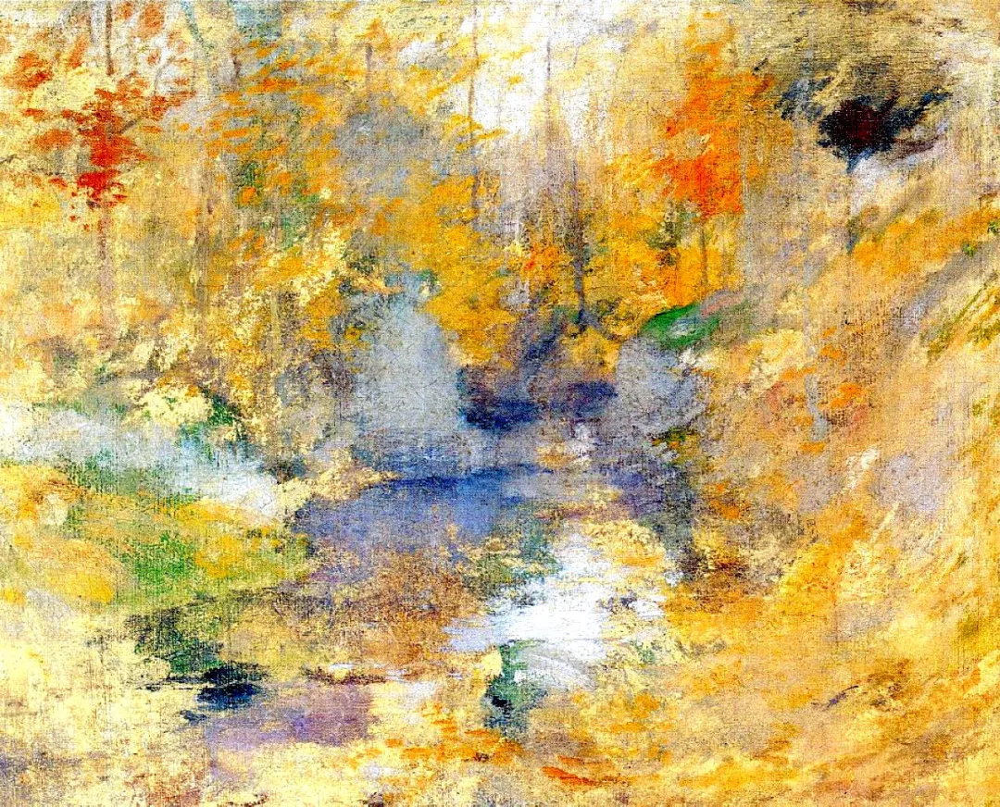

John Henry Twachtman

  

连叔好！

  

连叔，谢谢你多年来文章和思想上的陪伴，愿连叔和连太每天心情愉悦，牙齿晒太阳！！

  

连叔，我也有一件事情在困惑着我，是这样的，我跟老公领证一年但还未摆酒，已经住在一起了，我知道两个人在一起是互补磨合互相变好的过程，但在这个过程中，怎么去判断和把握好互相牵制的程度呢？有时候我会觉得好累呀，但是经常又会因为我们之间的状态而感到幸福和感激。

  

老公现在每天出去兼职几个小时，月入（3000～5000），他不抽烟不喝酒，唯一的爱好的踢球和熬夜看比赛，知道我不赞成他熬夜他会在我睡着后又出去看，长期下来，他的睡眠习惯就是在下半夜到隔天将近中午的时候了，你说作为一个28岁的人，这样太不上进了吧！！因为老公家里条件还可以，现在在一线城市他不需要承受房子带来的压力，现在就是我们两个人的家要怎么赚钱？创造更好的生活？

  

虽说家里条件还可以，但从小他爸妈没有让他享受好的物质生活，在大学大概就是一个月1000块生活费，毕业之后就他自己赚自己花，在大学毕业后的3年里都是每个月赚3000～5000左右，自己赚自己花，每天的爱好就是踢足球，直到我们遇见，在一起之后，他知道了他需要赚更多的钱。但长期养成的生活习惯和思维习惯怎么可能说改变就改变呢，大家都在努力赚钱，又怎么会让每天睡到大中午和不能吃苦的人赚到钱？？？我目前在银行上班，月入8000，加上自己炒股，目前存款有80W。老公只知道我的月收入，其他的不知道。我不告诉他的原因一方面是觉得鉴于他目前的工作状况和收入状况不说比说好，另一方面是我从小就有偷偷攒钱的习惯，算是自己的小成就感所致吧。但是我们日常的吃用开销都花老公的钱，他会主动承担，所以目前我是赚多少攒多少，（房子住老公家里的所以没有房租压力）

  

最近我的心态有些着急了，也是害怕，我怕我一直对待这些问题是错的，我从来不会跟他吵跟他闹，我知道，尽管说是大人了，激励和陪伴也应该如同对待孩子一样的。我知道一个人真正开始改变是来源于他的内心，我期待着那一天。

  

连叔，我哪里做的不对？我哪里可以做的好一些？我想和老公一起解决这些问题。

  

祝好！   

  

早睡早起的人

  

* * *

  

早睡早起的人：

  

我们是同类，我也是早睡早起的人。我现在也常劝人早睡早起，这是最典型的躺赢，一天的效率更高，对身体也好。这么好的事，不早点发现太可惜了。但我自己这作息，也只是近几年的事。原来也是迟睡迟起。

  

希望你老公早日能调整为早睡早起吧。不过，即使不能调整，只要不影响你休息，这也不是大问题。他赚钱少，具体情况具体分析，也不是大问题，一是他没当寄生虫，事事伸手，生活费还是赚够了；二是家境好，一线城市已有房子，额外再挣个三五千，生活很舒服了。他一辈子幸福的概率很高，生活没有坏习惯，又不贪，能守住父母给的财富。别小瞧守财，它不比发财容易。太有企图心，太想干点大事的富二代，风险反而大，几次错的决策，就能败掉父母创下的产业，最后用房抵债的，也不在少数。

  

对你这个善于投资的人来说，你容易看不惯老公的知足与守成。你一算账，我有你这个基础，现在可能赚800万了。但是从他的背景来看，知足与守成并非缺点，没有改的迫切性。你们的组合，其实是很好的互补，你投资，增值家庭资产，他闲散，多照顾家庭，以后常带孩子一起踢球，这样别说三胎了，六胎都不怕。

  

强人成家，最怕强人所难，你希望别人和你一样强，甚至只能和你同一种模式的强，不然就痛苦。这往往是强人家庭不幸福的源头，给家人太大的压迫感。摧毁别人，反弹自己。强人要学会接受多样性，欣赏不同类型的强，还得理解弱的力量，这才是强的最高段位，这才是用好了自己的强。幸而能强，就更有责任将强转化成幸福。

  

祝开心。

  

连岳

  

（我的邮箱：lianyue@xmlykd.com，来信请谨慎，只会在微信平台公开回复，并授权我用于图书汇编。）

推荐：[爱你，与你何关？](http://mp.weixin.qq.com/s?__biz=MjM5NDU0Mjk2MQ==&mid=2651641090&idx=1&sn=4d65c0d89a045464610a37569f5a8538&chksm=bd7e511c8a09d80a1218528a1af6acc3750a9d7382f7bd7c770311b0e0003fb7927f52a6d1dc&scene=21#wechat_redirect)  

上文：[语文大害怕：为什么我总是不会写作文？](http://mp.weixin.qq.com/s?__biz=MjM5NDU0Mjk2MQ==&mid=2651709272&idx=1&sn=99041554b9cfe7737a4fcc0a2e52c8f5&chksm=bd7f5b468a08d2508efe4aa29229ac8b68eab204bd40319864547a589923108165cfd734194f&scene=21#wechat_redirect)
