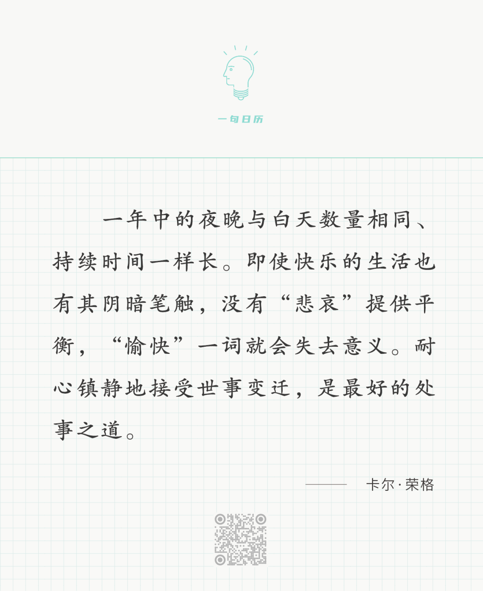

Isaac Levitan

  

长按二维码可关注

  

没人喜欢烦恼、痛苦、悲哀。从来没人喜欢。

  

但没有一个人能逃脱烦恼、痛苦、悲哀。每一代人，每一个人，都有其烦恼、痛苦、悲哀。从孩子能表达情绪开始，他就逐渐有了烦恼、痛苦和悲哀。我们也不能假设人们生活在和平、富足、向上的时候，就没有烦恼、痛苦、悲哀。反而因为保护得更好，心灵更敏感，更容易引发烦恼、痛苦、悲哀。

  

如何面对烦恼、痛苦、悲哀，是一个人必须回答的问题。答得好，人生就好。

  

我们没必要去喜欢烦恼、痛苦、悲哀。那样反人性。

  

只须接受它们即可。既然一定会发生，那就来吧。

  

快乐的人不一定是得到更多的快乐份额，而是接受了不快乐，不快乐的时间停留得更短，他于是创造了更多快乐。正如愿意早起的人，并不憎恨闹钟，按掉铃声，起来就是。而不愿早起的人，闹钟带来多次的、持久的烦恼。

  

烦恼、痛苦、悲哀，都属于闹钟，起到唤醒作用。烦恼让你找方法，痛苦让你找解脱，悲哀之后则是平静。你不愿意醒，它们就一直在响。你愿意醒，就不会恨它们。醒了它们就消失了。

  

今天是第174期“下周很重要”，把事情做好的第一步，也是接受自己必须做这些事，这样才能看到做事的烦恼即进步的快乐。

  

推荐：[一生都该是少年模样](http://mp.weixin.qq.com/s?__biz=MjM5NDU0Mjk2MQ==&mid=2651707047&idx=1&sn=770f02550ccf574b08df875d08a2bab0&chksm=bd7f52b98a08dbaf02b09e562bcb570a2a0ad0b129a6c0edd92840a56356e2d0a7a6db3be8e5&scene=21#wechat_redirect)  

上文：[如何交朋友？](http://mp.weixin.qq.com/s?__biz=MjM5NDU0Mjk2MQ==&mid=2651708876&idx=1&sn=f78c4beda934927264ed97434e2d8607&chksm=bd7f59d28a08d0c43aa78b173eafa8672f23b71e54305d7d2a33a5997776fe592c5290be2bd8&scene=21#wechat_redirect)
