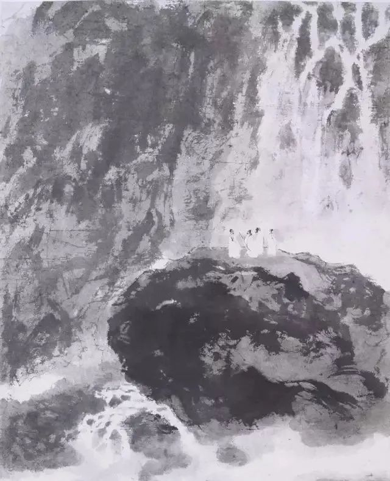

傅抱石

  

亲爱的连叔：

  

见信好！

  

虽然按年龄，称呼您连叔不妥当，但我觉得大家都这样叫，很亲热，也很尊敬。去年疫情期间，看了朋友转发的您的一篇文章，一下就被吸引到了，循迹找到并添加了您的公众号，后来就喜欢上您的公众号。一年多来每天早上都会先看您的文章，并将适合的推荐给家人和朋友。并从中学到了很多。谢谢连叔，于我，您是一位老师和人生导师的存在！

  

我今年48岁，老公大我一岁。我们都是湖南农村出身，我和老公都是高中生，高中一毕业就出来广东打工，97年结婚，育有一儿一女。几十年如一日，辛勤的工作，夫妻一心养育孩子 ，操持家庭。期间因缺乏长远眼光错失创业置业的机会，因自身没有长期学习的意识和精神，加上行业不景气的原因，长期工作的单位倒闭，所以现在工作上也没有好的成就。回望人生最重要的黄金阶段，常感失败和失落。一晃几十年过去了，也只在广东中山城镇有一套自住商品房，一辆代步车。无房贷车贷，小量积蓄。和一份普通的工作。唯一欣慰的是两孩子都很善良懂事优秀。女儿本科硕士都是在上海排名前四高校学习，现已经入户上海，并在上海工作半年；儿子今年也高考完了，预估分数应该也能上985高校。成家这些年，感觉对两孩子的养育特别是在教育这方面已尽力了。

  

但因长年在广东工作生活，父母公婆都远在几百公里之外的湖南。这些年没有尽到做儿女的责任，常常感觉愧对四位老人家。现在孩子们大了，不需要我们的照顾。四位老人家年纪也大了，心态已不同以前，最近常常流露出希望我们回他们身边工作生活的意思，按理我们应该回到父母身边尽儿女的孝道（我和老公这几年也一直在考虑这个问题），但想到要离开熟悉了的长达几十年的工作生活环境，回老家再一切重新开始，（回老家得重新找工作，也只有农村有房子。）加上我们现在这尴尬的年纪，又有些缺乏勇气了。这段时间一直很焦虑很纠结这件事，期望连老师能帮忙指点迷津！ 

  

祝连叔及家人一切安好！

  

不该迷惑的迷惑人

  

* * *

  

不该迷惑的迷惑人：

  

你们这对夫妻很优秀，优秀到你们现在的迷惑都是不少人没资格的迷惑。不到50岁，很多夫妻的重心还在孩子，有人二胎还小呢。你们已经出色地完成养育工作，孩子开始高质量地自立。

  

你们的同龄人，父母也老了，面临同样的养老问题。这些父母也想孩子陪伴，可完全不敢有这奢望，深知孩子还处于生活的重压之下，只能自己孤独一点。

  

中国地域辽阔，这几十年又是国内人口大迁徙时代，两代人相隔百里千里，是常态。父母老了以后，养老问题就变得难解，要么夫妻双方的父母（4个，甚至更多老人）迁移至孩子所在之地（主要是经济更发达的地区），多数孩子没这个经济实力，多数父母也不愿意硬生生扯断一生的社交圈与舒适圈。而孩子由于工作与生活的牵扯，也不太可能返回老家。见父母只能逢年过节，外加生病之时。这是在完成城市化进程中，几代人不得不接受的痛苦代价。它虽然普通存在，但它并不值得追求，如果时机合适能改善，当然应该毫不犹豫地改善它。

  

你们就有这个时机。还年轻，但慈育孩子的任务基本结束。你们改变常居地点回到老家，重新找工作，或者自己做点生意，也可顺其自然完成，平滑地进入孝养老人的阶段。广东中山城镇的房产，你们结合这十来年房价的走势，看看当地的经济发展前景，若可保值增值，那就留着收租，用这租金，也可在老家供房，以房养房，居住压力并不会更大。

  

慈育孩子，孝养父母，在中国人的传统价值里，这从来都是了不起的成就，是最值得尊重的。所以中国的中青年，从来都是压力大的，此时兼具双重身份，是自己孩子的父母，要慈育，是自己父母的孩子，要孝养。也正因为必须经过这层考验，中国人普遍具有责任感、同情心，幼吾幼以及人之幼，老吾老以及人之老，价值观与方法论从家庭升华到国家与天下，家庭再小，都运行天理，国家再大，又像家庭一样温暖。

  

中国去年以来，之所以防疫最成功（顺便也为经济复苏最成功创造了条件），有三个原因，一是执政者出色的管理能力；二是科学技术的进步；三是中国独有的传统价值，推己及人，自利利他，齐家治国，这是一个更高级的国家形态。三个原因缺一不可，而传统价值，需要数千年的积累，变成我们的文化基因，这是别人很难追赶的，甚至还没能力理解的。

  

我要恭喜你们有机会孝养老人。你们善良勤奋，在哪里都必能养活自己。而且我相信你们会活得好。

  

祝开心。

  

连岳

  

（我的邮箱：lianyue@xmlykd.com，来信请谨慎，只会在微信平台公开回复，并授权我用于图书汇编。）

推荐：[一个起死回生的孩子](http://mp.weixin.qq.com/s?__biz=MjM5NDU0Mjk2MQ==&mid=2651711111&idx=1&sn=f321fb749229c295e0d2f66e22cd1313&chksm=bd7f62998a08eb8f525fe0f6007c8bac3d2a27a5dcf00a2f0dabb37f847b2d2f735c5f0c9a07&scene=21#wechat_redirect)

上文：[人生哪件事不苦？](http://mp.weixin.qq.com/s?__biz=MjM5NDU0Mjk2MQ==&mid=2651711434&idx=1&sn=6594c2df0139b9d000b908673e58f7d8&chksm=bd7f63d48a08eac282d438c03a9902cc350c91c2786d58e0e8dcee08ac41c7fe7d99d55684b6&scene=21#wechat_redirect)
