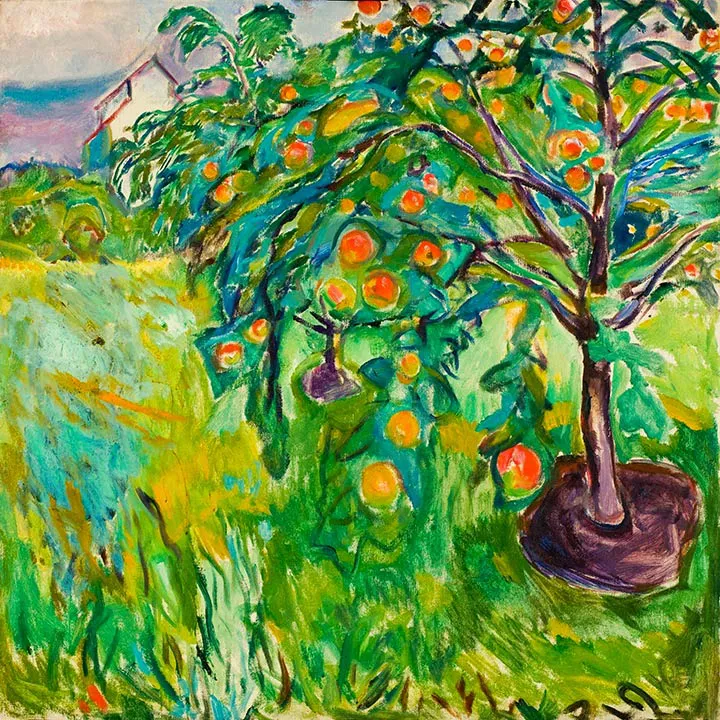

Edvard Munch

  

尊敬的连叔:

  

您好！我是一名大二的学生。鉴于您每天要阅读很多来信，一定很疲惫。那我就直入主题吧。

  

我崇尚公平，却总陷于不公之地！不公现象：在学习上，与我水平相当的人总在考试时作弊（不是我猜的，而是亲眼所见，每次考试ta都坐在我周边，每当监考老师出去时，ta们就在那扔纸条，悄悄说话，于是整个考场就闹哄哄的。监考老师一进来，大家就都安静下来了），本来我们实力相当，要是凭真本事的话，我也不一定会逊于谁，可总有些人会在自己的实力上再耍些小聪明，那我自然是比不过了。我就是个实心眼，我要是耍小聪明了，我过不了心里那关，我心虚。在考试这件事上，我更喜欢实事求是，毕竟知识学到脑子里才是本事。道理我都懂，我很多时候也是这样安慰自己的，可每当排名下来，我们的差距就那一点点，ta拿了奖学金，拿了证书……我心里就不舒服，那份荣誉本该属于我啊！倘若ta们光明磊落，结局是我输了，那我输的心服口服。可现实呢？？不公啊，不公。

  

除了在学习学习方面，还有在一些比赛方面，我总能清楚的目睹一些同学通过作弊等手段，让自己的排名遥遥领先，最终拿到奖励。（若是当时可以带手机，我倒想把它录下来，证明这种事情确实存在）

  

 “道理都懂，却依旧过不好这一生”，这句话曾被人点评说幼稚，但我却觉得这句话很形象。在我的生活中，总会出现一些意难平之事。其实你用一些大道理自我开导也是可取的，但我并非圣人实在做不到事后波澜不惊，每次自己气自己。最终还是扰乱了自己的生活，我知道自己这样做不对，但我还是小情绪不断。我想改掉自己这样的性格，但又无计可施……还请连叔能在百忙之中指教一二，辛苦啦！           

黛玉

  

* * *

  

黛玉：

  

别人作弊，而我没有作弊。这不是很酷的事吗？有什么可气的？这就是出淤泥而不染，这就是“虽千万人吾往矣”，对的事，千万人反对，我也会做，错的事，千万人盲从，我也不会做。有这种坚持，有这种气节，本身就是教育成功的证明，开心都来不及。

  

当然，我希望你所在的学校不要为了考验你一个人（或少数人）而放任作弊。你描述的情况没有纠正，当然是学校的失职。不过，你现在要想的问题是：如果学校一直失职，你要怎么办？这也算是提前接受了人生的大挑战，当我们可以作弊时，要不要作弊？既然你在学校遇见了，那就提前成熟一下。这取决于你人生想不想大赢，想不想站在最高点。不想，那你就随波逐流作个庸人，别人变坏你也变坏。你对这点要有知觉，因为你的话话已经是“别人都很坏，所以我当好人不划算”，这是人变坏之前必然的关键心理环节，过不了关，就滑向坏人那边。当它出现时，自己就要警惕起来。别人都很穷，你不会想穷，别人都感染病毒时，你不会想感染，别人都生病，你不会想生病。别人都作弊，也是同样的道理，作弊就是知识上的穷，就是思想上的病毒，就是成长中的生病。

  

但愿你是一个人生想大赢的人。必须想，大二都没有这雄心，不敢特立独行，前景就不太乐观了。想大赢的人，面对“别人都作弊……”的处境，有当下和长远两个方案：

  

一是在当下成为最强者。作弊不可能成为第一名。作弊就是抄一点标准答案，理科的难题，文科的文章，没有真才实学，怎么可能答得好？就是给作弊者抄，他们也可能看不懂。魔高一尺，道高一丈。用实力碾压是最爽的。你再强一点，就能彻底鄙视作弊了。

  

二是延迟满足，目光放长远一点。作弊一成习惯，就在混子圈里打滚，人生受到诅咒。人生履行的那些重要责任，享受的那些纯粹幸福，都无法依靠作弊。作弊能得到健康？作弊能教育孩子？作弊能抚慰父母？作弊能做出重大决定？作弊能管理好公司？作弊能获得朋友？作弊能赢得尊重？都不能。作弊者只能当一个无足轻重的混子，在家庭，在社会，都是一个多余人，都是一个负担。这很公平吧？再过30年，你到了我这个年纪，就会看到无数多这种公正的人生判决书。

  

先贤说得好，做人做学问，重要的就是诚心，不自欺，要慎独，独自一人，没有监督，想作什么弊都可以，那时你仍然不会作弊，一生的功业就有了坚实的基础。同学作弊，你不作弊，这说明你人生已经领先了，不要放弃这个优势。

  

祝开心。

  

连岳

  

（我的邮箱：lianyue@xmlykd.com，来信请谨慎，只会在微信平台公开回复，并授权我用于图书汇编。）

推荐：[穷查理，富人生](http://mp.weixin.qq.com/s?__biz=MjM5NDU0Mjk2MQ==&mid=2651699115&idx=2&sn=6c49095503de7c47c8a5e51aeb1a6746&chksm=bd7f33b58a08baa3d4ac09e823ed952193a968e92d7aae315c20df7435a13577f8f38141ea8e&scene=21#wechat_redirect)

上文：[用嘴爱孩子是不够的，要用心，要用成长](http://mp.weixin.qq.com/s?__biz=MjM5NDU0Mjk2MQ==&mid=2651708036&idx=1&sn=00f9515dc8b8ce7331b65f2e7dd8ee68&chksm=bd7f5e9a8a08d78c3280b4b266855baf5cd9be0589d78cdad076890ca08f521cd3cc51e66c42&scene=21#wechat_redirect)
