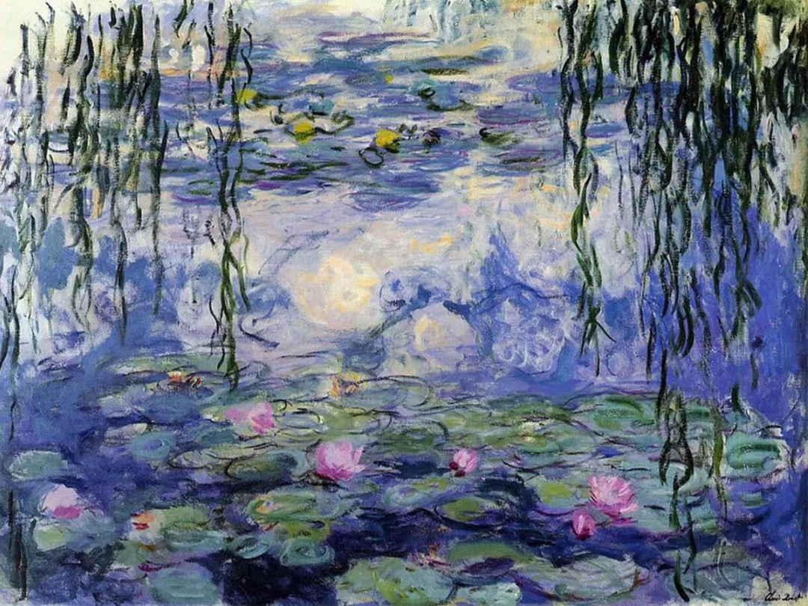

Claude Monet

  

连叔您好，

  

我妈妈非常喜欢您，经常给我分享您的文章。我是一名即将面临小中考和期末考试的初二学生，我不知道我该怎么办了，初一暑假我和父母关系破裂，我开始不跟他们交流，甚至初二开学就跟老师顶嘴，挑战权威，不完成作业，我初一成绩不是很好，级部200-300名（级部600多名学生），初二上学期成绩稳定在210名，并且每天都在和老师斗智斗勇，表面上我每天上课睡觉不好好写作业，可是我在课后经常会花更多时间去学习，所以我的朋友经常说“你看你，不学习都能考的那么好”，他们没有看到我的努力，我也不需要他们看到。可是这学期我被老师和朋友“抛弃”了，老师不在管我了，班主任甚至将我和我在这个班里关系最好的人分开了，她觉得我带坏了她的学生。上半学期因为我不服输且欠揍的性格被语文老师认为我不尊重她所以这学期她没有管过我，并且总在课堂上暗戳戳的说我，比如“不尊重我的后果大家也是看到了，比如某些人啊，就是不求上进……”只要上她的课我跟谁说话了，她就会让和我说话的人站着，我不知道我做错了什么，我的成绩并没有因为她不管我而下降，因为我最喜欢语文了，我不可能放弃的，可我好像坚持不下去了。

  

期中考试是全市统考，我只有两科没及格，成绩也下滑了一点，他们总说“你在努力一点就能考上高中了”只要我再努力一点，可是我努力不上去了。我的情绪总是被影响，喜怒无常的，我控制不好我的情绪，每天都很崩溃，甚至觉得世界是假一切都是想象出来的这个想法，我很担心我的状态，我去网上查了一下，无意间看到了一句话“只是生活不如意，找的借口罢了”我很生气，但仔细想想难道不是吗？我觉得我变得更维护自己了，我以前看到一个喜欢的人会心跳加速小鹿乱撞，可是我现在感觉不到任何感情的存在，会说一些很冷血的话，我的理性代替了感性。有时候我又会以上帝视角看着自己，明明知道什么应该做什么不应该做可我控制不了自己的身体，我的身体达不到我精神指令的目标，我觉得我的身体和精神是分开的。身体里面像有两个人在打架，真的好累啊，自己反抗自己，真的一点意思都没有。我有时候还会觉得自己是不是有精神病，有时候身体的反应会告诉我们一些信息，我很害怕，我想过我要不要去看一下心理医生，可是我的父母已经很累了，要是真的检查出什么来他们也应该接受不了自己的孩子精神出问题了，并且治病也是一笔很大的费用，我的家庭承担不起。所以我打消了这个念头，选择自己扛着。这段时间慢慢的好起来了，可情绪还是我生活中唯一的变数，我不知道为什么所有人都能扛过的坏情绪我却败在了这里，还有两个周就要地生结业考了，我想考高中，我不想平庸，我有这个实力去上一个我想上的学校，可是所有老师的孤立，自己的情绪，让我根本无法再前进了，都说熬过去就好了，可我熬不过去了。我每天都紧绷着一根弦，身体里两个人的打架让我更累了，我也很害怕突然就想不开了就离开了。

  

非常感谢您能看完这么长的一篇废话，我很希望您能看到这封邮件，我真的很希望能得到您的建议，因为我真的没有办法了。

  

谢谢连叔。

  

一个迷茫的初中生

  

* * *

  

一个迷茫的初中生：

  

你想成为一个很厉害的人。这没错，我还希望你一生都有这个企图心。当人的自我开始觉醒，一个显著标志就是想变得厉害，让人印象深刻。青春期为什么会逆反？那就是向家长、老师这些权威表示：我比你们还厉害。你刻意在学校不读书，回家偷偷努力，也是在打造一个厉害的人设：我随随便便就能赢你们！你因为成绩下滑，能不能上高中都成了疑问，这招失去效果，没人觉得你厉害，这是你心理痛苦的主要原因。

  

你其实很厉害了，初一和父母决裂，初二和老师顶嘴。你很聪明地意识到，在父母与孩子的关系中，在老师与学生的关系中，你作为孩子与学生，表面上处于下位，但只要你不管不顾，父母和老师反而得退让，因为他们爱你，有责任感，担心你走极端，无论你如何逆反，如何蹂躏他们，他们也只能忍受。让他们都怕你，是不是一种厉害？当然是。但是这种厉害胜之不武，专门挑家人与师长下手，谁爱你你惹谁，你知道他们不会下重手，最后总是会让你的。你看，逆反的少年不敢去惹社会上的流氓，那样真要被打死的。 

  

让爱自己的人担心、害怕，那是最容易的事，你耍赖、你捣乱、你出尔反尔、你故意伤害自己，都可以立马见效。只是这种厉害太低级了。人生巅峰不过是流氓，等着警察抓。我们应该追求高级一点的厉害，父母爱你，老师爱你，同学爱你，那就是高级的厉害，这种爱体现为以为你荣，尊重你，愿意亲近你，你让人们想到你、见到你就有微笑。这种人人都爱的厉害是所谓的“仁者无敌”，仁是什么？是爱人，爱人的人就是仁者。它的起步也不难， 你看到这封回信后，替我向你妈妈问个好，你们的关系就能修补，爱人就是这么简单，一句主动的问候就行了。从今天开始，你遵守课堂纪律，尊重老师，认真完成作业，十天半月后，老师就会对你刮目相看，爱人就是这么简单，敬畏规则、珍惜他人的付出就行了。这并非不酷，主动爱人，主动修补关系，甚至主动向正确服软，去引导和创造爱，这才是真正的酷。

  

祝开心。

  

连岳

  

（我的邮箱：lianyue@xmlykd.com，来信请谨慎，只会在微信平台公开回复，并授权我用于图书汇编。）

推荐：[我为什么这么高兴？](http://mp.weixin.qq.com/s?__biz=MjM5NDU0Mjk2MQ==&mid=2651640981&idx=1&sn=87e14cdaa8c858ca1e568ec71779fbd3&chksm=bd7e508b8a09d99de10ba66f42fd6f705b0dd8028b0098c23ce8b59fcfa2d4517ba932bec42a&scene=21#wechat_redirect)  

上文：[强人不幸福的源头](http://mp.weixin.qq.com/s?__biz=MjM5NDU0Mjk2MQ==&mid=2651709412&idx=1&sn=ff37cab215c7a67007a6ad7dfc81ee7e&chksm=bd7f5bfa8a08d2ecf990e7eec40b749133411b095b8f75c99491742b8fb59b4d1b59a3dcf566&scene=21#wechat_redirect)
