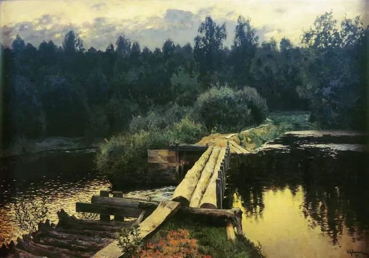

Isaac Levitan

  

连叔，

  

您好！

  

提笔写信是因为最近特别沮丧，总是感觉迷茫。

  

我今年37岁，老公长我10岁。我们在西北老家十八线县城中的国企相识，14年前不满于国企的腐朽，我们一起辞职南下来到深圳。满怀热血和激情，但是混杂着身无所长的自卑（我大专，他高中学历），辗转多个工厂也吃了很多苦。可谓是受到现实的毒打才明白远方并没有想象中那么好。直到到今天，才感觉日子稍稍没那么难堪。结婚12年我们夫妻关系良好，有一个10岁聪明可爱的女儿。不愿意她做留守儿童所以一直带在身边。总体家庭温暖和睦，苦中有甜。

  

昨夜跟老公在楼顶乘凉（出租屋顶楼），不远处新起的楼盘鳞次栉比，我眼看着它们一栋栋拔地而起到现在的万家灯火。可是，这么多房子没有属于我们的一间。我们在老家县城有一套价值20多万的房子，现在手里有将近二十万的存款。哪怕知道这些加一起想换个深圳的房子就是奢望，可是还是挡不住我想啊！我也想有自己的房子，我想给女儿更好的条件。可是我们是平凡的不能再平凡，普通的不能再普通的人。老公很知足，觉得两个人从拉着两个拉杆箱到深圳，十几年间一点点积累也是拥有了很多。他想着过几年等女儿上大学后我们回老家，县城有自己的房子住，也可以照顾年迈的父母。可是我不甘心啊！我们勤勤恳恳努力工作，微薄的薪水想攀上深圳的房子就是奢望，打工人真的不配不应该在深圳有一套自己的房子吗？难道我们打工人来深圳就是贡献自己十几二十年，青春和血泪都留在深圳，最后回老家去吗？

  

在此之前很多年从没想过买深圳的房子，心不动便没烦恼。如今起了心，但是没有力，便生出了很多苦恼。连叔，我要怎么想才能使自己没那么沮丧，让自己的心态能平和一点呢？

  

迷茫的中年女人

  

* * *

  

迷茫的中年女人：

  

两个相爱的人结为夫妻，一般来说，他们要完成的三个任务：一是为双方的老人养老送终，使他们不恐惧；二是将孩子抚育成人，使他们不孤独；三是在生活的压力与考验之下，爱不消失。

  

三个任务完成得好，无论贫富，都受人尊敬，是成功的爱情与人生。有老人不养，有孩子不教，辜负那个将一生托付给自己的人，那么，这人穷是烂人，这人富也是烂人。

  

从你的来信，我可以断定，你们这三个任务将完成得好。你们的爱情与人生是成功的，即使在深圳始终没有自己的房子，退休后将回老家县城。

  

确实，人奋斗后没有达到自己的预期目标，会有不甘，会有遗憾。人难免会比财富，但对比上面三个任务，你就知道，这是小比，不是人生的主线。如果只比钱，世上可能失败者是绝大多数。那样，不论世界的财富总量如何增长，失败与不快乐都是主流。

  

所以，人生不能只是比钱，重要的是比爱，比责任，比健康，这样才不会本末倒置。子贡问孔子，穷不觉得低人一等，富不觉得高人一等，这样不错吧？孔子说，是不错，但更高的境界是穷的时候快乐，富的时候好礼。当然，这快乐不是强颜欢笑，这礼也不是虚情假意，它是知道人生本质后的真心流露，能驾驭一切境遇。你是在深圳买不起房子，可是你有爱你的丈夫，可爱的女儿，温暖的家庭。命运纵然让我穷，我也能经营出这些大快乐，这是大成就，你们应该自豪。多少人受了命运的厚爱，一手好牌打得稀烂，不会爱人，最终也没人爱他，他们才应该沮丧。

  

祝开心。

  

连岳

  

（我的邮箱：lianyue@xmlykd.com，来信请谨慎，只会在微信平台公开回复，并授权我用于图书汇编。）

推荐：[无背景者的最佳策略](http://mp.weixin.qq.com/s?__biz=MjM5NDU0Mjk2MQ==&mid=2651633949&idx=1&sn=c7bef4596fe2dd926aa01b70fc1683c3&chksm=bd7e3d038a09b415859e682d11d37ab00a3621e2caef7c1b5d20a62b57bb764782e6cc57a966&scene=21#wechat_redirect)  

上文：[不焦虑，不自大，善配合，家里的小学生，一定能教育好](http://mp.weixin.qq.com/s?__biz=MjM5NDU0Mjk2MQ==&mid=2651710452&idx=1&sn=2d85e5d611ca9c98a90da7042e700632&chksm=bd7f67ea8a08eefc4d5d1478e984142b44db2e037fabd4643224f8c6490f274eea4bf13c9fe7&scene=21#wechat_redirect)
