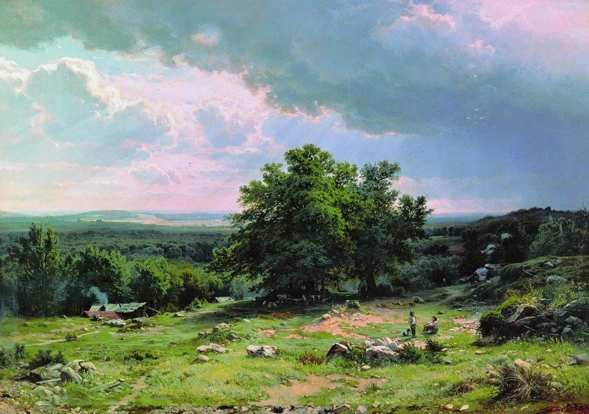

Ivan I. Shishkin

  

连岳老师，

  

我又来给你写信了，虽然你没有回复过我。也许每一次写信都是对内心的一次梳理，不一定是为了等您的回复。

  

今天是2021年高考的第一天。今天我在医院工作了一天，依然很忙，也和以往上班的任何一天一样，我写文书记录的时候看着6月7号这个特殊的日期，就回想13年前的今天，我参加高考的时候，从来没有想过13年后的今天是这样的。

  

这13年，我经历读书，还助学贷款，给爸爸妈妈买新房子，爸爸生病手术化疗好转，妈妈做了大手术，姐姐们结婚生子，我们三个人都从小城市来到在二线城市安家，他们的小家庭有一到两套房子、有自己的车子，我也靠自己个人买了房子，有稳定的医院工作，只是暂时还没有结婚，而且我们自己大家庭关系非常融洽。

  

我小时候不知道长大以后会过怎样的生活，只希望能不要爸爸妈妈那么辛苦那么累，想给他们买新房子不让他们被大家庭的人嘲笑（大家族的人都不支持我们读书，他们很辛苦，送我们上学，没有自己的房子），想他们健健康康，想他们因为有我们内心踏实幸福快乐。好像这些都实现了，但我还是觉得长大的这13年的人生没有那么完美，好像不是我懵懵懂懂中期待的那个生活。

  

原来工作有烦恼，生活有烦恼，虽然我们都在努力低头拉车，也同时认真寻找生活里的美好，但总会有情绪沮丧失落的时候。今天工作时又有病人也因为病情对我发脾气了，说真的，我能理解病人和家属，我也能自我梳理情绪了。姐姐的婆婆因为很小的事情，竟然离家出走了，没带任何联系方式，姐夫工作一整天，下班和家人找了一整晚，夜里10点多去派出所立案登记，到现在都没有回来。这就是成人的无可奈何啊，白天工作，晚上还有这样的琐碎等着你。连叔，如果2021年6月7号的我回到2008年的高考考场，知道原来13年后的今天是这样的，不知道我是否还有勇气去畅想未来，去接受一年又一年的成长和改变。

  

连叔，我知道，我们认真工作学习生活的每一天，都是为了不辜负来到这个人世一趟，不辜负爱我的人，不辜负18岁高考考场上奋笔疾书心怀梦想的那个少年，所以一边长大、一边接受、一边改变。连叔，这就是我们成年人该有的样子，对不对，有责任、有目标、有计划、有行动，还有接受一切好与不好的心态和能量。

  

连叔，你说再过10年的6月7号，我想起今天晚上沮丧掉眼泪给你写信的时候，我会是什么样子。希望我能越来越好，我会继续低头踏实拉车，等抬头仰望的时候，觉得沮丧失落的时候，我心里一直都有那个高考考场上奋笔疾书畅销未来的少年。

  

XHMM

  

* * *

  

XHMM：

  

我很喜欢你订10年计划的思考方式，人生经常需要有这样的大视野，才能有大格局。脚踏实地，10年可以完成的事情，超乎我们的想像。正如你13年前的少年梦想是给父母买房子，现在超额实现了。

  

在你这个融洽的大家庭里，你父母的幸福感应该是最强的，虽然他们步入老年，生过大病，动过大手术。13年前，他们可能是你10年后的年纪，仍然一穷二白，拉扯3个孩子，眨眼间，美梦成真，孩子们各有事业，生活富足。他们的人生如倒吃甘蔗，渐入佳境。这是他们该得的，13年前的那种窘迫，他们没有放弃、哀怨，不顾嘲笑，坚持让教育与高考改变你们的命运。没有这种韧性、忍耐与远见，就是给一个中国这样和平繁荣、高速发展的大环境，也不会有这么大的成就。你人生已经接触过很多好老师，但最好的老师就是你的父母，在遇见困难时，想想最困难时的他们，你必然会生出无穷的动力。

  

你现在的沮丧属于甜蜜的沮丧，是少年梦想实现后的短暂失重。你父母的梦想比你更大，住上新房子，他们就满足了？不是的，他们希望你经营好自己的家庭，事业上不停精进，成为一个大医生，一个伟大医生。父母不会陪我们一生，他们几乎不可能看到孩子最终的成就，但他们生前看到自己的文化基因在孩子身上体现，你的韧性、忍耐和远见像他们一样，他们就会放心，觉得自己的一生非常值得，没有遗憾。如果我们的人生浮皮潦草，得过且过，对家庭，对事业的责任心不够，可能会听到那些好父母在天堂失望的叹气吧。

  

第7次全国人口普查显示，中国大学（指大专及以上）文化程度的人口近2.2亿，被时代，被教育，被高考改变的人已经很多，只满足于自己的小生活，那可能用小了这个命运。一份工作，一个小安乐窝，不难得到，物质满足后，饱食终日，无所作为，人的精神反而会退化，要么虚荣炫富，要么好高骛远，要么纸醉金迷，要么意志薄弱。人在物质目标之上，还要有一个高一点的目标，这样，我们才不会被日常的琐碎牵着鼻子走，也才能做到见利思义。

  

这个高一点的目标是什么呢？是让自己的好父母、好师长以自己为豪，是让更多人的人生更美好，这个目标是无限的，可以奋斗10年，可以奋斗一生，永不厌倦。你是医生，有实现这个目标的职业优势，止痛疗伤后，病人就有微笑。你的一刻专业与抚慰，就可以改善病人及其家人的一天，甚至一生。一刻都这么美，积累10年，我不知道有多美，到时你告诉我吧。

  

祝开心。

  

连岳

  

（我的邮箱：lianyue@xmlykd.com，来信请谨慎，只会在微信平台公开回复，并授权我用于图书汇编。）

推荐：[一生都该是少年模样](http://mp.weixin.qq.com/s?__biz=MjM5NDU0Mjk2MQ==&mid=2651707047&idx=1&sn=770f02550ccf574b08df875d08a2bab0&chksm=bd7f52b98a08dbaf02b09e562bcb570a2a0ad0b129a6c0edd92840a56356e2d0a7a6db3be8e5&scene=21#wechat_redirect)  

上文：[让人怕低级，让人爱高级](http://mp.weixin.qq.com/s?__biz=MjM5NDU0Mjk2MQ==&mid=2651709736&idx=1&sn=48a062364c7dd94ae44ea603579bc25a&chksm=bd7f65368a08ec203e3cc254c3be7b633ef132ae0a77ab76aece07a911b174c02887682a2324&scene=21#wechat_redirect)
