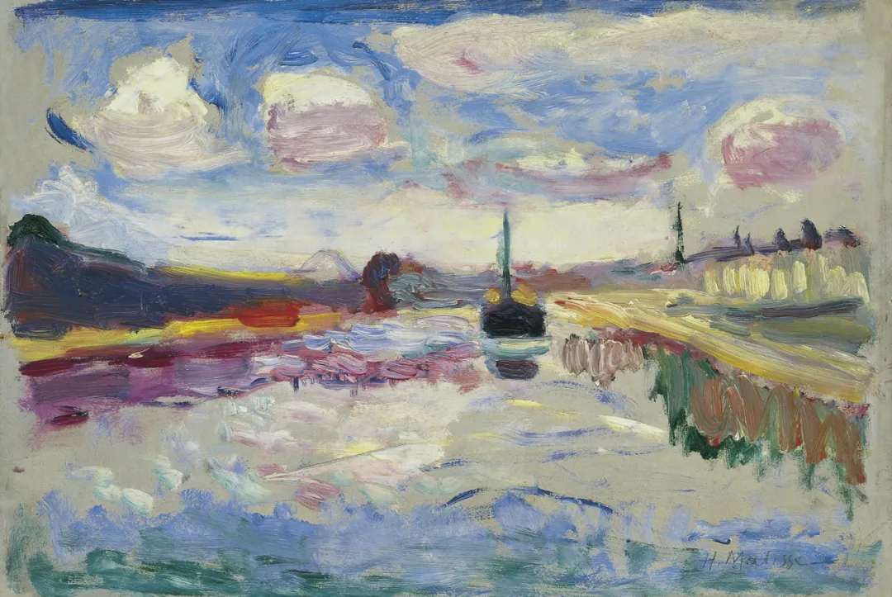

Henri Matisse

  

连叔：

  

你好，再给你写这封信的时候我刚刚考完高考回到家。说来好笑，考试之前我幻想了很多考完试应当做的事情，练字、看书、不为了考试的去学习。但也许是感觉自己这次没有发挥的很好的原因吧，考完试我什么都不想做，睡觉也不想。我平常成绩很好，一直都是班里第一，这也许是我自己的一点骄傲吧，接受不了别人超过我，学习或者是其他什么方面。当我发现好像自己这里有点不如别人的时候，我就会自己努把力。我不知道这样是不是不对，因为我内心渴望成为一个平静从容的人，每每晚上睡觉我都会在想第二天要怎样让自己平静从容一些，但是真正把我置于处理问题的境地的时候我还是和以前一样，想到和做到真的差了好远，但我不会放弃我内心的追求，成为自己心向往之的人吧。

  

这几天高考，我真切感受到了家庭给一个人的帮助。我的父母对我很好，虽然我一直将自己最丑陋的一面毫无保留的暴露给他们，但他们一直很包容我，昨天晚上我也给你写了一封很丧气的信，但是一觉醒来发现人生还是很美好，就没发出去。昨天晚上可能是自己的原因吧，当我和我父母说了我可能没考好的时候，我一直感觉我妈妈在责怪我，我真的很狭隘，一直用自己的想法去揣测别人。

  

之前老师和我们说一定要做一个理性的人，但是我却希望自己可以感性一些。我是一个很利己的人，但是我接受的教育让我没办法做出伤害别人的行为，所以我做的任何一个决定都非常的谨慎理性。我真的很希望自己能够像那些伟人一样心里的志向更加远大一些，也许我我自己的一点点自恋，我一直觉得自己不能和别人一样，我高中三年带给我的不只是一份不错的成绩，更多的是一种学习的能力，我一直在告诉自己有了这种能力到哪里都不会过得太差。我也一直在告诉自己我不是在为了考试而学习，我是在为了知识本身而学习。但是当我发现我生物选择题错了一个4分题的时候，我心态真的很崩，也许因为这4分我将会于我心中理想的大学失之交臂。也许是考试的时候太怕自己考砸了，我变得很迷信，考试之前学生们不都喜欢摸一摸那些成绩很好的人吸吸运气吗，之前还好，觉得也挺可爱的，但是高考那几天我真的讨厌别人摸我，好像真的会吸走我的运气一样，现在想想那种想法真的是我自己都想笑。可能以这种心态考试考不好也是正常的吧。不过我还是得承认是自己能力的问题，如果能力够强，怎么考都会很好。我已经决定成绩怎么样我都不会复读了，我相信以我的实力怎么考都可以上个重本，大不了大学的时候多增长一些实力考我心中理想大学的研究生吧。

  

不知道我的心态会不会被时间抹平，如果成绩出来那天我有什么别的看法还会写信给你的！

  

祝平安！

  

一个学生

  

* * *

  

一个学生：

  

你一直是班里第一名的学霸，那不必担心，前途是远大的。只要你立了志，在一个领域持续发力精进，你的学习能力就能保证你成为专家，成为顶尖人物。我建议每一个像你一样的学霸，对这点要始终自信，这并非自大，而是一种责任感，既然自己有这么强的学习能力，那就必须让它发扬光大。

  

当然，远大前途越走越窄，走到无路可走的学霸也大有人在。高考结束，人生真正的竞争才开始。有几关必须过，过不了，之前的优秀一笔勾销。

  

一是能承受失败的打击。人是在失败中成长的，没有永远的第一，没有永远的胜利。一直在胜利中长到高中毕业的学霸，比较难理解、难接受这一点。这容易走到两个极端，要么一点小失误、小挫折就彻底崩溃，一蹶不振；要么心理变态，极度自大自恋，嫉妒、诋毁一切比自己强的人。你这次生物丢了4分很痛苦，却也是失败教育的开始，越快调整好，走出来，这一关越容易过。

  

二是对家人好。这点听起来简单，做起来不容易。琐琐碎碎的家事，平平淡淡的日常，似乎谁都能做好，我能力这么强，是干大事的人，做了太浪费。一掉到这个陷阱，你忽视家人的奉献，冷淡家人的爱，成为感知能力特别弱的人，很难令人尊重。家庭是一个人的核心道场，小事里藏着大道理。现在敬重爱你的父母，将来温暖爱你的配偶，引领爱你的孩子。这敬重，这温暖，这引领，以及要做好这些的真诚、耐心，是你成就一切大事的素质与方法。

  

三是利他。这不是说不要利己。利己写在基因里，人永远有。人只利己，那不过服从基因的本能，不算什么本事。人要有智慧看到利己与利他是一体两面，利他做得好才是大利己。就像同学摸你求好运，摸完他们开心，也是对你的肯定，虽然是个幼稚的游戏，但也说明利他就是利己。利他是无损自己的，利他是成就自己的。利几个家人，成就一个个家长。利成百上千员工，成就一个好企业家。利一国国民，成就一个好领袖。利全人类，成就一个圣人。想不想通利己与利他关系，人就会自我中心，吝啬，封闭，最后无足轻重，甚至神憎鬼厌，天资再高也难成就自己。

  

以上三条，是人人做得到的，换言之，在人生之路上，学霸的优势并没有想像的那么大，即使是所谓的学渣，甚至文盲，想通这三点，并执行之，他就会飞快地进化迭代，成就不可思议。在人生的竞争中，现在是好好加油的时候了。

  

祝开心。

  

连岳

  

另，我从12日至14日放假停更，祝各位假期愉快。

  

（我的邮箱：lianyue@xmlykd.com，来信请谨慎，只会在微信平台公开回复，并授权我用于图书汇编。）

推荐：[他律权，解决教育中谁说了算的问题](http://mp.weixin.qq.com/s?__biz=MjM5NDU0Mjk2MQ==&mid=2651633807&idx=1&sn=984dc3d58ee125284739d7886cd8824f&chksm=bd7e3c918a09b587dda4343dfc2ab3a45441232d57ceb7e92a05cf35782b3bb3badab047a584&scene=21#wechat_redirect)  

上文：[高考之后的人生](http://mp.weixin.qq.com/s?__biz=MjM5NDU0Mjk2MQ==&mid=2651710193&idx=1&sn=ad565e006b884dc5bb34010f8657c5ba&chksm=bd7f66ef8a08eff987c02a3065d43ea904d1967259f6ad2519d101ed9e4aacb8928891a1916c&scene=21#wechat_redirect)
